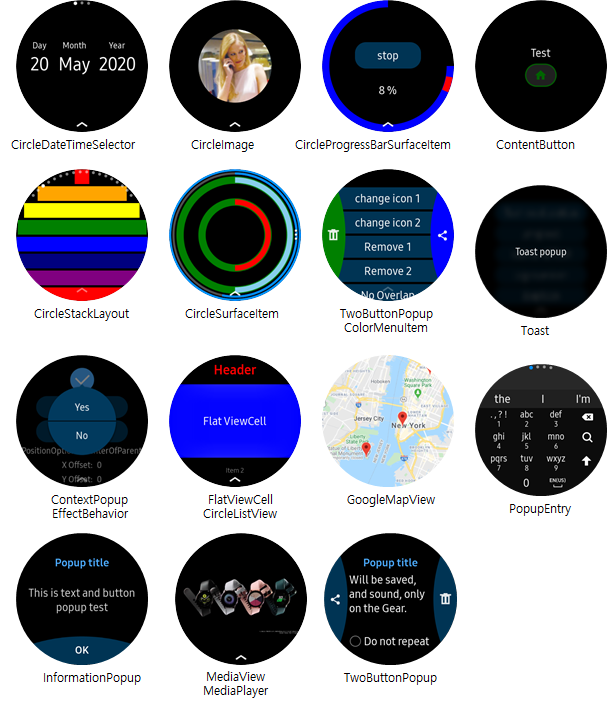

# Tizen Wearable CircularUI

- [Introduction](#introduction)
- [Controls](#controls)
- [Prerequisite](#prerequisite)
- [How to use CircularUI](#how-to-use-circularui)
- [Sample and Test application using CircularUI](#sample-and-test-application-using-circularui)
- [Tip and Tech](#tip-and-tech)

## Introduction
The Tizen Wearable CircularUI project is a set of helpful extensions of the Xamarin Forms framework. 
The aim of the Tizen Wearable CircularUI project is an open source software to motivate and help software developer to create Tizen Wearable app(Xamarin.Forms app) more easily and efficiently.  
The binaries are available via NuGet (package name **Tizen.Wearable.CircularUI**) 

_Xamarin Forms provides cross-platform APIs, but this project are only worked on the Samsung Gear device that support Tizen .NET._ 

## Controls

The Tizen Wearable CircularUI project provides UI controls that fit on a circular screen and interact with hardware features provided on a Samsung wearables such as bezel rotation.

- [CircleDateTimeSelector](https://samsung.github.io/Tizen.CircularUI/api/Tizen.Wearable.CircularUI.Forms.CircleDateTimeSelector.html) : A picker control to select date or time that fits in the circular screen. Unlike `Xamarin.Forms.DatePicker` or `Xamarin.Forms.TimePicker`, it can be shown on the page without popup.
- [CircleImage](https://samsung.github.io/Tizen.CircularUI/api/Tizen.Wearable.CircularUI.Forms.CircleImage.html) : An image control that crops an image in a circle shape.
- [CircleProgressBarSurfaceItem](https://samsung.github.io/Tizen.CircularUI/api/Tizen.Wearable.CircularUI.Forms.CircleProgressBarSurfaceItem.html) : A progress control that fits in the circular screen. This control can be only used in the `CircleSurfaceView`.
- [CircleSliderSurfaceItem](https://samsung.github.io/Tizen.CircularUI/api/Tizen.Wearable.CircularUI.Forms.CircleSliderSurfaceItem.html) : A slider control that responds to the bezel action and fits in the circular screen.
- [CircleStackLayout](https://samsung.github.io/Tizen.CircularUI/api/Tizen.Wearable.CircularUI.Forms.CircleStackLayout.html) : A container to layout children linear in the circular area.
- [CircleSurfaceEffectBehavior](https://samsung.github.io/Tizen.CircularUI/api/Tizen.Wearable.CircularUI.Forms.CircleSurfaceEffectBehavior.html) : A behavior that allows you to insert views that require `CircleSurface`.
- [CircleSurfaceItem](https://samsung.github.io/Tizen.CircularUI/api/Tizen.Wearable.CircularUI.Forms.CircleSurfaceItem.html) : An item class to represent the items in the `CircleSurface`.
- [CircleSurfaceView](https://samsung.github.io/Tizen.CircularUI/api/Tizen.Wearable.CircularUI.Forms.CircleSurfaceView.html) : A view that can have several `CircleSurfaceItem`s, not a page.
- [CircleToolbarItem](https://samsung.github.io/Tizen.CircularUI/api/Tizen.Wearable.CircularUI.Forms.CircleToolbarItem.html) : An item class that can show a toolbar item fitting in the circular screen.
- [ColorMenuItem](https://samsung.github.io/Tizen.CircularUI/api/Tizen.Wearable.CircularUI.Forms.ColorMenuItem.html) : An item class that allows you to set the background color of the button used in the popup control.
- [ContentButton](https://samsung.github.io/Tizen.CircularUI/api/Tizen.Wearable.CircularUI.Forms.ContentButton.html) : A button control that allows you to customize the view to show.
- [ContextPopupEffectBehavior](https://samsung.github.io/Tizen.CircularUI/api/Tizen.Wearable.CircularUI.Forms.ContextPopupEffectBehavior.html) : A behavior to show a small popup which has one or two buttons. This can be added to any `Xamarin.Forms.View`.
- [FlatViewCell](https://samsung.github.io/Tizen.CircularUI/api/Tizen.Wearable.CircularUI.Forms.FlatViewCell.html) : A cell that turns off the default effect(fish-eye effect) applied in wearable profile.
- [GoogleMapView](https://samsung.github.io/Tizen.CircularUI/api/Tizen.Wearable.CircularUI.Forms.GoogleMapView.html) : A view to display google javascript map.
- [InformationPopup](https://samsung.github.io/Tizen.CircularUI/api/Tizen.Wearable.CircularUI.Forms.InformationPopup.html) : A popup that includes a control showing progress and one button on the bottom of the circular screen.
- [MediaPlayer](https://samsung.github.io/Tizen.CircularUI/api/Tizen.Wearable.CircularUI.Forms.MediaPlayer.html) : A class that provides the essential components to play the media contents.
- [MediaView](https://samsung.github.io/Tizen.CircularUI/api/Tizen.Wearable.CircularUI.Forms.MediaView.html) : A view to display a video on the screen.
- [PopupEntry](https://samsung.github.io/Tizen.CircularUI/api/Tizen.Wearable.CircularUI.Forms.PopupEntry.html) : An entry that opens popup for editing text of the entry.
- [TwoButtonPage](https://samsung.github.io/Tizen.CircularUI/api/Tizen.Wearable.CircularUI.Forms.TwoButtonPage.html) : A page that has two buttons. One is on the left, and the other is on the right side of the circular screen.
- [TwoButtonPopup](https://samsung.github.io/Tizen.CircularUI/api/Tizen.Wearable.CircularUI.Forms.TwoButtonPopup.html) : A popup that has two buttons. One is on the left, and the other is on the right side of the circular screen.
- [Toast](https://samsung.github.io/Tizen.CircularUI/api/Tizen.Wearable.CircularUI.Forms.Toast.html) : A popup for simple feedback. 

Tizen Wearable CircularUI project also provides extended Xamarin.Forms controls.
These controls basically look same as what it is in Xamarin.Forms, but provide additional features just for Tizen wearables. The developers would want to use the following controls only when they specifically need to use the provided features in each controls.

- [BezelInteractionPage](https://samsung.github.io/Tizen.CircularUI/api/Tizen.Wearable.CircularUI.Forms.BezelInteractionPage.html) : A subclass of Xamarin.Forms.ContentPage that allows you to set which view gets the bezel rotation event.
- [CircleListView](https://samsung.github.io/Tizen.CircularUI/api/Tizen.Wearable.CircularUI.Forms.CircleListView.html) : A subclass of Xamarin.Forms.ListView that allows you to change the bar color of the `ListView`.
- [CircleScrollView](https://samsung.github.io/Tizen.CircularUI/api/Tizen.Wearable.CircularUI.Forms.CircleScrollView.html) : A subclass of Xamarin.Forms.ScrollView that allows you to change the bar color of the `ScollView`.
- [CircleStepper](https://samsung.github.io/Tizen.CircularUI/api/Tizen.Wearable.CircularUI.Forms.CircleStepper.html) : A subclass of Xamarin.Forms.Stepper that provides additional properties to set visible elements on Tizen wearable.
- [CircularShell](https://samsung.github.io/Tizen.CircularUI/api/Tizen.Wearable.CircularUI.Forms.CircularShell.html) : A subclass of Xamarin.Forms.Shell that provides more extended properties for Flyout. When the Flyout is opened, the application will not be terminated even if an user press the back button.  

## Deprecated APIs
Following controls are obsolete as of Tizen.CircularUI version 1.5.0. 
However, they can be substituted with Xamarin.Forms controls. Below shows how they can be substituted based on Xamarin.Forms 4.6.0 Service Release 2 (4.6.0.800) or higher.

- Check → Xamarin.Forms.CheckBox or Xamarin.Forms.Switch
    - DisplayStyle → Switch.Style + SwitchStyle(TizenSpecific)
	- Color → Switch.OnColor, Switch.ThumbColor, Switch.BackgroundColor
- CirclePage → Xamarin.Forms.ContentPage
    - ActionButton → Button + Button.Style(TizenSpecific) or ContentButton(CircularUI)
	- RotaryFocusObject → BezelInteractionPage(CircularUI) or Application.ActiveBezelInteractionElement(TizenSpecific)
	- CircleSurfaceItems → CircleSurfaceView.CircleSurfaceItems(CircularUI)
	- CircleToolbarItems → Page.ToolbarItems
- ActionButtonItem → Not Needed
- IndexPage → Xamarin.Forms.CarouselView + Xamarin.Forms.IndicatorView or Xamarin.Forms.CarouselPage
    - You can also simply use Xamarin.Forms.Shell with Xamarin.Forms.ShellSection.
- Radio → Xamarin.Forms.RadioButton
	- Value → RadioButton.Text
	- IsSelected → RadioButton.IsChecked
	- GroupName → RadioButton.GroupName
	- Color → RadioButton.BackgroundColor
	- Selected → RadioButton.CheckChanged
	- CircleSurfaceEffectBehavior → BezelInteractionPage(CircularUI)

## Prerequisite

 - Visual Studio 2017
 - Visual Studio Tools for Tizen
     - [How to install Visual Studio Tools for Tizen](https://developer.tizen.org/development/visual-studio-tools-tizen/installing-visual-studio-tools-tizen)
 - Installing Tizen Wearable emulator image (WEARABLE-4.0-Emulator or WEARABLE-5.0-Emulator)

## How to use CircularUI

- [QuickStart](doc/guide/Quickstart.md)

- The [API Reference](https://samsung.github.io/Tizen.CircularUI/api/index.html) is available on the web to browse.
- The [API Guide](https://samsung.github.io/Tizen.CircularUI/index.html) is available on the web to browse.

## Sample and Test application using CircularUI

<table>
  <tr>
    <th></th>
    <th>Screenshot</th>
    <th>Description</th>
  </tr>
  <tr>
    <td>WearableUIGallery</td>
    <td></td>
    <td>This application was created to check the basic behavior of CircularUI API. It contains all the controls of the CircularUI API, and the functions of each control consist of one TC or several TCs depending on the characteristics of the control. 
    - Install guide : sdb install org.tizen.example.WearableUIGallery.Tizen.Wearable-1.0.0.tpk  
    <a href="https://github.com/Samsung/Tizen.CircularUI/tree/master/test/WearableUIGallery">Source</a></td>
  </tr>
  <tr>
    <td>SimpleTextWatchface</td>
    <td></td>
    <td>This application was created to check the default behavior of the Watchface API.  
    - Install guide : sdb install org.tizen.example.SimpleTextWatchface-1.0.0.tpk  
    - Test guide :  
    1) Touch and hold on Watchface of Main page  
    2) Move to left on watchface list and select SimpleTextWatchface icon  
    3) You can see `SimpleTextWatchface` on Watchface of Main page  
        <a href="https://github.com/Samsung/Tizen.CircularUI/tree/master/test/SimpleTextWatchface">Source</a> </td>
  </tr>
  <tr>
    <td>XUIComponents</td>
    <td></td>
    <td>This application is similar to the UIComponents application using the native API. The functions of each control consist of several test cases depending on the characteristics of the control.  
    - Install guide : sdb install org.tizen.example.UIComponents.Tizen.Wearable-1.0.0.tpk  
        <a href="https://github.com/Samsung/Tizen.CircularUI/tree/master/sample/XUIComponents">Source</a></td>
  </tr>
</table>

## Tip and Tech

- [Localization](doc/guide/Localization.md) : This guide describes how to support multiple languages. 
- Recommendations for `ItemHeight` of `ListView` or `CircleListView`
  - According to the [Galaxy Watch's UI Component guideline](https://developer.samsung.com/galaxy-watch-design/ui-components/list.html), we recommend that the height of each item (including headers or footers) can be used to occupy at least one third of the screen (at least 115~120). The default height for a list item is 130 pixel.

