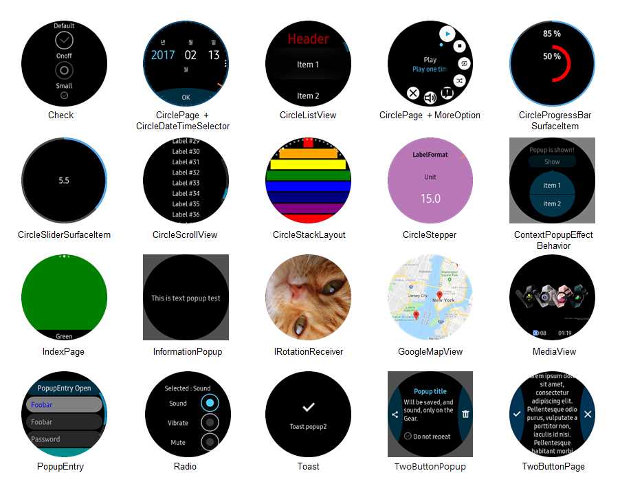

# Tizen Wearable CircularUI

- [Introduction](#introduction)
- [Controls](#controls)
- [Prerequisite](#prerequisite)
- [How to use CircularUI](#how-to-use-circularui)
- [Sample and Test application using CircularUI](#sample-and-test-application-using-circularui)

## Introduction
The Tizen Wearable CircularUI project is a set of helpful extensions of the Xamarin Forms framework. 
The aim of the Tizen Wearable CircularUI project is to develop an open source software motivate software developer to creating Tizen Wearable Xamarin Forms app more easily and efficiently.  
The binaries are available via NuGet (package name **Tizen.Wearable.CircularUI**) 

_Xamarin Forms provides cross-platform APIs, but this project are only worked on the Samsung Gear device that support Tizen .NET._ 

## Controls
The Tizen Wearable CircularUI project provides you the following UI controls:

- Check : A subclass of Xamarin.Forms.Switch control supports Tizen specific style.
- CircleDateTimeSelector : A control to select date or time fits in the circular screen.
- CircleListView : A subclass of Xamarin.Forms.ListView control fits in the circular screen and has the circular scrollbar.
- CirclePage : A subclass of Xamarin.Forms.Page that can show Circular ProgressBar and Circular Slider and the button on the bottom of the screen. it can also show MenuItems on the circular menu.(MoreOption)
- CircleProgressBarSurfaceItem : A control fits in the circular screen. it can be shown in CirclePage only.
- CircleSliderSurfaceItem : A Slider control that responds to the bezel action and fits in the circular screen.
- CircleScrollView : A subclass of Xamarin.Forms.ScrollView that can be scrolled by the bezel action.
- CircleStackLayout : A container to layout children linear in the circular area.
- CircleStepper : A control to select a number of steps fits in the circular screen.
- CircleSurfaceEffectBehavior : The CircleSurfaceEffectBehavior is an effect which allows you to insert views that require CircleSurface.
- TwoButtonPopup : A popup has two buttons on the left and right side of the circular screen.
- ConfirmPopupEffect : the effect to show a small popup has one or two button sticky with any control.
- IndexPage : A subclass of multiple pages that can slide child page horizontal and has dots on top of the screen for the number of child pages.
- InformationPopup : A popup has a control to show progress and one button on the bottom side of the circular screen.
- IRotationReceiver : A event receiver for using the bezel action.
- Radio : A radio control.
- PopupEntry : The PopupEntry is a class that extends Xamarin.Forms.Entry. It makes a new layer when editing text on the entry.
- Toast : A popup for simple feedback.
- TwoButtonPage : A subclass of Xamarin.Forms.Page has two buttons on the left and right side of the circular screen.

## Prerequisite
 - Visual Studio 2017
 - Visual Studio Tools for Tizen
     - [How to install Visual Studio Tools for Tizen](https://developer.tizen.org/development/visual-studio-tools-tizen/installing-visual-studio-tools-tizen)
 - Installing Tizen Wearable emulator image (WEARABLE-4.0-Emulator or WEARABLE-5.0-Emulator)

## How to use CircularUI
- [QuickStart](doc/guide/Quickstart.md)

- The [API Reference](https://samsung.github.io/Tizen.CircularUI/api/index.html) is available on the web to browse.
- The [API Guide](https://samsung.github.io/Tizen.CircularUI/index.html) is available on the web to browse.

## Sample and Test application using CircularUI

<table>
  <tr>
    <th></th>
    <th>Screenshot</th>
    <th>Description</th>
  </tr>
  <tr>
    <td>WearableUIGallery</td>
    <td></td>
    <td>This application was created to check the basic behavior of CircularUI API. It contains all the controls of the CircularUI API, and the functions of each control consist of one TC or several TCs depending on the characteristics of the control. 
    - Install guide : sdb install org.tizen.example.WearableUIGallery.Tizen.Wearable-1.0.0.tpk  
    <a href="https://github.com/Samsung/Tizen.CircularUI/tree/master/test/WearableUIGallery">Source</a></td>
  </tr>
  <tr>
    <td>SimpleTextWatchface</td>
    <td></td>
    <td>This application was created to check the default behavior of the Watchface API.  
    - Install guide : sdb install org.tizen.example.SimpleTextWatchface-1.0.0.tpk  
    - Test guide :  
    1) Touch and hold on Watchface of Main page  
    2) Move to left on watchface list and select SimpleTextWatchface icon  
    3) You can see `SimpleTextWatchface` on Watchface of Main page  
        <a href="https://github.com/Samsung/Tizen.CircularUI/tree/master/test/SimpleTextWatchface">Source</a> </td>
  </tr>
  <tr>
    <td>XUIComponents</td>
    <td></td>
    <td>This application is similar to the UIComponents application using the native API. The functions of each control consist of several test cases depending on the characteristics of the control.  
    - Install guide : sdb install org.tizen.example.UIComponents.Tizen.Wearable-1.0.0.tpk  
        <a href="https://github.com/Samsung/Tizen.CircularUI/tree/master/sample/XUIComponents">Source</a></td>
  </tr>
</table>