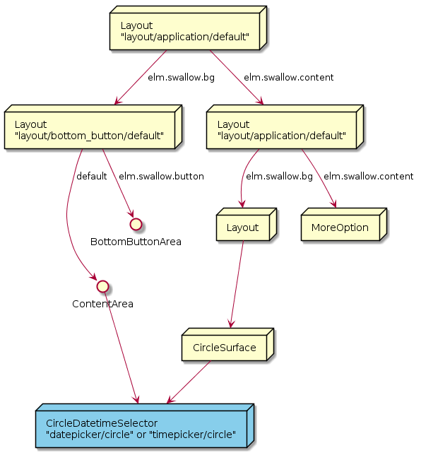
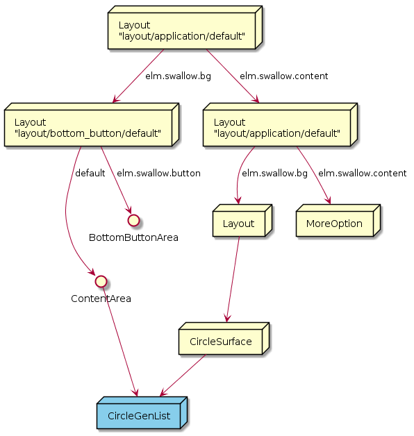
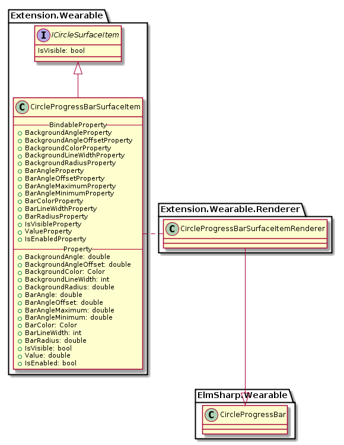
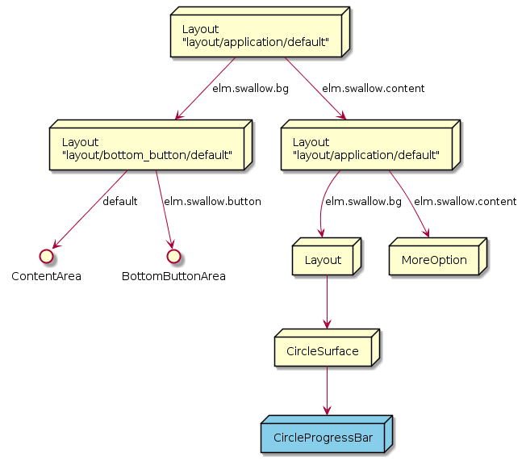
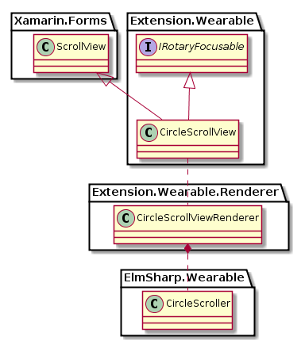
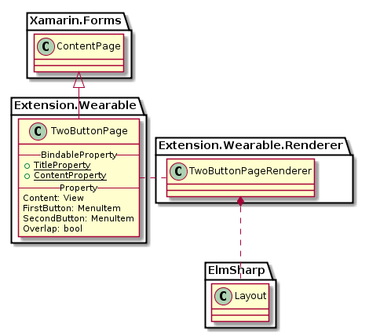
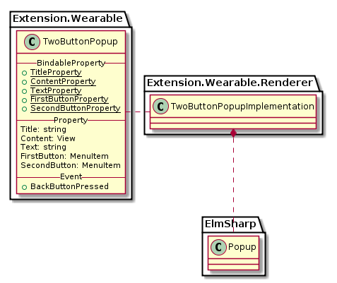
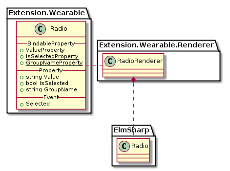
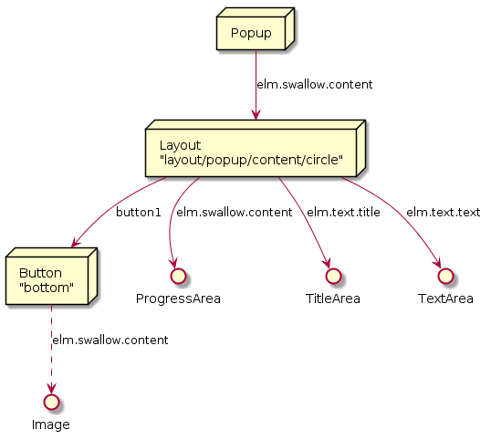

# Circular UI Design files

Design files for Circular UI on Xamarin Forms

# CirclePage


`CirclePage`는 `CircleSurface`가 필요한 View들을 넣을 수 있는 `ContentPage`와 흡사하며, `ToolbarItems`를 `MoreOption`으로 보여줄 수 있다. 
또한 ActionButton 을 가지고 있고, `MenuItem` type으로 text, icon, command등을 사용할 수 있다.
`ICircleSurfaceItem`으로 View는 아니지만 CircleSurface에 표현되는 object들을 `CircleSurface`를 통해 표현한다.


`CirclePage`의 class Diagram은 위와 같으며, Class 중 Xamarin interface 부분은 다음과 같이 Code로 표현된다.

 ```C#
 public class CirclePage : Xamarin.Forms.ContentPage
 {
     public static readonly BindableProperty RotaryEventCunsumerProperty;

     public IList<ICircleSurfaceItem> CircleSurfaceItems { get; }
     public MenuItem ActionButton { get; set; }
     public string RotaryFocusTargetName { get; set; }
     public IRotaryFocusable RotaryFocusObject { get; set; }
 }

 public interface ICircleSurfaceItem
 {
     public bool IsVisible { get; set; }
 }

 public interface IRotaryFocusable
 {
     event RotaryEventHandler Rotated;
 }

 public delegate RotaryEventHandler(RotaryEventArgs args);

 public class RotaryEventArgs : EventArgs
 {
     public bool IsClockwise { get; set; }
 }

 ```
 이미 Page에 속성으로 있는 `Content` Property를 사용하며,  
**현재 Page에서 Bezel Action을 받을 (Rotary Event를 가져갈) 단 하나의 Consumer를 `RotaryFocusObject` property에 등록할 수 있다.  
 Page가 제거되거나, Hide 될때, `RotaryFocusObject`는 동작을 중단하며, 만약 Hide에서 Show 될때,
 `RotaryFocusObject`에 등록된 Child가 있다면, Rotary Event를 가져가게 된다.**

 또한 `RotaryFocusTargetName` Property를 사용해 Xaml상의 이름으로 RotaryFocusObject를 정할 수 있다.

 Example:
 ```xml
<w:CirclePage BackgroundColor="Blue" RotaryFocusTargetName="DateSelector">
<w:CirclePage.Content>
    <StackLayout>
        <w:CircleDateTimeSelector x:Name="DateSelector"/>
        <w:Button Text="OK"/>
    </StackLayout>
</w:CirclePage.Content>
</w:CirclePage>
 ```

CirclePage의 ElmSharp level에서의 Scene Graph는 다음과 같이 표현된다.


# CircleDateTimeSelector

`CircleDateTimeSelector`는 `ElmSharp.Wearable.CircleDatetimeSelector` 의 두가지 style "datepicker/circle", "timepicker/circle"를 표현하는 View로 Style별로 각기 "년:달:일", "시:분:AM/PM" 의 각 항목을 touch하여 Bezel Action으로 값을 변경할 수 있는 View이다.  
또한 System Default 크기가 360 X 360 (px) 크기로 full screen을 모두 차지하는 View이다.
이러한 Circle 관련 Widget은 `CircleSurface`가 있는 `Page`(`CirclePage`)의 Child로만 표현될 수 있으며,  
Bezel Action을 받기 위해 `CirclePage`의 `RotaryEventConsumer` property로 등록 되야 한다.


각 Picker는 View의 영역에 선택 가능한 Picker들로 이루어져 있으며, `CircleSurface`에서 원형 Surface의 주변을 둘러 Value를 선택할 수 있다.
이때 위 그림에서 붉은색으로 보이는 부분이 Value 선택을 위한 Marker이다.

CircleDatePicker와 `CircleTimePicker`의 Class Diagram은 아래와 같다.


위 Class 중 Xamarin interface 부분은 다음과 같이 Code로 표현된다.

 ```C#
 public class CircleDateTimeSelector : Xamarin.Forms.View, IRotaryEventConsumer
 {
     public static readonly BindableProperty MarkerColorProperty;
     public static readonly BindableProperty ValueTypeProperty;
     public static readonly BindableProperty DateTimeProperty;
     public static readonly BindableProperty MaximumDateProperty;
     public static readonly BindableProperty MinimumDateProperty;
     public static readonly BindableProperty IsVisibleOfYearProperty;
     public static readonly BindableProperty IsVisibleOfMonthProperty;
     public static readonly BindableProperty IsVisibleOfDateProperty;
     public static readonly BindableProperty IsVisibleOfHourProperty;
     public static readonly BindableProperty IsVisibleOfMinuteProperty;
     public static readonly BindableProperty IsVisibleOfAmPmProperty;

     public Color MarkerColor { get; set; }
     public DateTimeType ValueType { get; set; }
     public DateTime DateTime { get; set; }
     public DateTime MaximumDate { get; set; }
     public DateTime MinimumDate { get; set; }
     public bool IsVisibleOfYear { get; set; }
     public bool IsVisibleOfMonth { get; set; }
     public bool IsVisibleOfDate { get; set; }
     public bool IsVisibleOfHour { get; set; }
     public bool IsVisibleOfMinute { get; set; }
     public bool IsVisibleOfAmPm { get; set; }
 }

 public enum DateTimeType
 {
     Time,
     Date
 }

 ```

`CircleDateTimeSelector`는 Marker의 색을 바꾸기 위한 `Color` Property를 가지고 있으며,
`ValueType` Property를 변경하여 원하는 값을 선택할 수 있다.
`CirclePage`의 `RotaryEventConsumer` property에 Set되면 Bezel Action에 반응할 수 있게 된다.

* MarkerColor : `CircleSurface` 상에서 값을 선택하기 위한 Marker의 색을 변경한다.
* ValueType : Time이면 UI가 시간 선택이 가능하게, Date라면 날짜 선택이 가능하게 변경된다.
* DateTime : 날짜/시간을 가져오거나, 설정한다.
* MaximumDate : ValueType이 Date일때, 최대 날짜를 가져오거나 설정한다.
* MimimumDate : ValueType이 Date일때, 최소 날짜를 가져오거나 설정한다.
* IsVisibleOfYear : 년도항목이 보여질지 여부를 설정한다.
* IsVisibleOfMonth : 날짜의 월항목이 보여질지 여부를 설정한다.
* IsVisibleOfDate : 날짜의 일자항목이 보여질지 여부를 설정한다.
* IsVisibleOfHour : 시간의 시항목이 보여질지 여부를 설정한다.
* IsVisibleOfMinute : 시간의 분항목이 보여질지 여부를 설정한다.
* IsVisibleOfAmPm : 시간의 AM/PM항목이 보여질지 여부를 설정한다.

각 Picker는 다음과 같은 Scene Graph를 가진다.



# CircleListView
`CircleListView`는 `ElmSharp.Wearable.CircleGenList`를 표현하는 View이다.
기존의 `ListView`와 동일하나, Scroller가 `CircleSurface`에 Rendering된다.
또한 Bezel Action으로 List를 움직일 수 있다.


`CircleListView`의 Class Diagram은 아래와 같다.


위 Class 중 Xamarin interface 부분은 다음과 같이 Code로 표현된다.

 ```C#
 public class CircleListView : Xamarin.Forms.ListView, IRotaryEventConsumer
 {
 }
 ```
기존 `Genlist`에 비해 추가된 기능은 없으나, Bezel Action으로 Scrolling을 하기 위해서는 `CirclePage`의 `RotaryEventConsumer` property에 set 되어야 한다.

`CircleListView`는 ElmSharp Level에서 다음과 같은 Scene Graph로 표현된다.



# CircleProgressBarSurfaceItem

`CircleProgressBarSurfaceItem`는 `ElmSharp.Wearable.CircleProgressBar`를 표현하며, `CirclePage`에 Behavior 형태로 적용된다.

`ElmSharp.Wearable.CircleProgressBar`는 `CircleSurface`에만 Drawing되며, Content영역에 넣을 Object가 존재하지 않기 때문에, `CirclePage`의 Behavior로 동작한다.


`CircleProgressBarSurfaceItem`의 Class Diagram은 아래와 같다.



`CircleProgressBarSurfaceItem`는 `CirclePage`에만 적용되는 Behavior로 `CircleSurface` 영역에 Bar와 Background 2개의 Arc(원호)가 그려지며, 위 Class 중 Xamarin interface 부분은 다음과 같이 Code로 표현된다.

```C#
public class CircleProgressBarSurfaceItem : ICircleSurfaceItem
{
    public static readonly BindableProperty BackgroundAngleProperty;
    public static readonly BindableProperty BackgroundAngleOffsetProperty;
    public static readonly BindableProperty BackgroundColorProperty;
    public static readonly BindableProperty BackgroundLineWidthProperty;
    public static readonly BindableProperty BackgroundRadiusProperty;

    public static readonly BindableProperty BarAngleProperty;
    public static readonly BindableProperty BarAngleOffsetProperty;
    public static readonly BindableProperty BarAngleMaximumProperty;
    public static readonly BindableProperty BarAngleMinimumProperty;
    public static readonly BindableProperty BarColorProperty;
    public static readonly BindableProperty BarLineWidthProperty;
    public static readonly BindableProperty BarRadiusProperty;

    public static readonly BindableProperty IsVisibleProperty;
    public static readonly BindableProperty ValueProperty;
    public static readonly BindableProperty IsEnabled;

    public double BackgroundAngle { get; set; }
    public double BackgroundAngleOffset { get; set; }
    public Color BackgroundColor { get; set; }
    public int BackgroundLineWidth { get; set; }
    public double BackgroundRadius { get; set; }

    public double BarAngle { get; set ; }
    public double BarAngleOffset { get; set; }
    public double BarAngleMaximum { get; set; }
    public double BarAngleMinimum { get; set; }
    public Color BarColor { get; set; }
    public int BarLineWidth { get; set; }
    public double BarRadius { get; set; }

    public bool IsVisible { get; set; }
    public double Value { get; set; }
    public bool IsEnabled { get; set; }
}
```
각 Property의 동작은 다음과 같다.


* IsVisible : ProgressBar를 보이거나 안보이게 한다.
* IsEnabled : ProgressBar를 활성화 시키거나 비활성화 시킨다.


`CircleProgressBarBehavior` ElmSharp Level에서 다음과 같은 Scene Graph로 표현된다.



# CircleScrollView

`CircleScrollView`는 `ElmSharp.Wearable.CircleScroller`을 표현하는 View이다.

기존 `ScrollView`와 같지만, Scroller가 `CircleSurface`에 Rendering되며, Bezel Action으로 Scrolling이 가능하다.


`CircleScrollView`의 Class Diagram은 아래와 같다.



기존 `ScrollView`에 비해 추가된 기능은 없으나, Bezel Action으로 Scrolling을 하기 위해서는 `CirclePage`의 `RotaryEventConsumer` property에 set 되어야 한다.

`CircleScrollView`는 ElmSharp Level에서 다음과 같은 Scene Graph로 표현된다.


# CircleSliderSurfaceItem

`CircleSliderSurfaceItem`는 `ElmSharp.Wearable.CircleSlider`를 표현하며, `CirclePage`에 Behavior 형태로 적용된다.

`ElmSharp.Wearable.CircleSlider`는 `CircleSurface`에만 Drawing되며, Content영역에 넣을 Object가 존재하지 않기 때문에, `CirclePage`의 Behavior로 동작한다.


`CircleSliderSurfaceItem`의 Class Diagram은 아래와 같다.


`CircleSliderSurfaceItem`는 `CirclePage`에만 적용되는 Behavior로 `CircleSurface` 영역에 Bar와 Background 2개의 Arc(원호)가 그려지며, Value값을 조절하거나, Bezel Action으로 Bar의 Size를 조절할 수 있다.
위 Class 중 Xamarin interface 부분은 다음과 같이 Code로 표현된다.

```C#
public class CircleSliderSurfaceItem : ICircleSurfaceItem
{
    public static readonly BindableProperty BackgroundAngleProperty;
    public static readonly BindableProperty BackgroundAngleOffsetProperty;
    public static readonly BindableProperty BackgroundColorProperty;
    public static readonly BindableProperty BackgroundLineWidthProperty;
    public static readonly BindableProperty BackgroundRadiusProperty;

    public static readonly BindableProperty BarAngleProperty;
    public static readonly BindableProperty BarAngleOffsetProperty;
    public static readonly BindableProperty BarAngleMaximumProperty;
    public static readonly BindableProperty BarAngleMinimumProperty;
    public static readonly BindableProperty BarColorProperty;
    public static readonly BindableProperty BarLineWidthProperty;
    public static readonly BindableProperty BarRadiusProperty;

    public static readonly BindableProperty MinumumProperty;
    public static readonly BindableProperty MaximumProperty;
    public static readonly BindableProperty ValueProperty;
    public static readonly BindableProperty IsVisibleProperty;
    public static readonly BindableProperty IsEnabledProperty;

    public double BackgroundAngle { get; set; }
    public double BackgroundAngleOffset { get; set; }
    public Color BackgroundColor { get; set; }
    public int BackgroundLineWidth { get; set; }
    public double BackgroundRadius { get; set; }

    public double BarAngle { get; set; }
    public double BarAngleOffset { get; set; }
    public double BarAngleMaximum { get; set; }
    public double BarAngleMinimum { get; set; }
    public Color BarColor { get; set; }
    public int BarLineWidth { get; set; }
    public double BarRadius { get; set; }

    public double Minimum { get; set; }
    public double Maximum { get; set; }
    public double Value { get; set; }
    public double Increment { get; set; }
    public bool IsVisible { get; set; }
    public bool IsEnabled { get; set; }
}
```

각 Property의 동작은 `CircleProgressBarSurfaceItem`의 동일한 Property와 같으며, `CircleProgressBarSurfaceItem`의 Value가 0~1 사이 값이라면, `CircleSliderSurfaceItem`는 `Minimum` ~ `Maximum`의 값으로 조절 가능하다. Default 값은 0~1이다.


* Minimum : Value의 최소값이다. (Default 0)
* Maximum : Value의 최대값이다. (Default 1)
* IsVisible : Slider를 보이거나 안보이게 한다.
* IsEnabled : ProgressBar를 활성화 시키거나 비활성화 시킨다.

`CircleSliderSurfaceItem` ElmSharp Level에서 다음과 같은 Scene Graph로 표현된다.


# CircleStepper

`CircleStepper`는 `ElmSharp.Wearable.CircleSpinner`를 표현하는 View로 Xamarin의 `Stepper`를 확장한다.
화면상의 View를 선택하면, Bezel Action을 통해 View의 Value를 변경할 수 있다.


`CircleStepper`의 Class Diagram은 아래와 같다.


위 Class 중 Xamarin interface 부분은 다음과 같이 Code로 표현된다.

 ```C#
 public class CircleStepper : Xamarin.Forms.Stepper, IRotaryEventConsumer
 {
     public static readonly BindableProperty MarkerColorProperty;
     public static readonly BindableProperty MarkerLineWidthProperty;
     public static readonly BindableProperty LabelFormatProperty;

     public Color MarkerColor { get; set; }
     public int MarkerLineWidth { get; set; }
     public string LabelFormat { get; set; }
 }
 ```
기존 `Stepper`에 Marker color, MarkerLineWidth, LabelFormat이 추가되었습니다. 이 View의 Value를 변경하기 위해 Bezel Action을 하기 위해서는 `CirclePage`의 `RotaryEventConsumer` property에 set 되어야 한다.


* MarkerColor : Bezel Action시에 움직이는 Marker의 색
* MarkerLineWidth : Bezel Action시에 움직이는 Marker의 길이
* LabelFormat : Value가 보여지는 형식

`CircleStepper`는 ElmSharp Level에서 다음과 같은 Scene Graph로 표현된다.


# IndexPage

`IndexPage`는 `ElmSharp.Index`를 표현하며, `Xamarin.Forms`의 `MultiPage`를 확장한다.

`Page`를 `MultiPage`의 `Chidren`으로 `Add`하거나 `Remove`하면 `Index item`이 `Page`개수에 따라 자동으로 추가 및 삭제된다.

 `Xamarin.Forms`의 `CarouselPage`과 동작이 유사하며, `Index`가 추가된 형태이다.
 
 `Page`를 scroll하면 `Index`가 내부적으로 select 동작한다.

 현재 선택된 `Page`와 `Index` 값은 `CurrentPage`값을 통해 알 수 있으며, `Page(Index)` 변경은 `CurrentPageChanged` 이벤트로 전달 받을 수 있다.


`IndexPage`의 Class Diagram은 아래와 같다.


위 Class 중 Xamarin interface 부분은 다음과 같이 Code로 표현된다.

 ```C#
 public class IndexPage : Xamarin.Forms.MultiPage<ContentPage>
 {
 }
 ```

 ElmSharp Level에서의 Scene Graph는 다음과 같이 표현된다.


# Check

`Check`는 `ElmSharp.Check`를 표현하는 View로 Xamarin의 `Switch`를 확장한다.

 `Xamarin Switch`에서는 on&off 형태의 Check만을 제공하므로,
 Tizen Wearable의 Check GUI 지원을 위하여 이를 확장하여 API를 제공한다.


`Check`의 Class Diagram은 아래와 같다.


위 Class 중 Xamarin interface 부분은 다음과 같이 Code로 표현된다.

 ```C#
 public class Check : Switch
 {
     public static readonly BindableProperty DisplayStyleProperty;

     public CheckDisplayStyle DisplayStyle { get;  set; }
 }

 public enum CheckDisplayStyle
 {
      Default,
      Onoff,
      Small
 }

 ```

# TwoButtonPage


TwoButtonPage는 Circle 에 내접하는 사각형 영역을 Contents 영역으로 가지고 있는 Page이다.
또한 2개의 버튼 영역을 가지고 있다.



TwoButtonPage의 Diagram은 위와 같으며, 다음과 같이 코드로 표현된다.
`Overlap` 가 참인 경우 `Content`가 `FirstButton`, `SecondButton` 과 겹치며, 반대의 경우 Content가 버튼들과 겹치지 않는다.

```C#
public class TwoButtonPage : ContentPage
{
    public static readonly BindableProperty TitleProperty;
    public static readonly BindableProperty ContentProperty;

    public bool Overlap { get; set; }
    public MenuItem FirstButton { get; set; }
    public MenuItem SecondButton { get; set; }
}
```

ElmSharp의 Popup을 사용하지 않으며, Layout이므로 Parent가 존재한다.

ElmSharp Level에서의 Scene Graph는 다음과 같이 표현된다.


# TwoButtonPopup


`TwoButtonPopup`는 `ElmSharp.Popup`의 `two-button popup`형태를 표현하며, 화면을 구성하는 layer의 최상단에 Popup형태로 display 된다.




TwoButtonPopup Diagram은 위와 같으며, 다음과 같이 코드로 표현된다.

```C#
public class TwoButtonPopup : BindableObject
{
    public static readonly BindableProperty TitleProperty;
    public static readonly BindableProperty TextProperty;
    public static readonly BindableProperty ContentProperty;
    public static readonly BindableProperty FirstButtonProperty
    public static readonly BindableProperty SecondButtonProperty

    public event EventHandler BackButtonPressed;

    public View Content { get; set; }
    public string Title { get; set; }
    public string Text { get; set; }
    public MenuItem FirstButton { get; set; }
    public MenuItem SecondButton { get; set; }
}
```

ElmSharp의 Popup을 사용하며, Layout이 아니므로 Parent가 존재하지 않는다(Xaml을 사용하여 Layouting 불가).

ElmSharp Level에서의 Scene Graph는 다음과 같이 표현된다.


# Radio


`Radio`는 `ElmSharp`의 `Radio` `widget`을 표현한다.




Radio Diagram은 위와 같으며, 다음과 같이 코드로 표현된다.

```C#
public class Radio : View
{
    public static readonly BindableProperty ValueProperty;
    public static readonly BindableProperty IsSelectedProperty;
    public static readonly BindableProperty GroupNameProperty;

    public event EventHandler Selected;

    public string Value { get; set; }
    public bool IsSelected { get; set; }
    public string GroupName { get; set; }
}
```

# ContextPopupEffectBehavior


`ContextPopupEffectBehavior`는 특정 widget에 비례하거나 화면상의 어느 위치에 1개 혹은 2개의 버튼을 가지는 popup을 나타낼 수 있습니다.

Accept 버튼을 기본으로 하나 가지며, 기본으로 공백 Text가 Accept에 표시 됩니다.

`Visibility`가 `True`가 될때, 화면에 나타나며,
Accept나 Cancel시에 주어진 Command가 실행 되며 자동으로 사라지며, `Visibility`가 `False`가 됩니다.

```xml
<?xml version="1.0" encoding="utf-8" ?>
<w:CirclePage
    x:Class="WearableUIGallery.TC.TCConfirm"
    xmlns="http://xamarin.com/schemas/2014/forms"
    xmlns:x="http://schemas.microsoft.com/winfx/2009/xaml"
    xmlns:w="clr-namespace:Tizen.Wearable.CircularUI.Forms;assembly=Tizen.Wearable.CircularUI.Forms"
    x:Name="mypage">
    <ContentPage.Content>
        <AbsoluteLayout>
            <w:Check
                x:Name="CtxCheck"
                AbsoluteLayout.LayoutBounds="0.5, 0.2, 1, 0.25"
                AbsoluteLayout.LayoutFlags="All"
                HorizontalOptions="CenterAndExpand"
                IsToggled="False"
                VerticalOptions="CenterAndExpand">
                <w:Check.Behaviors>
                    <w:ContextPopupEffectBehavior
                        AcceptCommand="{Binding AcceptedCommand, Source={x:Reference mypage}}"
                        AcceptText="Yes"
                        CancelCommand="{Binding CancelCommand, Source={x:Reference mypage}}"
                        CancelText="No"
                        Visibility="{Binding IsToggled, Source={x:Reference CtxCheck}, Mode=TwoWay}"
                        PositionOption="BottomOfView"/>
                </w:Check.Behaviors>
            </w:Check>
        </AbsoluteLayout>
    </ContentPage.Content>
</w:CirclePage>
```

이 Behavior의 Xamarin Forms 속성은 다음 코드와 같다.

```cs
public class ContextPopupEffectBehavior : Behavior<View>
{
    public static BindableProperty AcceptTextProperty = BindableProperty.Create(nameof(AcceptText), typeof(string), typeof(ContextPopupEffectBehavior), null);
    public static BindableProperty AcceptCommandProperty = BindableProperty.Create(nameof(AcceptCommand), typeof(ICommand), typeof(ContextPopupEffectBehavior), null);
    public static BindableProperty AcceptCommandParameterProperty = BindableProperty.Create(nameof(AcceptCommandParameter), typeof(object), typeof(ContextPopupEffectBehavior), null);
    public static BindableProperty CancelTextProperty = BindableProperty.Create(nameof(CancelText), typeof(string), typeof(ContextPopupEffectBehavior), null);
    public static BindableProperty CancelCommandProperty = BindableProperty.Create(nameof(CancelCommand), typeof(ICommand), typeof(ContextPopupEffectBehavior), null);
    public static BindableProperty CancelCommandParameterProperty = BindableProperty.Create(nameof(CancelCommandParameter), typeof(object), typeof(ContextPopupEffectBehavior), null);
    public static BindableProperty VisibilityProperty = BindableProperty.Create(nameof(Visibility), typeof(bool), typeof(ContextPopupEffectBehavior), false);
    public static BindableProperty PositionOptionProperty = BindableProperty.Create(nameof(PositionOption), typeof(PositionOption), typeof(ContextPopupEffectBehavior), PositionOption.BottomOfView);
    public static BindableProperty OffsetProperty = BindableProperty.Create(nameof(Offset), typeof(Point), typeof(ContextPopupEffectBehavior), default(Point));
    public string AcceptText { get; set; }
    public ICommand AcceptCommand { get; set; }
    public object AcceptCommandParameter { get; set; }
    public string CancelText { get; set; }
    public ICommand CancelCommand { get; set; }
    public object CancelCommandParameter { get; set; }
    public bool Visibility { get; set; }
    public PositionOption PositionOption { get; set; }
    public Point Offset { get; set; }
}
public enum PositionOption
{
    BottomOfView,
    CenterOfWindow,
    Absolute,
    Relative
}
```

각 속성의 의미는 다음과 같다.

* AcceptText : Accep 버튼에서 쓰일 Text 값이 주어지지 않을 경우 Accept Button은 공백으로 표시된다.
* AcceptCommand : Accept 시에 수행 될 Command
* AcceptCommandParameter : AcceptCommand에 적용 될 Parameter
* CancelText : Cancel 버튼으로 쓰일 Text
* CancelCommand : Cancel 시에 수행 될 Command, popup 외부를 선택해서 popup이 사라져도 수행된다.
* CancelCommandParameter : CancelCommand에 적용 될 Parameter
* Visibility : True시에 Popup이 나타나며, False가 되면 사라집니다.
* PositionOption 
  * `BottomOfView` : Effect를 사용한 View의 하단에 popup이 나타납니다. View의 중앙에서 Offset만큼 위치가 변경됩니다.
  * `CenterOfWindow` : 화면 중앙에 Popup에서 Offset만큼 이동합니다.
  * `Absolute` : Offset의 값을 X, Y로 하여 popup이 화면에 배치됩니다.
  * `Relative` : Offset.X * Window.Width, Offset.Y * Window.Height 에 배치됩니다.
* Offset : PositionOption에 따라 적용되는 값. 0,0 시작 위치는 popup 위의 꼭지 부분 입니다.
# Toast

`Toast`는  간단한 메세지와 icon 을 나타낼 수 있습니다.
duration 설정을 통해 'Toast' pop-up의 display 시간을 설정 가능하며, duration 시간후 자동으로 popup은 사라집니다. 


 Xamarin interface 부분은 다음과 같이 Code로 표현됩니다.

 ```C#
 public sealed class Toast
 {
     public static void DisplayText(string text, int duration = 3000)

     public static void DisplayIconText(string text, FileImageSource icon, int duration = 3000)
 }
 ```

 `Toast`의 사용방법은 아래와 같습니다.
 ```C#
    Toast.DisplayText("Toast message", 3000);

    Toast.DisplayIconText("Toast message", new FileImageSource { File = "icon_image.png" }, 3000);
 ```


# InformationPopup


`InformationPopup`는 `ElmSharp.Popup`의 여러가지 형태의 popup을 표현하며, 화면을 구성하는 layer의 최상단에 Popup형태로 display 된다.
IsProgressRunning이 true일 경우 `small circle progress`가 화면 중앙에 표시되며 pulse 동작을 한다. 이때 title의 text는 무시된다.


InformationPopup Diagram은 위와 같으며, 다음과 같이 코드로 표현된다.

```C#
public class InformationPopup : BindableObject
{
    public static readonly BindableProperty IsProgressRunningProperty
    public static readonly BindableProperty TitleProperty;
    public static readonly BindableProperty TextProperty;
    public static readonly BindableProperty BottomButtonProperty;

    public event EventHandler BackButtonPressed;

    public bool IsProgressRunning { get; set; }
    public string Title { get; set; }
    public string Text { get; set; }
    public MenuItem BottomButton { get; set; }
}
```

ElmSharp의 Popup을 사용하며, Layout이 아니므로 Parent가 존재하지 않는다(Xaml을 사용하여 Layouting 불가).

ElmSharp Level에서의 Scene Graph는 다음과 같이 표현된다.



# CircleStackLayout


CircleStackLayout 은 StackLayout과 동일하지만, 원형 화면에 맞는 형태로 내부 컴포넌트의 배치를 한다.

사각형 컴포넌트가 원에 내접하게 배치되며, 배치 후에 margin등이 계산된다.

```C#
public class CircleStackLayout : StackLayout
{
}
```

