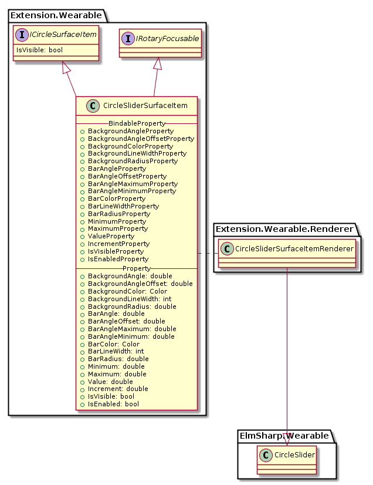
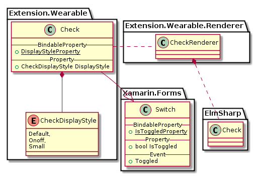

# Circular UI Design files

Design files for Circular UI on Xamarin Forms

# CirclePage


`CirclePage`는 `CircleSurface`가 필요한 View들을 넣을 수 있는 `ContentPage`와 흡사하며, `ToolbarItems`를 `MoreOption`으로 보여줄 수 있다. 
또한 Left, Right, Bottom 3개 영역에 `ButtonItems`을 사용해 Button을 보여준다.
`ICircleSurfaceItem`으로 View는 아니지만 CircleSurface에 표현되는 object들을 `CircleSurface`를 통해 표현한다.


`CirclePage`의 class Diagram은 위와 같으며, Class 중 Xamarin interface 부분은 다음과 같이 Code로 표현된다.

 ```C#
 public class CirclePage : Xamarin.Forms.ContentPage
 {
     public static readonly BindableProperty RotaryEventCunsumerProperty; 

     public IRotaryEventConsumer RotaryEventConsumer { get; set; }
     public IList<CircleButtonsItem> ButtonItems { get; }
     public IList<ICircleSurfaceItem> CircleSurfaceItems { get; }
 }

 public interface ICircleSurfaceItem
 {
     public bool IsVisible { get; set; }
 }

 public interface IRotaryEventConsumer
 {
     event RotaryEventHandler Rotated;
 }

 public delegate RotaryEventHandler(RotaryEventArgs args);

 public class RotaryEventArgs : EventArgs
 {
     public bool IsClockwise { get; set; }
 }

 public CircleButtonsItem : Xamarin.Forms.MenuItem
 {
     public CircleButtonsItemDirection Direction { get; set; }
 }

 public enum CircleButtonsItemDirection
 {
     Left,
     Right,
     Bottom
 }
 ```
 이미 Page에 속성으로 있는 `ToolbarItems`과 `Content` Property를 사용하며,  
**현재 Page에서 Bezel Action을 받을 (Rotary Event를 가져갈) 단 하나의 Consumer를 `RotaryEventConsumer` property에 등록할 수 있다.  
 Page가 제거되거나, Hide 될때, `RotaryEventConsumer`는 동작을 중단하며, 만약 Hide에서 Show 될때,
 `RotaryEventConsumer`에 등록된 Child가 있다면, Rotary Event를 가져가게 된다.**

 ElmSharp level에서의 Scene Graph는 다음과 같이 표현된다.


# CircleDateTimeSelector

`CircleDateTimeSelector`는 `ElmSharp.Wearable.CircleDatetimeSelector` 의 두가지 style "datepicker/circle", "timepicker/circle"를 표현하는 View로 Style별로 각기 "년:달:일", "시:분:AM/PM" 의 각 항목을 touch하여 Bezel Action으로 값을 변경할 수 있는 View이다.  
또한 System Default 크기가 360 X 360 (px) 크기로 full screen을 모두 차지하는 View이다.
이러한 Circle 관련 Widget은 `CircleSurface`가 있는 `Page`(`CirclePage`)의 Child로만 표현될 수 있으며,  
Bezel Action을 받기 위해 `CirclePage`의 `RotaryEventConsumer` property로 등록 되야 한다.


각 Picker는 View의 영역에 선택 가능한 Picker들로 이루어져 있으며, `CircleSurface`에서 원형 Surface의 주변을 둘러 Value를 선택할 수 있다.
이때 위 그림에서 붉은색으로 보이는 부분이 Value 선택을 위한 Marker이다.

CircleDatePicker와 `CircleTimePicker`의 Class Diagram은 아래와 같다.


위 Class 중 Xamarin interface 부분은 다음과 같이 Code로 표현된다.

 ```C#
 public class CircleDateTimeSelector : Xamarin.Forms.View, IRotaryEventConsumer
 {
     public static readonly BindableProperty ColorProperty; 
     public static readonly BindableProperty ValueTypeProperty; 
     public static readonly BindableProperty DateTimeProperty;
     public static readonly BindableProperty MaximumDateProperty;
     public static readonly BindableProperty MinimumDateProperty;

     public Color Color { get; set; }
     public DateTimeType ValueType { get; set; }
     public DateTime DateTime { get; set; }
     public DateTime MaximumDate { get; set; }
     public DateTime MinimumDate { get; set; }
 }

 public enum DateTimeType
 {
     Time,
     Date
 }
 ```

`CircleDateTimeSelector`는 Marker의 색을 바꾸기 위한 `Color` Property를 가지고 있으며,
`ValueType` Property를 변경하여 원하는 값을 선택할 수 있다.
`CirclePage`의 `RotaryEventConsumer` property에 Set되면 Bezel Action에 반응할 수 있게 된다.

* Color : `CircleSurface` 상에서 값을 선택하기 위한 Marker의 색을 변경한다.
* ValueType : Time이면 UI가 시간 선택이 가능하게, Date라면 날짜 선택이 가능하게 변경된다.
* DateTime : 날짜/시간을 가져오거나, 설정한다.
* MaximumDate : ValueType이 Date일때, 최대 날짜를 가져오거나 설정한다.
* MimimumDate : ValueType이 Date일때, 최소 날짜를 가져오거나 설정한다.

각 Picker는 다음과 같은 Scene Graph를 가진다.


# CircleListView
`CircleListView`는 `ElmSharp.Wearable.CircleGenList`를 표현하는 View이다.
기존의 `ListView`와 동일하나, Scroller가 `CircleSurface`에 Rendering된다.
또한 Bezel Action으로 List를 움직일 수 있다.


`CircleListView`의 Class Diagram은 아래와 같다.


위 Class 중 Xamarin interface 부분은 다음과 같이 Code로 표현된다.

 ```C#
 public class CircleListView : Xamarin.Forms.ListView, IRotaryEventConsumer
 {
 }
 ```
기존 `Genlist`에 비해 추가된 기능은 없으나, Bezel Action으로 Scrolling을 하기 위해서는 `CirclePage`의 `RotaryEventConsumer` property에 set 되어야 한다.

`CircleListView`는 ElmSharp Level에서 다음과 같은 Scene Graph로 표현된다.


# CircleProgressBarSurfaceItem

`CircleProgressBarSurfaceItem`는 `ElmSharp.Wearable.CircleProgressBar`를 표현하며, `CirclePage`에 Behavior 형태로 적용된다.

`ElmSharp.Wearable.CircleProgressBar`는 `CircleSurface`에만 Drawing되며, Content영역에 넣을 Object가 존재하지 않기 때문에, `CirclePage`의 Behavior로 동작한다.


`CircleProgressBarSurfaceItem`의 Class Diagram은 아래와 같다.


`CircleProgressBarSurfaceItem`는 `CirclePage`에만 적용되는 Behavior로 `CircleSurface` 영역에 Bar와 Background 2개의 Arc(원호)가 그려지며, 위 Class 중 Xamarin interface 부분은 다음과 같이 Code로 표현된다.

```C#
public class CircleProgressBarSurfaceItem : ICircleSurfaceItem
{
    public static readonly BindableProperty BackgroundAngleProperty;
    public static readonly BindableProperty BackgroundAngleOffsetProperty;
    public static readonly BindableProperty BackgroundColorProperty;
    public static readonly BindableProperty BackgroundLineWidthProperty;
    public static readonly BindableProperty BackgroundRadiusProperty;

    public static readonly BindableProperty BarAngleProperty;
    public static readonly BindableProperty BarAngleOffsetProperty;
    public static readonly BindableProperty BarAngleMaximumProperty;
    public static readonly BindableProperty BarAngleMinimumProperty;
    public static readonly BindableProperty BarColorProperty;
    public static readonly BindableProperty BarLineWidthProperty;
    public static readonly BindableProperty BarRadiusProperty;

    public static readonly BindableProperty IsVisibleProperty;
    public static readonly BindableProperty ValueProperty;
    public static readonly BindableProperty IsEnabled;

    public double BackgroundAngle { get; set; }
    public double BackgroundAngleOffset { get; set; }
    public Color BackgroundColor { get; set; }
    public int BackgroundLineWidth { get; set; }
    public double BackgroundRadius { get; set; }

    public double BarAngle { get; set ; }
    public double BarAngleOffset { get; set; }
    public double BarAngleMaximum { get; set; }
    public double BarAngleMinimum { get; set; }
    public Color BarColor { get; set; }
    public int BarLineWidth { get; set; }
    public double BarRadius { get; set; }

    public bool IsVisible { get; set; }
    public double Value { get; set; }
    public bool IsEnabled { get; set; }
}
```
각 Property의 동작은 다음과 같다.


* IsVisible : ProgressBar를 보이거나 안보이게 한다.
* IsEnabled : ProgressBar를 활성화 시키거나 비활성화 시킨다.


`CircleProgressBarBehavior` ElmSharp Level에서 다음과 같은 Scene Graph로 표현된다.


# CircleScrollView

`CircleScrollView`는 `ElmSharp.Wearable.CircleScroller`을 표현하는 View이다.

기존 `ScrollView`와 같지만, Scroller가 `CircleSurface`에 Rendering되며, Bezel Action으로 Scrolling이 가능하다.


`CircleScrollView`의 Class Diagram은 아래와 같다.


기존 `ScrollView`에 비해 추가된 기능은 없으나, Bezel Action으로 Scrolling을 하기 위해서는 `CirclePage`의 `RotaryEventConsumer` property에 set 되어야 한다.

`CircleScrollView`는 ElmSharp Level에서 다음과 같은 Scene Graph로 표현된다.


# CircleSliderSurfaceItem

`CircleSliderSurfaceItem`는 `ElmSharp.Wearable.CircleSlider`를 표현하며, `CirclePage`에 Behavior 형태로 적용된다.

`ElmSharp.Wearable.CircleSlider`는 `CircleSurface`에만 Drawing되며, Content영역에 넣을 Object가 존재하지 않기 때문에, `CirclePage`의 Behavior로 동작한다.


`CircleSliderSurfaceItem`의 Class Diagram은 아래와 같다.



`CircleSliderSurfaceItem`는 `CirclePage`에만 적용되는 Behavior로 `CircleSurface` 영역에 Bar와 Background 2개의 Arc(원호)가 그려지며, Value값을 조절하거나, Bezel Action으로 Bar의 Size를 조절할 수 있다.
위 Class 중 Xamarin interface 부분은 다음과 같이 Code로 표현된다.

```C#
public class CircleSliderSurfaceItem : ICircleSurfaceItem
{
    public static readonly BindableProperty BackgroundAngleProperty;
    public static readonly BindableProperty BackgroundAngleOffsetProperty;
    public static readonly BindableProperty BackgroundColorProperty;
    public static readonly BindableProperty BackgroundLineWidthProperty;
    public static readonly BindableProperty BackgroundRadiusProperty;

    public static readonly BindableProperty BarAngleProperty;
    public static readonly BindableProperty BarAngleOffsetProperty;
    public static readonly BindableProperty BarAngleMaximumProperty;
    public static readonly BindableProperty BarAngleMinimumProperty;
    public static readonly BindableProperty BarColorProperty;
    public static readonly BindableProperty BarLineWidthProperty;
    public static readonly BindableProperty BarRadiusProperty;

    public static readonly BindableProperty MinumumProperty;
    public static readonly BindableProperty MaximumProperty;
    public static readonly BindableProperty ValueProperty;
    public static readonly BindableProperty IsVisibleProperty;
    public static readonly BindableProperty IsEnabledProperty;

    public double BackgroundAngle { get; set; }
    public double BackgroundAngleOffset { get; set; }
    public Color BackgroundColor { get; set; }
    public int BackgroundLineWidth { get; set; }
    public double BackgroundRadius { get; set; }

    public double BarAngle { get; set; }
    public double BarAngleOffset { get; set; }
    public double BarAngleMaximum { get; set; }
    public double BarAngleMinimum { get; set; }
    public Color BarColor { get; set; }
    public int BarLineWidth { get; set; }
    public double BarRadius { get; set; }

    public double Minimum { get; set; }
    public double Maximum { get; set; }
    public double Value { get; set; }
    public bool IsVisible { get; set; }
    public bool IsEnabled { get; set; }
}
```

각 Property의 동작은 `CircleProgressBarSurfaceItem`의 동일한 Property와 같으며, `CircleProgressBarSurfaceItem`의 Value가 0~1 사이 값이라면, `CircleSliderSurfaceItem`는 `Minimum` ~ `Maximum`의 값으로 조절 가능하다. Default 값은 0~1이다.


* Minimum : Value의 최소값이다. (Default 0)
* Maximum : Value의 최대값이다. (Default 1)
* IsVisible : Slider를 보이거나 안보이게 한다.
* IsEnabled : ProgressBar를 활성화 시키거나 비활성화 시킨다.

`CircleSliderSurfaceItem` ElmSharp Level에서 다음과 같은 Scene Graph로 표현된다.


# CircleStepper

`CircleStepper`는 `ElmSharp.Wearable.CircleSpinner`를 표현하는 View로 Xamarin의 `Stepper`를 확장한다.
화면상의 View를 선택하면, Bezel Action을 통해 View의 Value를 변경할 수 있다.


`CircleStepper`의 Class Diagram은 아래와 같다.


위 Class 중 Xamarin interface 부분은 다음과 같이 Code로 표현된다.

 ```C#
 public class CircleStepper : Xamarin.Forms.Stepper, IRotaryEventConsumer
 {
     public static readonly BindableProperty RatioProperty;
     public static readonly BindableProperty ColorProperty;

     public double Ratio { get; set; }
     public Color Color { get; set; }
 }
 ```
기존 `Stepper`와 거의 흡사하나, `Ratio` Property를 통해 각 Step마다 `CircleSurface`에서 몇도씩 움직일지 정할 수 있다. 이 View의 Value를 변경하기 위해 Bezel Action을 하기 위해서는 `CirclePage`의 `RotaryEventConsumer` property에 set 되어야 한다.

* Ratio : 각 Step/Increment 마다 움직이는 각도에 대한 비율
* Color : Bezel Action시에 움직이는 Marker의 색

`CircleStepper`는 ElmSharp Level에서 다음과 같은 Scene Graph로 표현된다.


# ContextPopup

`ContextPopup`는 `ElmSharp.ContextPopup`을 표현하며, 화면을 구성하는 layer의 최상단에 Popup형태로 display 된다.

`ContextPopup`의 `Items`에 추가되는 `ContextItem`은 1개 혹은 2개 값을 가지며, 그 이상의  `ContextItem`은 화면에 표시 않는다.(초과된 item은 하단에 숨겨져 있으며. Scroll up시 화면에 표시 가능하다)

item이 1개 일 경우 Popup 전체를 , 2개의 경우 위 아래 나뉘어서 표시 된다(아래 이미지 참조)


`ContextPopup`의 Class Diagram은 아래와 같다.


위 Class 중 Xamarin interface 부분은 다음과 같이 Code로 표현된다.

 ```C#
 public class ContextPopup : BindableObject
 {
     public static readonly BindableProperty IsAutoHidingEnabledProperty;
     public static readonly BindableProperty SelectedIndexProperty;
     public static readonly BindableProperty SelectedItemProperty;

     public event EventHandler<SelectedItemChangedEventArgs> ItemSelected;
     public event EventHandler Dismissed;

     public bool IsAutoHidingEnabled  { get; set; }
     public int SelectedIndex { get; set; }
     public ContextPopupItem SelectedItem { get; set; }
     public IList<ContextPopupItem> Items { get; }

     public void Show(View anchor);
     public void Show(View anchor, int xOffset, int yOffset);
     public void Dismiss();
 }

 public class ContextPopupItem
 {
    public string Label
 }

 ```

# Index

`Index`는 `ElmSharp.Index`를 표현하는 View로 Xamarin의 `View`를 확장한다.

`View`로 동작 하므로 `Layout`영역을 차지 한다. 따라서 Index를 상단 맨위에 배치할 경우 그 아래 Index를 적용하고자 하는 View를 위치시킨다.

 `Xamarin Scrollview`의 경우`page scroll` 기능이 미지원하므로, `ScrollX`,`ScrollY` 좌표를 이용하며 index를 select해야 한다.

 `IndexItem`이 추가되면 horizental center 위치에 item이 추가되며, 이후 추가되는 item 개수에 따라 양옆으로 item이 각각 추가된다.


`Index`의 Class Diagram은 아래와 같다.


위 Class 중 Xamarin interface 부분은 다음과 같이 Code로 표현된다.

 ```C#
 public class Index : View
 {
     public static readonly BindableProperty IsAutoHidingEnabledProperty;
     public static readonly BindableProperty SelectedIndexProperty;
     public static readonly BindableProperty SelectedItemProperty;
     public static readonly BindableProperty DisplayStyleProperty;

     public event EventHandler SelectedIndexChanged;

     public bool IsAutoHidingEnabled  { get; set; }
     public int SelectedIndex { get; set; }
     public IndexItem SelectedItem { get; set; }
     public IndexDisplayStyle DisplayStyle { get;  set; }
     public IList<IndexItem> Items { get; }
 }

 public class IndexItem
 {
    public string Label
 }

 public enum IndexDisplayStyle
 {
      Thumnail,
      Circle
 }

 ```
 

# Check

`Check`는 `ElmSharp.Check`를 표현하는 View로 Xamarin의 `Switch`를 확장한다.

 `Xamarin Switch`에서는 on&off 형태의 Check만을 제공하므로,
 Tizen Wearable의 Check GUI 지원을 위하여 이를 확장하여 API를 제공한다. 


`Check`의 Class Diagram은 아래와 같다.



위 Class 중 Xamarin interface 부분은 다음과 같이 Code로 표현된다.

 ```C#
 public class Check : Switch
 {
     public static readonly BindableProperty DisplayStyleProperty;

     public CheckDisplayStyle DisplayStyle { get;  set; }
 }

 public enum CheckDisplayStyle
 {
      Default,
      Onoff,
      Small,
      Popup
 }

 ```