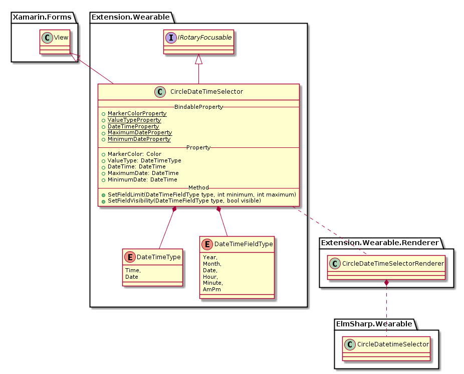
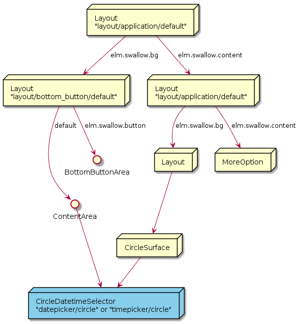

# CircleDateTimeSelector

`CircleDateTimeSelector`는 `ElmSharp.Wearable.CircleDatetimeSelector` 의 두가지 style "datepicker/circle", "timepicker/circle"를 표현하는 View로 Style별로 각기 "년:달:일", "시:분:AM/PM" 의 각 항목을 touch하여 Bezel Action으로 값을 변경할 수 있는 View이다.  
또한 System Default 크기가 360 X 360 (px) 크기로 full screen을 모두 차지하는 View이다.
이러한 Circle 관련 Widget은 `CircleSurface`가 있는 `Page`(`CirclePage`)의 Child로만 표현될 수 있으며,  
Bezel Action을 받기 위해 `CirclePage`의 `RotaryEventConsumer` property로 등록 되야 한다.


각 Picker는 View의 영역에 선택 가능한 Picker들로 이루어져 있으며, `CircleSurface`에서 원형 Surface의 주변을 둘러 Value를 선택할 수 있다.
이때 위 그림에서 붉은색으로 보이는 부분이 Value 선택을 위한 Marker이다.

CircleDatePicker와 `CircleTimePicker`의 Class Diagram은 아래와 같다.



위 Class 중 Xamarin interface 부분은 다음과 같이 Code로 표현된다.

 ```C#
 public class CircleDateTimeSelector : Xamarin.Forms.View, IRotaryEventConsumer
 {
     public static readonly BindableProperty ColorProperty; 
     public static readonly BindableProperty ValueTypeProperty; 
     public static readonly BindableProperty DateTimeProperty;
     public static readonly BindableProperty MaximumDateProperty;
     public static readonly BindableProperty MinimumDateProperty;

     public Color Color { get; set; }
     public DateTimeType ValueType { get; set; }
     public DateTime DateTime { get; set; }
     public DateTime MaximumDate { get; set; }
     public DateTime MinimumDate { get; set; }

     public void SetFieldLimit(DateTimeFieldType type, int minimum, int maximum);
     public void SetFieldVisibility(DateTimeFieldType type, bool visible);
 }

 public enum DateTimeType
 {
     Time,
     Date
 }

 public enum DateTimeFieldType
 {
     Year,
     Month,
     Date,
     Hour,
     Minute,
     AmPm
 }

 ```

`CircleDateTimeSelector`는 Marker의 색을 바꾸기 위한 `Color` Property를 가지고 있으며,
`ValueType` Property를 변경하여 원하는 값을 선택할 수 있다.
`CirclePage`의 `RotaryEventConsumer` property에 Set되면 Bezel Action에 반응할 수 있게 된다.

* Color : `CircleSurface` 상에서 값을 선택하기 위한 Marker의 색을 변경한다.
* ValueType : Time이면 UI가 시간 선택이 가능하게, Date라면 날짜 선택이 가능하게 변경된다.
* DateTime : 날짜/시간을 가져오거나, 설정한다.
* MaximumDate : ValueType이 Date일때, 최대 날짜를 가져오거나 설정한다.
* MimimumDate : ValueType이 Date일때, 최소 날짜를 가져오거나 설정한다.

각 Picker는 다음과 같은 Scene Graph를 가진다.


