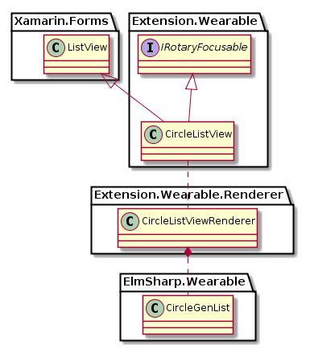

# CircleListView
`CircleListView`는 `ElmSharp.Wearable.CircleGenList`를 표현하는 View이다.
기존의 `ListView`와 동일하나, Scroller가 `CircleSurface`에 Rendering된다.
또한 Bezel Action으로 List를 움직일 수 있다.


`CircleListView`의 Class Diagram은 아래와 같다.



위 Class 중 Xamarin interface 부분은 다음과 같이 Code로 표현된다.

 ```C#
 public class CircleListView : Xamarin.Forms.ListView, IRotaryEventConsumer
 {
 }
 ```
기존 `Genlist`에 비해 추가된 기능은 없으나, Bezel Action으로 Scrolling을 하기 위해서는 `CirclePage`의 `RotaryEventConsumer` property에 set 되어야 한다.

`CircleListView`는 ElmSharp Level에서 다음과 같은 Scene Graph로 표현된다.


