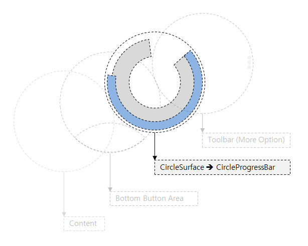
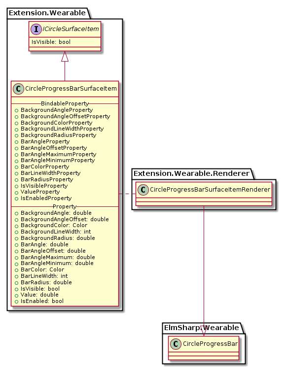
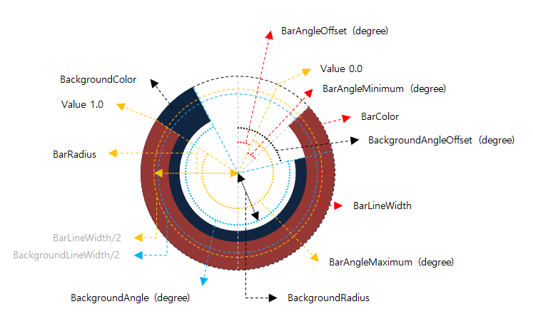
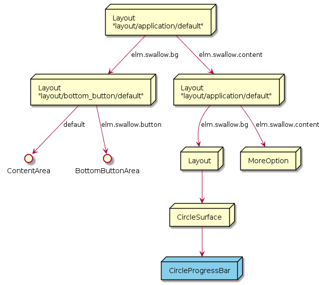

# CircleProgressBarSurfaceItem

`CircleProgressBarSurfaceItem`는 `ElmSharp.Wearable.CircleProgressBar`를 표현하며, `CirclePage`에 Behavior 형태로 적용된다.

`ElmSharp.Wearable.CircleProgressBar`는 `CircleSurface`에만 Drawing되며, Content영역에 넣을 Object가 존재하지 않기 때문에, `CirclePage`의 Behavior로 동작한다.



`CircleProgressBarSurfaceItem`의 Class Diagram은 아래와 같다.



`CircleProgressBarSurfaceItem`는 `CirclePage`에만 적용되는 Behavior로 `CircleSurface` 영역에 Bar와 Background 2개의 Arc(원호)가 그려지며, 위 Class 중 Xamarin interface 부분은 다음과 같이 Code로 표현된다.

```C#
public class CircleProgressBarSurfaceItem : ICircleSurfaceItem
{
    public static readonly BindableProperty BackgroundAngleProperty;
    public static readonly BindableProperty BackgroundAngleOffsetProperty;
    public static readonly BindableProperty BackgroundColorProperty;
    public static readonly BindableProperty BackgroundLineWidthProperty;
    public static readonly BindableProperty BackgroundRadiusProperty;

    public static readonly BindableProperty BarAngleProperty;
    public static readonly BindableProperty BarAngleOffsetProperty;
    public static readonly BindableProperty BarAngleMaximumProperty;
    public static readonly BindableProperty BarAngleMinimumProperty;
    public static readonly BindableProperty BarColorProperty;
    public static readonly BindableProperty BarLineWidthProperty;
    public static readonly BindableProperty BarRadiusProperty;

    public static readonly BindableProperty IsVisibleProperty;
    public static readonly BindableProperty ValueProperty;
    public static readonly BindableProperty IsEnabled;

    public double BackgroundAngle { get; set; }
    public double BackgroundAngleOffset { get; set; }
    public Color BackgroundColor { get; set; }
    public int BackgroundLineWidth { get; set; }
    public double BackgroundRadius { get; set; }

    public double BarAngle { get; set ; }
    public double BarAngleOffset { get; set; }
    public double BarAngleMaximum { get; set; }
    public double BarAngleMinimum { get; set; }
    public Color BarColor { get; set; }
    public int BarLineWidth { get; set; }
    public double BarRadius { get; set; }

    public bool IsVisible { get; set; }
    public double Value { get; set; }
    public bool IsEnabled { get; set; }
}
```
각 Property의 동작은 다음과 같다.



* IsVisible : ProgressBar를 보이거나 안보이게 한다.
* IsEnabled : ProgressBar를 활성화 시키거나 비활성화 시킨다.


`CircleProgressBarBehavior` ElmSharp Level에서 다음과 같은 Scene Graph로 표현된다.


