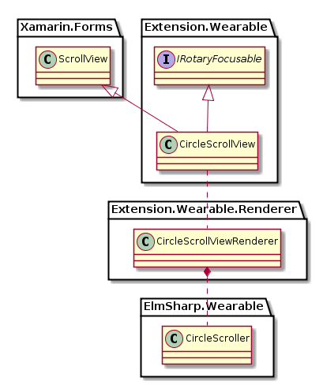

# CircleScrollView

`CircleScrollView`는 `ElmSharp.Wearable.CircleScroller`을 표현하는 View이다.

기존 `ScrollView`와 같지만, Scroller가 `CircleSurface`에 Rendering되며, Bezel Action으로 Scrolling이 가능하다.

`CircleScrollView`의 Class Diagram은 아래와 같다.

기존 `ScrollView`에 비해 추가된 기능은 없으나, Bezel Action으로 Scrolling을 하기 위해서는 `CirclePage`의 `RotaryEventConsumer` property에 set 되어야 한다.

`CircleScrollView`는 ElmSharp Level에서 다음과 같은 Scene Graph로 표현된다.

