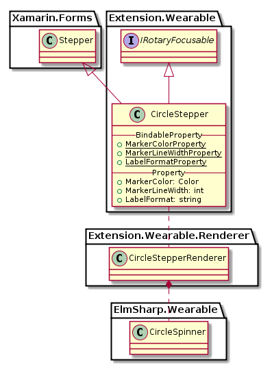

# CircleStepper

`CircleStepper`는 `ElmSharp.Wearable.CircleSpinner`를 표현하는 View로 Xamarin의 `Stepper`를 확장한다.
화면상의 View를 선택하면, Bezel Action을 통해 View의 Value를 변경할 수 있다.


`CircleStepper`의 Class Diagram은 아래와 같다.



위 Class 중 Xamarin interface 부분은 다음과 같이 Code로 표현된다.

 ```C#
 public class CircleStepper : Xamarin.Forms.Stepper, IRotaryEventConsumer
 {
     public static readonly BindableProperty ColorProperty;

     public Color Color { get; set; }
 }
 ```
기존 `Stepper`에 Marker color만 추가되었습니다. 이 View의 Value를 변경하기 위해 Bezel Action을 하기 위해서는 `CirclePage`의 `RotaryEventConsumer` property에 set 되어야 한다.

* Color : Bezel Action시에 움직이는 Marker의 색

`CircleStepper`는 ElmSharp Level에서 다음과 같은 Scene Graph로 표현된다.


