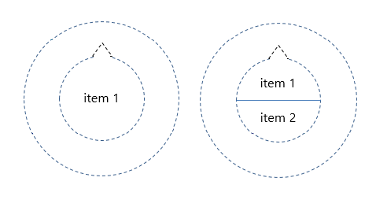
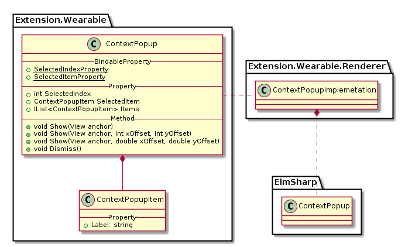

# ContextPopup

`ContextPopup`는 `ElmSharp.ContextPopup`을 표현하며, 화면을 구성하는 layer의 최상단에 Popup형태로 display 된다.

`ContextPopup`의 `Items`에 추가되는 `ContextItem`은 1개 혹은 2개 값을 가지며, 그 이상의  `ContextItem`은 화면에 표시 않는다.(초과된 item은 하단에 숨겨져 있으며. Scroll up시 화면에 표시 가능하다)

item이 1개 일 경우 Popup 전체를 , 2개의 경우 위 아래 나뉘어서 표시 된다(아래 이미지 참조)




`ContextPopup`의 Class Diagram은 아래와 같다.



위 Class 중 Xamarin interface 부분은 다음과 같이 Code로 표현된다.

 ```C#
 public class ContextPopup : BindableObject
 {
     public static readonly BindableProperty SelectedIndexProperty;
     public static readonly BindableProperty SelectedItemProperty;

     public event EventHandler<SelectedItemChangedEventArgs> ItemSelected;
     public event EventHandler Dismissed;

     public int SelectedIndex { get; set; }
     public ContextPopupItem SelectedItem { get; set; }
     public IList<ContextPopupItem> Items { get; }

     public void Show(View anchor);
     public void Show(View anchor, int xOffset, int yOffset);
     public void Show(View anchor, double xOffset, double yOffset);
     public void Dismiss();
 }

 public class ContextPopupItem
 {
    public string Label
 }

 ```
