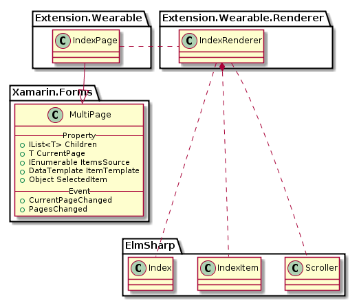

# IndexPage

`IndexPage`는 `ElmSharp.Index`를 표현하며, `Xamarin.Forms`의 `MultiPage`를 확장한다.

`Page`를 `MultiPage`의 `Chidren`으로 `Add`하거나 `Remove`하면 `Index item`이 `Page`개수에 따라 자동으로 추가 및 삭제된다.

 `Xamarin.Forms`의 `CarouselPage`과 동작이 유사하며, `Index`가 추가된 형태이다.
 
 `Page`를 scroll하면 `Index`가 내부적으로 select 동작한다.

 현재 선택된 `Page`와 `Index` 값은 `CurrentPage`값을 통해 알 수 있으며, `Page(Index)` 변경은 `CurrentPageChanged` 이벤트로 전달 받을 수 있다.


`IndexPage`의 Class Diagram은 아래와 같다.



위 Class 중 Xamarin interface 부분은 다음과 같이 Code로 표현된다.

 ```C#
 public class IndexPage : Xamarin.Forms.MultiPage<ContentPage>
 {
 }
 ```

 ElmSharp Level에서의 Scene Graph는 다음과 같이 표현된다.


