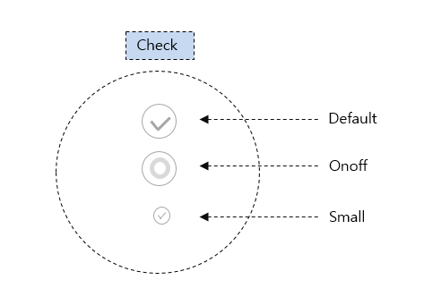
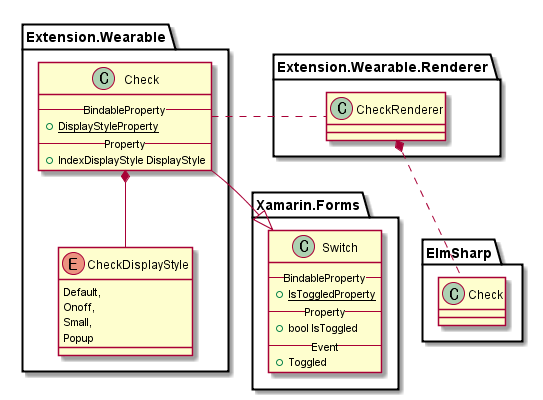

# Check

`Check`는 `ElmSharp.Check`를 표현하는 View로 Xamarin의 `Switch`를 확장한다.

 `Xamarin Switch`에서는 on&off 형태의 Check만을 제공하므로,
 Tizen Wearable의 Check GUI 지원을 위하여 이를 확장하여 API를 제공한다.




`Check`의 Class Diagram은 아래와 같다.



위 Class 중 Xamarin interface 부분은 다음과 같이 Code로 표현된다.

 ```C#
 public class Check : Switch
 {
     public static readonly BindableProperty DisplayStyleProperty;

     public CheckDisplayStyle DisplayStyle { get;  set; }
 }

 public enum CheckDisplayStyle
 {
      Default,
      Onoff,
      Small,
      Popup
 }

 ```
