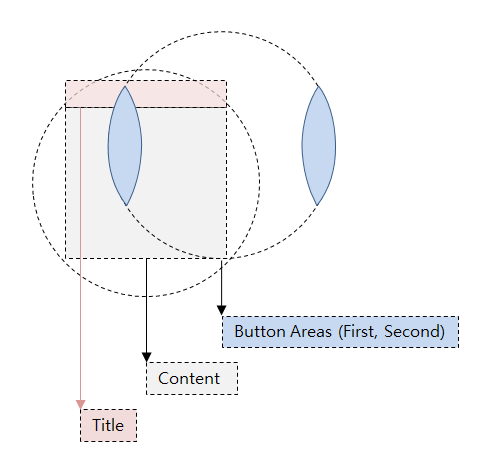
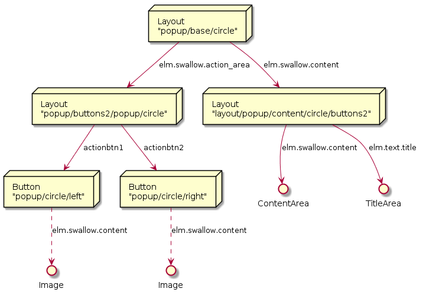

# TwoButtonPage



TwoButtonPage는 Circle 에 내접하는 사각형 영역을 Contents 영역으로 가지고 있는 Page이다.
또한 2개의 버튼과 Title 영역을 가지고 있다.


TwoButtonPage의 Diagram은 위와 같으며, 다음과 같이 코드로 표현된다.

```C#
public class TwoButtonPage : ContentPage
{
    public static readonly BindableProperty TitleProperty;
    public static readonly BindableProperty ContentProperty;

    public MenuItem FirstButton { get; set; }
    public MenuItem SecondButton { get; set; }
}
```

ElmSharp의 Popup을 사용하지 않으며, Layout이므로 Parent가 존재한다.

ElmSharp Level에서의 Scene Graph는 다음과 같이 표현된다.

