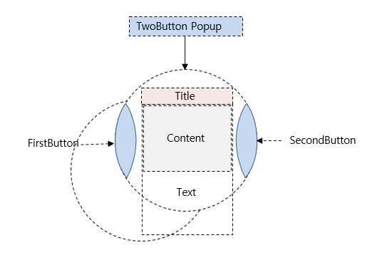
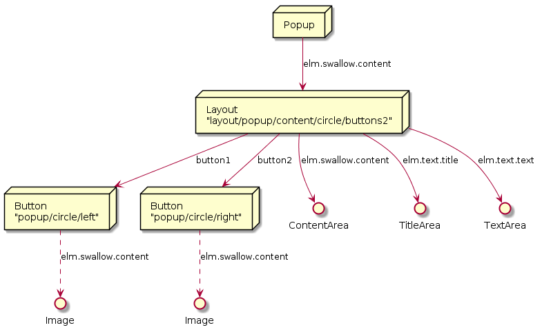

# TwoButtonPopup



`TwoButtonPopup`는 `ElmSharp.Popup`의 `two-button popup`형태를 표현하며, 화면을 구성하는 layer의 최상단에 Popup형태로 display 된다.


TwoButtonPopup의 Diagram은 위와 같으며, 다음과 같이 코드로 표현된다.

```C#
public class TwoButtonPopup : BindableObject
{
    public static readonly BindableProperty TitleProperty;
    public static readonly BindableProperty TextProperty;
    public static readonly BindableProperty ContentProperty;

    public event EventHandler BackButtonPressed;

    public View Content { get; set; }
    public string Title { get; set; }
    public string Text { get; set; }
    public MenuItem FirstButton { get; set; }
    public MenuItem SecondButton { get; set; }
}
```

ElmSharp의 Popup을 사용하며, Layout이 아니므로 Parent가 존재하지 않는다(Xaml을 사용하여 Layouting 불가).

ElmSharp Level에서의 Scene Graph는 다음과 같이 표현된다.


