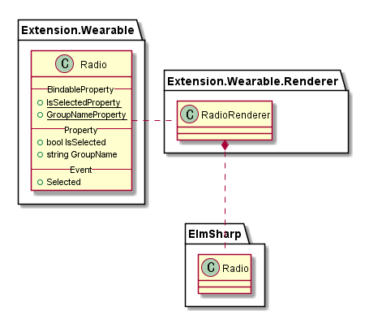

# Radio


`Radio`는 `ElmSharp`의 `Radio` `widget`을 표현한다.




Radio Diagram은 위와 같으며, 다음과 같이 코드로 표현된다.

```C#
public class Radio : View
{
    public static readonly BindableProperty IsSelectedProperty;
    public static readonly BindableProperty GroupNameProperty;

    public event EventHandler Selected;

    public bool IsSelected { get; set; }
    public string GroupName { get; set; }
}
```
