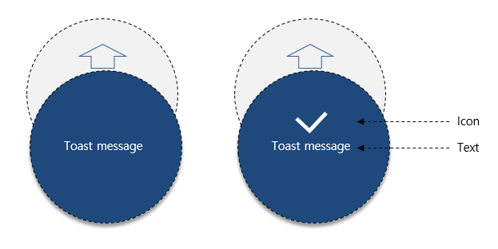

# Toast

`Toast`는  간단한 메세지와 icon 을 나타낼 수 있습니다.
duration 설정을 통해 'Toast' pop-up의 display 시간을 설정 가능하며, duration 시간후 자동으로 popup은 사라집니다. 



 Xamarin interface 부분은 다음과 같이 Code로 표현됩니다.

 ```C#
 public sealed class Toast
 {
     public static void DisplayText(string text, int duration = 3000)

     public static void DisplayIconText(string text, FileImageSource icon, int duration = 3000)
 }
 ```

 `Toast`의 사용방법은 아래와 같습니다.
 ```C#
    Toast.DisplayText("Toast message", 3000);

    Toast.DisplayIconText("Toast message", new FileImageSource { File = "icon_image.png" }, 3000);
 ```

