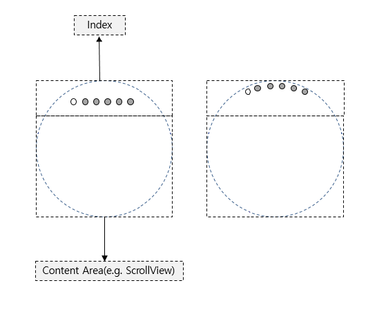
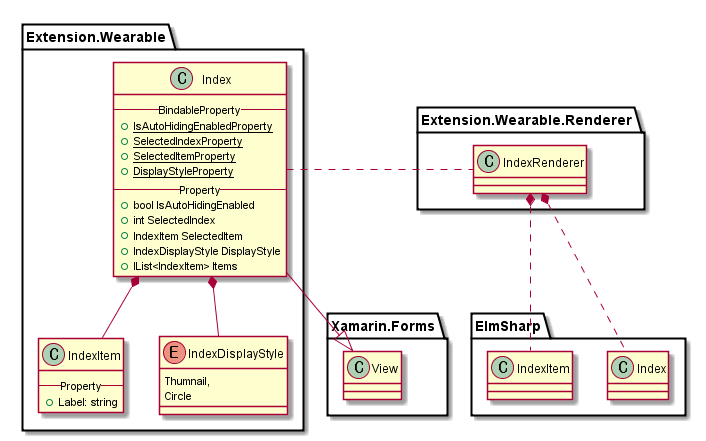

# Index

`Index`는 `ElmSharp.Index`를 표현하는 View로 Xamarin의 `View`를 확장한다.

`View`로 동작 하므로 `Layout`영역을 차지 한다. 따라서 Index를 상단 맨위에 배치할 경우 그 아래 Index를 적용하고자 하는 View를 위치시킨다.

 `Xamarin Scrollview`의 경우`page scroll` 기능이 미지원하므로, `ScrollX`,`ScrollY` 좌표를 이용하며 index를 select해야 한다.

 `IndexItem`이 추가되면 horizental center 위치에 item이 추가되며, 이후 추가되는 item 개수에 따라 양옆으로 item이 각각 추가된다.



`Index`의 Class Diagram은 아래와 같다.



위 Class 중 Xamarin interface 부분은 다음과 같이 Code로 표현된다.

 ```C#
 public class Index : View
 {
     public static readonly BindableProperty IsAutoHidingEnabledProperty;
     public static readonly BindableProperty SelectedIndexProperty;
     public static readonly BindableProperty SelectedItemProperty;
     public static readonly BindableProperty DisplayStyleProperty;

     public event EventHandler SelectedIndexChanged;

     public bool IsAutoHidingEnabled  { get; set; }
     public int SelectedIndex { get; set; }
     public IndexItem SelectedItem { get; set; }
     public IndexDisplayStyle DisplayStyle { get;  set; }
     public IList<IndexItem> Items { get; }
 }

 public class IndexItem
 {
    public string Label
 }

 public enum IndexDisplayStyle
 {
      Thumnail,
      Circle
 }

 ```
