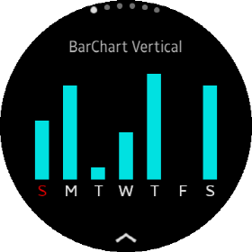
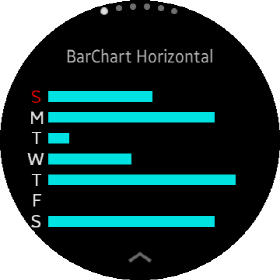
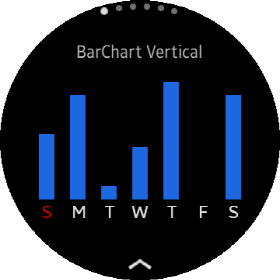
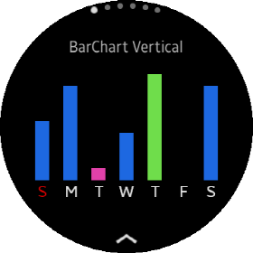
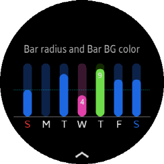
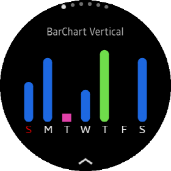
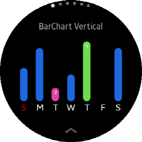
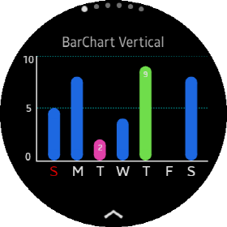

# BarChartView

A `BarChartView` is a chart that visualizes data as a set of bars.
Bar length is propotinal to the value of each `DataItem`. Any of Chart in CircularUI.Chart have `Minimum` and `Maximum` property.
Bar Length is calculated by renderer using this Minimun and Maximum property and `BarChartView` size.

## Create BarChartView

You can add `BarChartView` with C# or XAML file. Following code show the way how to add `BarChartView`.
`Data` class which is a set of data items(`DataItem`). If you don't set Data or data has no `DataItem`, `BarChartView` shows empty chart.


**C# file**

```cs
    var BarChart = new new BarChartView
    {
        VerticalOptions = LayoutOptions.Center,
        Maximum = 10,
        BarWidth = 10,
        WidthRequest = 300,
        HeightRequest = 200,
        Data = data
    }

    StackLayout layout = new StackLayout
    {
        VerticalOptions = LayoutOptions.Center,
        HorizontalOptions = LayoutOptions.Center,
        children =
        {
            BarChart
        }
    };
```

**XAML file**

_Refer to XAML code at the \test\CircularChartGallery\Pages\SimpleBarChartTest.xaml_

```xml
<?xml version="1.0" encoding="utf-8" ?>
<c:CirclePage xmlns="http://xamarin.com/schemas/2014/forms"
             xmlns:x="http://schemas.microsoft.com/winfx/2009/xaml"
             xmlns:c="clr-namespace:Tizen.Wearable.CircularUI.Forms;assembly=Tizen.Wearable.CircularUI.Forms"
             xmlns:chart="clr-namespace:Tizen.Wearable.CircularUI.Chart.Forms;assembly=Tizen.Wearable.CircularUI.Chart.Forms"
             xmlns:local="clr-namespace:CircularUIChartGallery.ViewModel"
             RotaryFocusObject="{x:Reference Scroller}"
             x:Class="CircularUIChartGallery.Pages.SimpleBarChartTest">
    <c:CirclePage.BindingContext>
        <local:SimpleChartModel/>
    </c:CirclePage.BindingContext>
    <c:CirclePage.Content>
        <c:CircleScrollView x:Name="Scroller" Margin="0, 50, 0, 50">
            <StackLayout>
                <chart:BarChartView
                    x:Name="barChar1"
                    VerticalOptions="CenterAndExpand"
                    HorizontalOptions="CenterAndExpand"
                    BarWidth="10"
                    Maximum="10"
                    Data="{Binding WeeklyData}"
                    WidthRequest="300"
                    HeightRequest="200"/>
```

## Create data

The chart needs a set of data items. If you want to add values to the chart. You have to create `DataItem` object for each value.
add these data items to List. And then, you can hand over a list as `DataItems` property of `DataItemGroup` class. One or a List of `DataItemGroup` should be set of `DataItemGroups` property of `Data` class. One DataItemGroup object represents a group of DataItem, And One Data object is group of DataItemGroup object. It is designed to logically separate different groups (e.g Group Bar Char or Multi-Line Chart).
Following code show how to set each value and group.

_Refer to code at the \test\CircularChartGallery\ViewModel\SimpleChartModel.cs_

```cs
            //This label(TextItem) displayed in XAxis label
            var sunTextItem = new TextItem { Text = "S", FontSize = 7, TextColor = Color.Red };
            var monTextItem = new TextItem { Text = "M", FontSize = 7 };
            var tueTextItem = new TextItem { Text = "T", FontSize = 7 };
            var wedTextItem = new TextItem { Text = "W", FontSize = 7 };
            var thuTextItem = new TextItem { Text = "T", FontSize = 7 };
            var friTextItem = new TextItem { Text = "F", FontSize = 7 };
            var satTextItem = new TextItem { Text = "S", FontSize = 7 };

            //Create a list of DataItem.
            var dataItems = new List<IDataItem>
            {
                new DataItem {
                    Value = 5,           // value of data
                    Label = sunTextItem  // category label of each data
                },
                new DataItem {
                    Value = 8,
                    Label = monTextItem
                },
                new DataItem {
                    Value = 2,
                    Label = tueTextItem,
                    Color = Color.FromHex("#FF4AC0"),
                    ValueLabel = new TextItem { Text = "2", FontSize = 4, TextColor = Color.White }
                },
                new DataItem {
                    Value = 4,
                    Label = wedTextItem,
                },
                new DataItem {
                    Value = 9,
                    Label = thuTextItem,
                    Color = Color.FromHex("#7EFA55"),
                    ValueLabel = new TextItem { Text = "9", FontSize = 4, TextColor = Color.White }
                },
                new DataItem {
                    Value = 0,
                    Label = friTextItem
                },
                new DataItem {
                    Value = 8,
                    Label = satTextItem,
                }
            };

            //Set list of DataItem to  DataItems of DataItemGroup Class.
            var dataItemGroup = new DataItemGroup(dataItems, "test data set");
            dataItemGroup.Color = Color.FromHex("#2176FF");

            //Set dataItemGroup object to DataItemGroups of Data Class
            WeeklyData = new Data(dataItemGroup);
```



## Category label

In the above image, the labels representing the day is added to X-Axis. These label is imported from `Label` property of each `DataItem` and displayed.

## BarChartView type

`BarChartView` has `BarChartType` property. This property set the orientation of the Bar Chart. `BarChartType.Vertical` displays vertical bar chart.
`BarChartType.Horizontal` displays horizontal bar chart. Please refer to the following image and code. It shows the result of changing only `BarChartType` to `BarChartType.Horizontal`. `BarChartType` property default value is `BarChartType.Vertical`.

**CS file**

```cs
    BarChart.BarChartType = BarChartType.Horizontal
```

**XAML file**

```xml
    <chart:BarChartView
        x:Name="barChart2"
        VerticalOptions="CenterAndExpand"
        HorizontalOptions="CenterAndExpand"
        Maximum="10"
        BarChartType="Horizontal"
        Data="{Binding WeeklyData}"
        WidthRequest="300"
        HeightRequest="200"/>
```



## Coloring Bar and Bar background

If you don't set `Color` property in `DataItem` or `DataItemGroup`, BarChartView displays default bar color. Current default bar color is `Color.Cyan`.
If you want to set specific color at each data item. you must set `Color` property of each `DataItem`. If you set `Color` property in `DataItemGroup`. 
All bar of data item except data item which has own color displays `DataItemGroup`'s Color.
Following code show how to set Color of DataItemGroup.

_Refer to code at the \test\CircularChartGallery\ViewModel\SimpleChartModel.cs_

```cs
            var dataItemGroup = new DataItemGroup(dataItems, "test data set");
            dataItemGroup.Color = Color.FromHex("#2176FF"); //Set Color of Group
```



```cs
            var dataItems = new List<IDataItem>
            {
                ...
                new DataItem {
                    Value = 1,
                    Label = tueTextItem,
                    Color = Color.FromHex("#FF4AC0"),  //set Color this data item.
                },
                new DataItem {
                    Value = 4,
                    Label = wedTextItem,
                },
                new DataItem {
                    Value = 9,
                    Label = thuTextItem,
                    Color = Color.FromHex("#7EFA55"),  //set Color this data item.
                },
```



Bar Chart support Bar background color. If you want to set bar background color. you must use `BarDataItem` which is derived clas of `DataItem`.
Following code show how to set `Color` and `BarBackgroundColor` property in each `BarDataItem`.

_Following code shows how to set color of each data item. Refer to code at the \test\CircularChartGallery\ViewModel\MainPageModel.cs_

```cs
            var barBGDummyDataItems = new List<IDataItem>
            {
                new BarDataItem {
                    Value = 5,
                    Color = Color.FromHex("#2176FF"),
                    BarBackgroundColor = Color.FromHex("#0F2752"),
                    Label = SunTextItem
                },
            ...
            };
```



## Rounding Bar

Default Bar shape is rectangle. You can change bar shape to rounded rectangle with `BarTopRadius` and `BarBottomRadius` property.
Following code shows how to set the top and the bottom radius of bars.

_Refer to XAML code at the \test\CircularChartGallery\Pages\SimpleBarChartTest.xaml_

```xml
                <chart:BarChartView
                    x:Name="barChar1"
                    VerticalOptions="CenterAndExpand"
                    HorizontalOptions="CenterAndExpand"
                    BarTopRadius="9"
                    BarBottomRadius="9"
                    BarWidth="19"
                    Maximum="10"
                    Data="{Binding WeeklyData}"
                    WidthRequest="300"
                    HeightRequest="200"/>
```



In the above image, the 3rd bar is shown as a rectangle even though `BarBottomRadius` and `BarTopRadius` property are set.
If the height of a bar is not enough to draw the radius value, the radius value is ignored and displayed in a rectangular shape.

If you set larger value or increate height of `BarChartView`, It will be shown rounded rectangle.

```cs
                new DataItem {
                    Value = 2,   // Changed Value 1 -> 2
                    Label = tueTextItem,
                    Color = Color.FromHex("#FF4AC0"),
                },
```


## Labeling Bar

If you want to display a value in the entire or specific bar, you must add the `ValueLabel` in the `DataItem` class.
In the above image, 4th and 5th bar have `ValueLabel`.

Following code is the data set of above image. This code shows how to add `ValueLabel` and `Label` in `DataItem` class.

```cs
            var dataItems = new List<IDataItem>
            {
                ...
                new DataItem {
                    Value = 2,
                    Label = tueTextItem,
                    Color = Color.FromHex("#FF4AC0"),
                    ValueLabel = new TextItem { Text = "2", FontSize = 4, TextColor = Color.White }
                },
                new DataItem {
                    Value = 4,
                    Label = wedTextItem,
                },
                new DataItem {
                    Value = 9,
                    Label = thuTextItem,
                    Color = Color.FromHex("#7EFA55"),
                    ValueLabel = new TextItem { Text = "9", FontSize = 4, TextColor = Color.White }
                ...
            }
```



## Customize Axis

You can create AxisOption structure and add it to AxisOption property of `BarChartView` for showing and customizing Axis.

### Create AxisOption

`AxisOption` struct controls axis line and reference labels and reference lines.
In CircularUI.Chart, we will use the term `Major Axis` or `Minor Axis` instead of `X-Axis` and `Y-Axis`.
Because Horizontal Bar Chart and Vertical Bar chart have different labels in X-Axis and Y-Axis.

If you set the value or labels for Major Axis and Minor Axis, you can set the value and labels regardless of whether the `BarChartType` is `BarChartType.Vertical` or `BarChartType.Horizontal`.

- If BarChartType is BarChartType.Vertical, Major Axis becomes X-Axis and Minor Axis becomes Y-Axis.
- If BarChartType is BarChartType.Horizontal, Major Axis becomes Y-Axis and Minor Axis becomes X-Axis.

The `Label` property of `DataItem` is displayed in Major Axis.The `ReferenceDataItems` list in `AxisOption` struct is displayed in Minor Axis.

Following code shows how to create AxisOption. First parameter of AxisOption constructor set visibility of Major Axis line.
Second parameter set visibility of Major Axis line. Third parameter set visibility of reference label.

```cs
    var option = new AxisOption(true, true, true, true);
```

### Add reference label and reference line

`ReferenceDataItems` List is displayed in Minor Axis. If any `DataItem` of ReferenceDataItems have the `ValueLabel` and `IsVisibleOfReferenceLabel` property of AxisOption
is true. the `ValueLabel` is displayed in Minor Axis.
If `IsVisibleOfReferenceLine` property of AxisOption is true, the reference lines are displayed by `Value` property of each `DataItem`.

Following code shows how to add reference labels and lines.

_Refer to XAML code at the \test\CircularChartGallery\Pages\SimpleBarChartTest.xaml and code at the \test\CircularChartGallery\ViewModel\SimpleChartModel.cs_

**CS file**

```cs
    option.ReferenceDataItems = new List<IDataItem>
    {
        new DataItem { Value = 0, ValueLabel = new TextItem{ Text = "0", FontSize = 5, TextColor = Color.White } },
        new DataItem { Value = 5, ValueLabel = new TextItem{ Text = "5", FontSize = 5, TextColor = Color.White } },
        new DataItem { Value = 10, ValueLabel = new TextItem{ Text = "10", FontSize = 5,  TextColor = Color.White } }
    };
```

**XAML file**

```xml
                <chart:BarChartView
                    x:Name="barChar1"
                    VerticalOptions="CenterAndExpand"
                    HorizontalOptions="CenterAndExpand"
                    BarTopRadius="9"
                    BarBottomRadius="9"
                    BarWidth="19"
                    Maximum="10"
                    Data="{Binding WeeklyData}"
                    AxisOption="{Binding MajorMinorAxisOption}"
                    WidthRequest="300"
                    HeightRequest="200"/>
```

