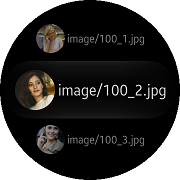

# CircleImage

`CircleImage` is view that hold an image with circle shape.
`CircleImage` derives from [Xamarin.Forms.Image](https://docs.microsoft.com/en-US/dotnet/api/Xamarin.Forms.Image?view=xamarin-forms).

 |||
 |:-----------------------------------:|:---------------------------------------------:|
 |                Page                 |                  ListView Item                |

## Create CircleImage

You can easily add `CircleImage` control with C# or XAML file.
Following example show the way how to use `CircleImage` control.

**C# file**

```cs
 var circleImage = new CircleImage
 {
     HorizontalOptions = LayoutOptions.Center,
     VerticalOptions = LayoutOptions.Center,
     Source = "image.jpg"
 };

 StackLayout layout = new StackLayout
 {
      BackgroundColor = Color.Transparent,
      Children =
      {
        circleImage
      }
 };
```

**XAML file**

_Refer to TCCircleImage code at the test\WearableUIGallery\WearableUIGallery\TC\TCCircleImage.xaml_

```xml
<ContentPage
    x:Class="WearableUIGallery.TC.TCCircleImage"
    xmlns="http://xamarin.com/schemas/2014/forms"
    xmlns:x="http://schemas.microsoft.com/winfx/2009/xaml"
    xmlns:local="clr-namespace:WearableUIGallery"
    xmlns:w="clr-namespace:Tizen.Wearable.CircularUI.Forms;assembly=Tizen.Wearable.CircularUI.Forms">
    <ContentPage.Content>
        <StackLayout HorizontalOptions="Center" VerticalOptions="Center">
            <w:CircleImage
                Source="image/100_1.jpg" 
                Aspect="AspectFill"
                WidthRequest="200"
                HeightRequest="200"
                BackgroundColor="Black"/>
        </StackLayout>
    </ContentPage.Content>
</ContentPage>
```

**Inserting CircleImage in ListView Item**

Following example show the way how to insert `CircleImage` control in CircleListView Item.

_Refer to TCCircleImageListView code at the test\WearableUIGallery\WearableUIGallery\TC\TCCircleImageListView.xaml_

```xml
    <w:CircleListView.ItemTemplate>
        <DataTemplate>
            <ViewCell>
                <StackLayout Orientation="Horizontal" HorizontalOptions="FillAndExpand" VerticalOptions="Center" Padding="30,10,30,10">
                    <w:CircleImage
                        Source="{Binding .}" 
                        Aspect="AspectFill"
                        VerticalOptions="Center"
                        HorizontalOptions="StartAndExpand"
                        WidthRequest="80"
                        HeightRequest="80"/>
                    <Label Text="{Binding .}"
                        VerticalOptions="Center"
                        HorizontalOptions="CenterAndExpand"
                        VerticalTextAlignment="Center"
                        HorizontalTextAlignment="Center"
                        HeightRequest="50"/>
                </StackLayout>
            </ViewCell>
        </DataTemplate>
    </w:CircleListView.ItemTemplate>
```