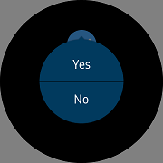

# ConfirmPopupEffect
`ConfirmPopupEffect` is an [`Effect`](https://developer.xamarin.com/api/type/Xamarin.Forms.Effect/) for Xamarin.Forms that is proportional to a particular widget or has one or two buttons anywhere on the screen.
Accept button has one default, and "Ok" text is displayed in Accept as default.

When `ConfirmVisibility` becomes `True`, it appears on the screen,
The command given at the time of Accept or Cancel is executed and disappears automatically, and `ConfirmVisibility` becomes `False`.
Also, when you touch the outside of the popup, the popup is automatically canceled. (Cancel command is performed similarly.)
You can change the pop-up position by adjusting the X and Y value of Offset.


## Properties
- AcceptText : string. Accept button is displayed as "Ok" when Accep button is not given Text value.
- AcceptCommand : [`System.Windows.Input.ICommand`](https://developer.xamarin.com/api/type/System.Windows.Input.ICommand/). Command to be executed when Accept
- AcceptCommandParameter : [`System.Object`](https://developer.xamarin.com/api/type/System.Object/). Parameter to be applied to AcceptCommand
- CancelText : string. Text to use as Cancel button
- CancelCommand : [`System.Windows.Input.ICommand`](https://developer.xamarin.com/api/type/System.Windows.Input.ICommand/). Command is executed at the time of cancellation, even if the popup disappears by selecting outside the popup.
- CancelCommandParameter : [`System.Object`](https://developer.xamarin.com/api/type/System.Object/). Parameter to be applied to CancelCommand
- ConfirmVisibility : Boolean. Popup appears if ConfirmVisibility is True, and disappears when it becomes False. CancelCommand works even if it disappears to False.
- PositionOption : Enumeration. Position type of popup
  * `BottomOfView` : The popup appears at the bottom of the View using the Effect. The position is changed by Offset in the center of View.
  * `CenterOfWindow` : In the center of the screen, move by the Offset in the Popup.
  * `Absolute` : The value of Offset is X, Y and popup is placed on the screen.
  * `Relative` : Set Offset.X * Window.Width, Offset.Y * Window.Height.
- Offset : [`Xamarin.Forms.Point`](https://developer.xamarin.com/api/type/Xamarin.Forms.Point/). A value of how far to move from the base tap position represented by the PositionOption type. If it isn't set, it returns 0,0.

For more information. Please refer to below links
- [ConfirmPopupEffect  API reference](https://github.sec.samsung.net/pages/dotnet/tizen-circular-ui/api/Tizen.Wearable.CircularUI.Forms.ConfirmPopupEffect.html)
- [Xamarin.Forms.RoutingEffect  API reference](https://developer.xamarin.com/api/type/Xamarin.Forms.RoutingEffect/)

## Adding popup with ConfirmPopupEffect at ContentPage
You can set popup with ConfirmPopupEffect at [`ContentPage.Content`](https://developer.xamarin.com/api/type/Xamarin.Forms.ContentPage/). To create a new popup, use the following code.

_This guide's code example use WearableUIGallery's TCConfirm.xaml and TCConfirm.xaml.cs code at the test\WearableUIGallery\WearableUIGallery\TC\TCConfirm.xaml_

**C# file**
```cs
	[XamlCompilation(XamlCompilationOptions.Compile)]
	public partial class TCConfirm : CirclePage
	{
		public TCConfirm ()
		{
			AcceptedCommand = new Command(() => BackgroundColor = Color.Green);
			CancelCommand = new Command(() => BackgroundColor = Color.Red);

			InitializeComponent ();
		}

		public ICommand AcceptedCommand { get; private set; }
		public ICommand CancelCommand { get; private set; }
	}
```

**XAML file**
```xml
<?xml version="1.0" encoding="utf-8" ?>
<w:CirclePage
    x:Class="WearableUIGallery.TC.TCConfirm"
    xmlns="http://xamarin.com/schemas/2014/forms"
    xmlns:x="http://schemas.microsoft.com/winfx/2009/xaml"
    xmlns:w="clr-namespace:Tizen.Wearable.CircularUI.Forms;assembly=Tizen.Wearable.CircularUI.Forms"
    x:Name="mypage">
    <ContentPage.Content>
        <StackLayout>
            <w:Check
                x:Name="confirm3"
                w:ConfirmPopupEffect.AcceptCommand="{Binding AcceptedCommand, Source={x:Reference mypage}}"
                w:ConfirmPopupEffect.AcceptText="Yes"
                w:ConfirmPopupEffect.CancelCommand="{Binding CancelCommand, Source={x:Reference mypage}}"
                w:ConfirmPopupEffect.CancelText="No"
                w:ConfirmPopupEffect.ConfirmVisibility="{Binding IsToggled, Source={x:Reference confirm3}, Mode=TwoWay}"
                w:ConfirmPopupEffect.PositionOption="CenterOfParent"
                HorizontalOptions="CenterAndExpand"
                IsToggled="False"
                VerticalOptions="CenterAndExpand">
                <w:Check.Effects>
                    <w:ConfirmPopupEffect />
                </w:Check.Effects>
            </w:Check>
        </StackLayout>
    </ContentPage.Content>
</w:CirclePage>
```

**Screenshot**
<table>
  <tr>
    <th>1st scene with Check</th>
    <th>2nd scene with ConfirmPopupEffect</th> 
    <th>3rd scene when selects 'Yes'</th> 
  </tr>
  <tr>
    <td></td>
    <td></td>
    <td></td> 
  </tr>
</table>

