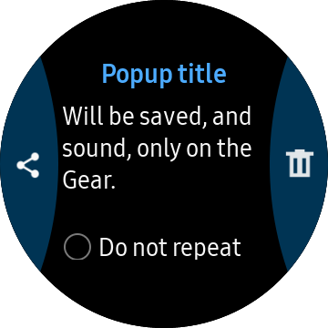

# ConfirmationPopup
`ConfirmationPopup` represents Tizen Wearable EFL Twobutton-popup style. `ConfirmationPopup` is usefull to select one of two options. (e.g  cancel/done, share/delete)\

*`ConfirmationPopup` is displayed seperate from any control. So you can't set this in XAML file.*



## Create ConfirmationPopup
`ConfirmationPopup.Title` Property set title of popup. you can set `Content` property with Layout such as `StackLayout` or `ScrollView`.
`ConfirmationPopup.FirstButton` property set left side button. `ConfirmationPopup.SecondButton`property set right side button. you can set` FirstButton` and `SecondButton` using `MenuItem`. You should add code at `Command` or `Clicked` event handler for controlling `MenuItem` clicked.


_This guide's code example use WearableUIGallery's TCConfirmationPopup code at the test\WearableUIGallery\WearableUIGallery\TC\TCConfirmationPopup.xaml.cs_

For more information . Please refer to [ConfirmationPopup  API reference](https://github.sec.samsung.net/pages/dotnet/tizen-circular-ui/api/Tizen.Wearable.CircularUI.Forms.ConfirmationPopup.html)

**C# file**
```cs
            var leftButton = new MenuItem()
            {
                Icon = new FileImageSource
                {
                    File = "image/b_option_list_icon_share.png",
                },
                Command = new Command(() =>
                {
                    /* must insert code when user press left button */
                })
            };

            ...

            _popUp1 = new ConfirmationPopup();
            _popUp1.FirstButton = leftButton;
            _popUp1.SecondButton = rightButton;
            _popUp1.Title = "Popup title";
            _popUp1.Content = new StackLayout()
            {
                HorizontalOptions = LayoutOptions.FillAndExpand,
                Children =
                {
                    new Label
                    {
                        Text = "Will be saved, and sound, only on the Gear.",
                    },
                    new StackLayout
                    {
                        Orientation = StackOrientation.Horizontal,
                        Padding = new Thickness(0, 30, 0, 30),
                        Children =
                        {
                            checkbox,
                            new Label
                            {
                                Text = "Do not repeat",
                            }
                        }
                    }
                }
            };
    }
```

## How to set long Text at ConfirmationPopup
ConfirmationPopup has `Text` Property. This Proerpty is usefull to set long text.\
If long text was set by `Text` property. you don't need to add `StackLayout` and `ScrollView` and `Label` for displaying long text.

*`Text` Property's area overlap `Content` Property area. So do not use two propery at the same time.*

**C# file**
```cs
            _popUp2 = new ConfirmationPopup();
            _popUp2.FirstButton = leftButton2;
            _popUp2.SecondButton = rightButton2;
            _popUp2.Title = "Popup title";
            _popUp2.Text = @"This is scrollable popup text.
This part is made by adding long text in popup. Popup internally added
scroller to this layout when size of text is greater than total popup
height. This has two button in action area and title text in title area";
```