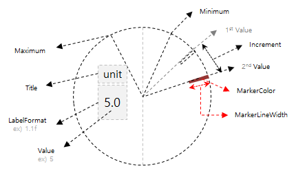

# ContentButton

`ContentButton` is a type of Xamarin.Forms.ContentView that contains a single child element (called Content) and is typically used for custom, reusable controls. Also, as its name implies, ContentButton is designed to be used like a Button that implements Xamarin.Forms.IButtonController.
It is an extension of [Xamarin.Forms.Stepper](https://developer.xamarin.com/api/type/Xamarin.Forms.Stepper/).



**WARNING: The marker is no longer supported from Tizen 4.0 SDK which is applied bezel-less UX in 2019. Therefore, the above image is obsolete and marker related API was deprecated.**

## Create CircleStepper

Basically `CircleStepper` looks same as [Xamarin.Forms.Stepper](https://developer.xamarin.com/api/type/Xamarin.Forms.Stepper/), and you can modify the value with [Bezel interaction](https://developer.tizen.org/design/wearable/interaction/bezel-interactions).
The difference from [Xamarin.Forms.ScrollView](https://developer.xamarin.com/api/type/Xamarin.Forms.ScrollView/) is to provide some additional properties for Tizen wearable.

`CircleStepper` has the following properties:

- Title: This property gets or sets the title on `CircleStepper`
- LabelFormat: This property gets or sets the format in which the value is shown.
- IsWrapEnabled: This property gets or sets a status of `Value` is wrapped.
- WheelAppeared: This event occurs when the `CircleStepper`'s wheel is appeared.
- WheelDisappeared: This event occurs when the `CircleStepper`'s wheel is disappeared.

This example consists of `StackLayout` with a `CircleStepper` and two Labels in the `CirclePage`.
Since 9 is set to `Minimum` and `LabelFormat` is set to "% 1.1f", "9.0" appears on the screen. Since the `Increment` is 7.5, it increases by 7.5 when you turn the bezel and increase the `Value`. The `Maximum` defined value is 99, hence the marker does not exceed this value.


For more information, see the following links:

- [CircleStepper API reference](https://samsung.github.io/Tizen.CircularUI/api/Tizen.Wearable.CircularUI.Forms.CircleStepper.html)
- [Xamarin.Forms.Stepper API reference](https://developer.xamarin.com/api/type/Xamarin.Forms.Stepper/)
- [Xamarin.Forms.Stepper Guide](https://docs.microsoft.com/en-us/xamarin/xamarin-forms/user-interface/controls/views#stepper)

_The code example of this guide uses XUIComponent's SpinnerDefault of CircleSpinner code. The code is available in sample\XUIComponents\UIComponents\UIComponents\Samples\CircleSpinner\SpinnerViewModel.cs and SpinnerDefault.xaml_

The following code shows how to use CircleStepper:

**C# file**

```cs

    public class SpinnerViewModel : INotifyPropertyChanged
    {
        double _value= 9.0;
        ...

        public double Value
        {
            get => _value;
            set
            {
                if (_value == value) return;
                _value = value;
                OnPropertyChanged();
            }
        }
```

**XAML file**

```xml
<ContentPage
    x:Class="UIComponents.Samples.CircleSpinner.SpinnerDefault"
    xmlns="http://xamarin.com/schemas/2014/forms"
    xmlns:x="http://schemas.microsoft.com/winfx/2009/xaml"
    xmlns:local="clr-namespace:UIComponents.Samples.CircleSpinner"
    xmlns:sys="clr-namespace:System;assembly=netstandard"
    xmlns:w="clr-namespace:Tizen.Wearable.CircularUI.Forms;assembly=Tizen.Wearable.CircularUI.Forms"
    xmlns:tizen="clr-namespace:Xamarin.Forms.PlatformConfiguration.TizenSpecific;assembly=Xamarin.Forms.Core">
    <ContentPage.BindingContext>
        <local:SpinnerViewModel />
    </ContentPage.BindingContext>
    <ContentPage.Content>
        <StackLayout Padding="0,50,0,0" Orientation="Vertical">
            <Label
                FontAttributes="Bold"
                FontSize="11"
                HorizontalTextAlignment="Center"
                Text="Title"
                TextColor="#0FB4EF" />
            <Label
                FontSize="8"
                HorizontalTextAlignment="Center"
                Text="unit"
                TextColor="White" />
            <w:CircleStepper
                x:Name="stepper"
                HorizontalOptions="CenterAndExpand"
                Increment="7.5"
                LabelFormat="%1.1f"
                MarkerColor="Coral"
                Maximum="99.0"
                Minimum="9.0"
                Value="{Binding Value}" />
            <Button Command="{Binding ButtonPressedExit}" Text="OK" tizen:VisualElement.Style="{x:Static tizen:ButtonStyle.Bottom}" />
        </StackLayout>
    </ContentPage.Content>
</ContentPage>
```
