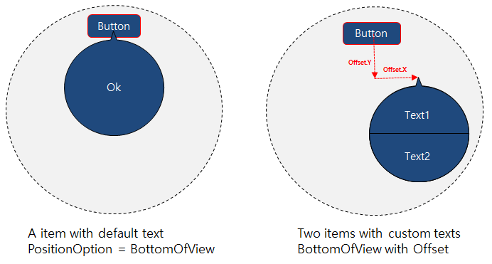

# ContextPopupEffectBehavior

`ContextPopupEffectBehavior` is an [Behavior](https://developer.xamarin.com/api/type/Xamarin.Forms.Effect/) for Xamarin.Forms that is used to make the [View](https://docs.microsoft.com/dotnet/api/xamarin.forms.view) have context popup that has one button or two buttons.
Accept button has one default, and "Ok" text is displayed in Accept as default.

When `Visibility` becomes `True`, it appears on the screen,
The command given at the time of Accept or Cancel is executed and disappears automatically, and `ConfirmVisibility` becomes `False`.
Also, when you touch the outside of the popup, the popup is automatically removed.
You can change the position by adjusting the X and Y value of Offset.



## Adding popup with ContextPopupEffectBehavior at CirclePage

You can set popup with `ContextPopupEffectBehavior` at any `View`. To create a new popup, use the following code.

`ContextPopupEffectBehavior` has the following properties:

- AcceptCommand : [System.Windows.Input.ICommand](https://developer.xamarin.com/api/type/System.Windows.Input.ICommand/). Command to be executed when Accept
- CancelCommand : [System.Windows.Input.ICommand](https://developer.xamarin.com/api/type/System.Windows.Input.ICommand/). Command is executed at the time of cancellation, even if the popup disappears by selecting outside the popup.
- Visibility : Popup appears if `ConfirmVisibility` is True, and disappears when it becomes False. `CancelCommand` works even if it disappears to False.
- PositionOption : Position type of popup
  - `BottomOfView` : The popup appears at the bottom of the View using the Effect. The position is changed by Offset in the center of View.
  - `CenterOfParent` : In the center of the screen, move by the Offset in the Popup.
  - `Absolute` : The value of Offset is X, Y and popup is placed on the screen.
  - `Relative` : Set Offset.X * Window.Width, Offset.Y * Window.Height.

In the example below, a `Check` with `ContextPopupEffectBehavior` in the `AbsoluteLayout` is set into the `CirclePage` 
I have set the texts to be shown in `AcceptText` and `CancelText`, and defined the commands to execute when each item is selected in `AcceptCommand` and `CancelCommand`.
Accept will change the background color to green and Cancel if it will be red.
I set the position by assigning `CenterOfParent` to the `PositionOption`. `Visibility` value set to be bound to `IsToggled`.

||||
|:----------------------------------------------------:|:--------------------------------------------------:|:-----------------------------:|
|                       BottomOfView                   |                    CenterOfParent                  |         Absolute/Relative     |

For more information. Please refer to below links

- [ContextPopupEffectBehavior  API reference](https://samsung.github.io/Tizen.CircularUI/api/Tizen.Wearable.CircularUI.Forms.ContextPopupEffectBehavior.html)
- [Xamarin.Forms.RoutingEffect  API reference](https://developer.xamarin.com/api/type/Xamarin.Forms.RoutingEffect/)
- [Xamarin.Forms.Effect Guide](https://docs.microsoft.com/en-us/xamarin/xamarin-forms/app-fundamentals/effects/)

_This guide's code example use WearableUIGallery's TCConfirm.xaml and TCConfirm.xaml.cs code at the test\WearableUIGallery\WearableUIGallery\TC\TCConfirm.xaml_

**C# file**

```cs
    [XamlCompilation(XamlCompilationOptions.Compile)
    public partial class TCConfirm : CirclePage
    {
        public TCConfirm ()
        {
            AcceptedCommand = new Command(() => BackgroundColor = Color.Green);
            CancelCommand = new Command(() => BackgroundColor = Color.Red);

            InitializeComponent ();
        }

        public ICommand AcceptedCommand { get; private set; }
        public ICommand CancelCommand { get; private set; }
    }
```

**XAML file**

```xml
<?xml version="1.0" encoding="utf-8" ?>
<w:CirclePage
    x:Class="WearableUIGallery.TC.TCConfirm"
    xmlns="http://xamarin.com/schemas/2014/forms"
    xmlns:x="http://schemas.microsoft.com/winfx/2009/xaml"
    xmlns:w="clr-namespace:Tizen.Wearable.CircularUI.Forms;assembly=Tizen.Wearable.CircularUI.Forms"
    x:Name="mypage">
    <ContentPage.Content>
        <AbsoluteLayout>
            <w:Check
                x:Name="CtxCheck"
                AbsoluteLayout.LayoutBounds="0.5, 0.2, 1, 0.25"
                AbsoluteLayout.LayoutFlags="All"
                HorizontalOptions="CenterAndExpand"
                IsToggled="False"
                VerticalOptions="CenterAndExpand">
                <w:Check.Behaviors>
                    <w:ContextPopupEffectBehavior
                        AcceptCommand="{Binding AcceptedCommand, Source={x:Reference mypage}}"
                        AcceptText="Yes"
                        CancelCommand="{Binding CancelCommand, Source={x:Reference mypage}}"
                        CancelText="No"
                        Visibility="{Binding IsToggled, Source={x:Reference CtxCheck}, Mode=TwoWay}"
                        PositionOption="BottomOfView"/>
                </w:Check.Behaviors>
            </w:Check>
        </AbsoluteLayout>
    </ContentPage.Content>
</w:CirclePage>
```

**Screenshot**

|| ||
|:----------------------------------------------------:|:-------------------------------------------------------------------:|:-----------------------------------------:|
|                       1st scene with Check            |                    2nd scene with ContextPopupEffectBehavior                |         3rd scene when selects 'Yes' |

