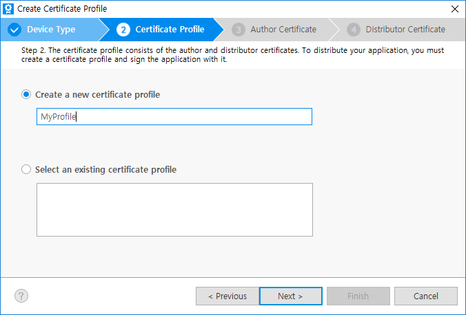

# Creating Certificates

In the menu bar, click `Tools > Tizen > Tizen Certificate Manager` to launch the Certificate Manager.

## Import old profile

If you have a profile you created in the past, you can import it or click a `cancel` button.

## Create a new Certificate Profile

Certificate profile will contain author certificate and distributor certificate.

### 1. New Certificate profile

Click the `+` button to create a certificate profile.

### 2. Type of the certificate

Select Samsung to generate certificates to develop and install to Samsung devices and will you can upload the application to the Store.
But if you want to use the emulator and do not have any plans to upload the application to the Store, just select Tizen to create certificate locally.

### 3. Type of the Device

Select `Device Type` and click `Next`

### 4. Create new or select old profile

Select `Create a new certificate profile` to create new one. In case of Select an existing certificate profile, see the [Managing Certificate Profile](xref:Tizen.Wearable.CircularUI.doc.ManagingCertificateProfile).

## Create a new author certificate

An author certificate includes information about the author of the application.
It is used to create an author signature, which ensures the integrity of the application from the author since the publication of the application.

### 1. Create new or select existing author certiicate

Select `Create a new author certificate`. In case of Select an existing author certificate, see the [Managing Certificate Profile](xref:Tizen.Wearable.CircularUI.doc.ManagingCertificateProfile).

With `Advanced options` menu, you can check `Use an existing author certificate` option to select either the Android keystore, or you can also choose already existing Samsung author certificate.

The same signing key helps in maintaining secure peer authentication between the Tizen Gear App and the Android mobile app.
You can find out more details from the [Accessory SDK](https://developer.samsung.com/galaxy/accessory). In case of selecting a Samsung author certificate, you can just renew the certificate with the same information. This renewed certificate will be the same as your original RSA key so upgrading your application is guaranteed.

### 2. Information of the author certicate

Enter the author name and password. It is recommended to set a strong password and not to forget it . If you want to use the same password for the distributor certificate in the next step, check the box below. `Additional Fields` contains more CSR(Certificate Signing Request) information to input, but are not mandatory.

### 3. Sign in to Samsung Account

At the Next step, a Samsung Account sign-in pops up. Sign in or Create a account. ( To get a certificate, you should have a Samsung Account. If you don't have it yet, please create a new account.)

### 4. Backup created Author certificate

After a few seconds from signing-in you can get the author certificate.

The author certificate should be secure. So we recommend making a backup. You can specify the backup location by clicking `Browse` button.

Be careful because if you lose the author certificate you will not be able to upgrade your application signed with the same certificate.

The `Next` step is creating distributor certificate.

## Create a new distributor certificate.

### 1. Create new or select existing distributor certiicate

Select `Create a new distributor certificate`. In case of `Select an existing distributor certificate`, see the [Managing Certificate Profile](xref:Tizen.Wearable.CircularUI.doc.ManagingCertificateProfile).

### 2. Information of the distributor certicate

Select the `Privilege` level for the distributor certificate. To ensure that implemented APIs work in the device, the application should be signed with distributor certificate which has appropriate privilege level.

> **Privileges**  
> To effectively protect the device system and user private data, the Tizen security architecture is based on privileges and application signing of the Linux basic security model, which includes process isolation and mandatory access control. The users must be able to grant privileges for security-sensitive operations  
> **Public** - No limitation to use for all Tizen application developers.  
> **Partner** - No limitation to request and get the distributor certificate with this level. But when the application is uploaded to the Store, Store re-signs the application with official partner level distributor certificate, only for the registered partner developer at Samsung.

 * If you have checked an option to apply the password to be the same as the author certificate to the distributor certificate at [Information of the author certicate](#2-information-of-the-author-certicate), the password is already filled in.If you want to change it, just type the new password for the distributor certificate.
 * Once the device is connected to the Host PC, the DUID is automatically added to the list. If you want to add more devices, just connect your device to your Host PC via USB or WiFi. Previous DUIDs on the list is not deleted even if you disconnect the device. To delete it click the trash icon. [How to connect the device to PC via WiFi]()
 * When you need to register devices that are more than 10, upload a txt file using `Import a DUID list file` menu. 1 DUID on a line and max 50 DUIDs are be available.

> The DUID of recent mobile and wearable devices start with a 2.0# but old devices are 1.0#. If a distributor certificate contains a 1.0# DUID, all devices with that certificate need one more step, see the [Permit device to install apps](xref:Tizen.Wearable.CircularUI.doc.PermitDeviceToInstallApps) guide.

> If you do not have any actual device but want to develop apps and upload to the Store, just launch the emulator virtual machine and use its DUID.

### 3. Finish to create the distributor certificate

Click `Next`, after a few seconds you can get the distributor certificate.

Click `Finish`. You can find the created profile and its information.

