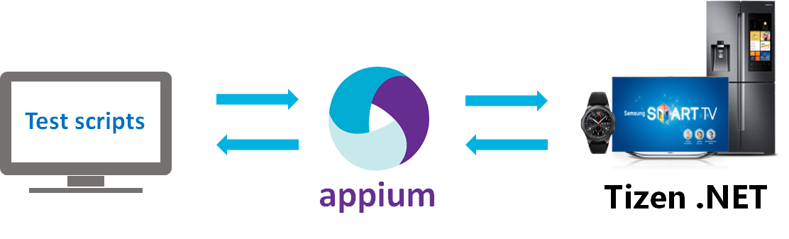
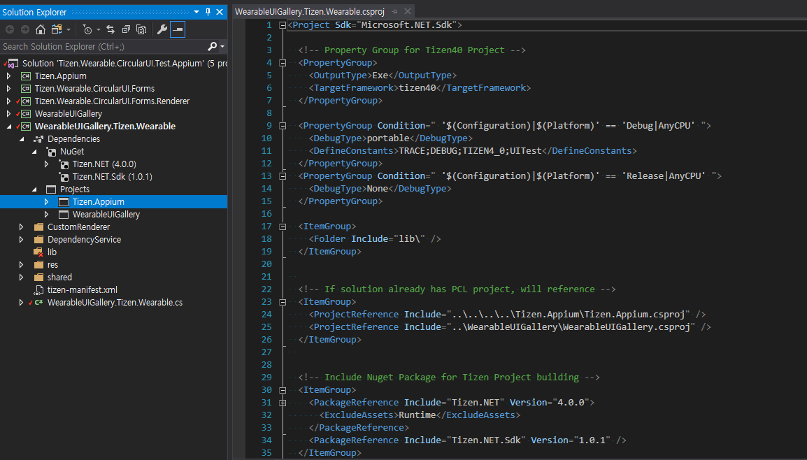
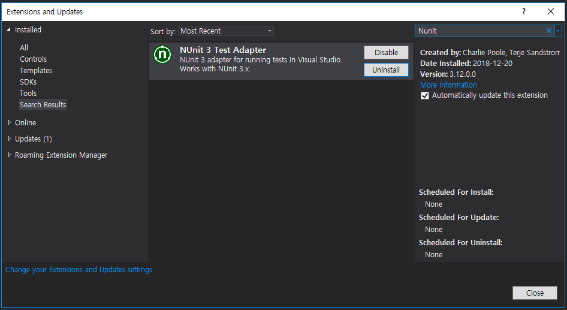
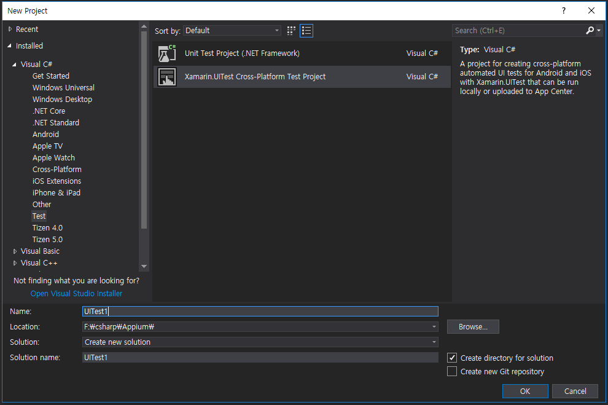
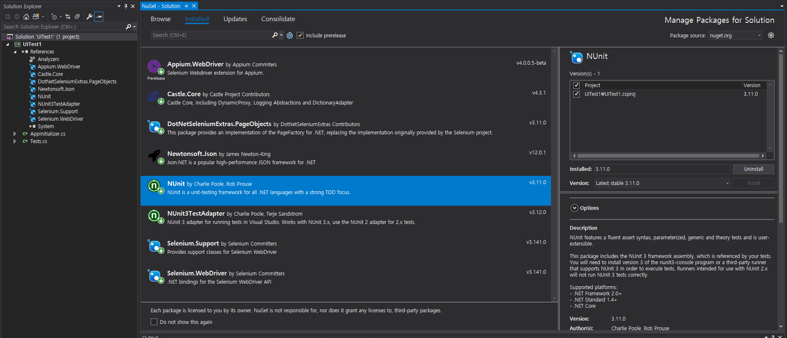
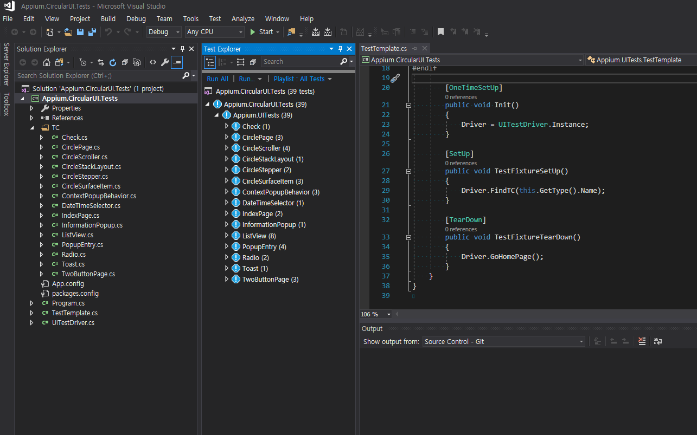

# Creating UI automation test for Tizen .NET Application

This guide shows how to create and run a UI automation test using Appium and NUnit for Tizen .NET Application.

[Appium](https://github.com/appium/appium) is an open source project supporting cross-platform test automation tool. You can find many guide and information.

In This guide, Test Application uses [WearableUIGallery](https://github.com/Samsung/Tizen.CircularUI/tree/master/test/WearableUIGallery) which contains many TCs to check CircularUI API behavior.

Appium Client has a test script for UI automation. This guide uses the [Appium.CircularUI.Test](https://github.com/Samsung/Tizen.CircularUI/tree/master/test/Appium.CircularUI.Tests).

Please refer to the following image




There are 4 step for building UI automation
- [Prerequisite](#prerequisite)
- [Modifying Your Application](#modifying-your-application)
- [Make Testscript](#make-testscript)
- [Run Testscript](#run-testscript)


## Prerequisite
1. Installing Appium server
    - appium guide  : https://github.com/appium/appium/blob/master/docs/en/contributing-to-appium/appium-from-source.md
    - appium git repository : https://github.com/appium/appium
    - setup and run appium server (e.g ubunt)

```
$ git clone https://github.com/appium/appium.git
$ cd appium
$ npm install appium-chromedriver --chromedriver_cdnurl=http://npm.taobao.org/mirrors/chromedriver
$ npm install
$ npm run build
$ node .
```


## Modifying Your Application
1. If your Application use CircularUI then download Tizen.Appium git. Otherwise, skips 2 ~ 3 steps and go to step 4 after adding Tizen.Appium NuGet in Your Application project.

2. In the `Tizen.Appium.csproj` file, add `WATCH` to the `DefineConstants` value for being restored CircularUI NuGet.

```
  <PropertyGroup Condition="'$(Configuration)|$(Platform)'=='Debug|AnyCPU'">
    <DefineConstants>TRACE;DEBUG;TIZEN4_0;WATCH</DefineConstants>
  </PropertyGroup>


    <ItemGroup Condition="$(DefineConstants.Contains(WATCH))">
    <PackageReference Include="Tizen.Wearable.CircularUI" Version="1.0.0-pre2-00118" />
  </ItemGroup>

```

3. Add `Tizen.Appium` project to your application solution, and then add Tizen.Appium in a reference project in your application project.

   In the following Image, `Tizen.Appium` is added in `Tizen.Wearable.CircularUI.Test.Appium` solution, and then add in a reference project in `WearableUIGallery.Tizen.Wearable` project.




4. Add `Tizen.Appium.TizenAppium.StartService` to main method and `Tizen.Appium.TizenAppium.StopService`  to `OnTerminate` methods.

```
        protected override void OnTerminate()
        {
            base.OnTerminate();
#if UITest
            global::Tizen.Appium.TizenAppium.StopService();
#endif
        }

        static void Main(string[] args)
        {
            var app = new Program();
            global::Xamarin.Forms.Platform.Tizen.Forms.Init(app);
            FormsCircularUI.Init();
#if UITest
            global::Tizen.Appium.TizenAppium.StartService(app);
#endif
            app.Run(args);
        }
```

5. Add `AutomationId` to the `Xamarin.Forms` control for allowing to find and control the specified control during the automation test. Please refer to the following code.

 ```xml
    <w:CirclePage.Content>
        <w:CircleScrollView x:Name="myscroller" Orientation="Vertical">
            <StackLayout Orientation="Vertical">
                <Label HorizontalOptions="CenterAndExpand" Text="Default" />
                <w:Check
                    AutomationId="default"
                    DisplayStyle="Default"
                    HorizontalOptions="CenterAndExpand"
                    IsToggled="False"
                    Toggled="OnToggledDefault" />

                <Label HorizontalOptions="CenterAndExpand" Text="Onoff" />
                <w:Check
                    AutomationId="onOff"
                    DisplayStyle="Onoff"
                    HorizontalOptions="CenterAndExpand"
                    IsToggled="True"
                    Toggled="OnToggledOnOff" />
 ```


## Make Testscript
1. Install Nunit Test Adapter in visual studio :  Visual Studio Tools > Extension and Update > 



2. Create unit test project(.NET framework)  
 Visual Studio  File > New > Project >  Tap Test in Visual C# > Select Unit Test Project(.NET Framework)




3. Remove NuGet packages (e.g NunitTestAdapter, Xamarin.UITest ...) except Nunit, and then update Nunit NuGet package to v3.11.0.

4. Install following NuGet packages
  - Appium.WebDriver (upper 4.0.0.4)
  - Selenium.WebDriver
  - Selenium.Support
  - Newtonsoft.Json
  - DotNetSeleniumExtras.PageObjects
  - Castle.Core



5. Remove auto-generated cs files(e.g AppInitializer.cs, Tests.cs), And then copy 3 files (`Program.cs, TestTemplate.cs, UITestDriver.cs`) from  `Tizen.Wearable.CircularUI\test\Appium.CircularUI.Tests\` to your project.

6. Set configuration. Please refer to `InitTizen()` in `test\Appium.CircularUI.Tests\UITestDriver.cs`
   You should set AppiumOptions
   - Set `platformName` to `Tizen`
   - Set `deviceName` to your testing device name.
   - Set `appPackage` to your Application package name.
   - Set `app` to your Application tpk name.
   - Create `TizenDriver` with Uri(Your Appium server IP address). In the below Example `192.168.0.49` is Appium server IP. You should insert your device's IP which installed Appium server. 4723 is designated port number for Appium server.

```cs
        void InitTizen(string platform, string profile)
        {
            AppiumOptions option = new AppiumOptions();

            option.AddAdditionalCapability("platformName", platform);
            option.AddAdditionalCapability("deviceName", "emulator-26111");
            option.AddAdditionalCapability("appPackage", "org.tizen.example.WearableUIGallery.Tizen.Wearable");
            option.AddAdditionalCapability("app", "org.tizen.example.WearableUIGallery.Tizen.Wearable-1.0.0.tpk");
            _driver = new TizenDriver<AppiumWebElement>(new Uri("http://192.168.0.49:4723/wd/hub"), option);
            _touchScreen = new RemoteTouchScreen(_driver);
        }
```

7. If you want to add a common set of functions that are performed before or after each test, please make [SetUp](https://github.com/nunit/docs/wiki/SetUp-Attribute) method and [TearDown](https://github.com/nunit/docs/wiki/TearDown-Attribute) method.

In the following Appium.CircularUI.Tests code, SetUp and TearDown methods are called in TestTemplate Class. Each Test Class inherited the TestTemplate Class.

```cs
using NUnit.Framework;

namespace Appium.UITests
{
    public class TestTemplate
    {
        public UITestDriver Driver;

        [OneTimeSetUp]
        public void Init()
        {
            Driver = UITestDriver.Instance;
        }

        [SetUp]
        public void TestSetUp()
        {
            Driver.FindTC(this.GetType().Name);
        }

        [TearDown]
        public void TestCleanUp()
        {
            Driver.GoHomePage();
        }
    }
}
```

8. Write test script with Nunit feature. please refer to [Nunit documentation](https://github.com/nunit/docs/wiki/NUnit-Documentation)

```cs
using NUnit.Framework;

namespace Appium.UITests
{
    [TestFixture, Order(15)]
    public class Check : TestTemplate
    {

        [Test]
        public void CheckTest()
        {
            Driver.Click("default");
            Driver.Click("onOff");
            Driver.Click("small");

            var isToggled = Driver.GetAttribute<bool>("default", "IsToggled");
            Assert.True(isToggled, "Check(default).IsToggled should be true, but got " + isToggled);

            ...
        }
    }

```

## Run Testscript
1. Launch your Tizen emulator or connect Tizen wearable device to PC which installed Appium server.

2. Run Appium Server. 

```
Appium installed Path/appium (master)$ node .
[Appium] Welcome to Appium v1.9.2-beta.2 (REV a95edb162350a359d6cc45b7aa89a3843b19f0ee)
[Appium] Appium REST http interface listener started on 0.0.0.0:4723

```


3. Launch `Test Explorer` Window In Visual Studio 2017.  Top menu bar > Test > Windows > Test Explorer




4. Click `Run All` in Test Explorer window.

You can run the selected test clicking the `Run Selected Test` menu with a mouse right click on a test case.