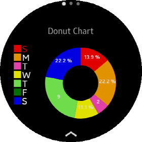

# DonutChartView

A `DonutChartView` is derived class of `PieChartView`.
Since all usage except the `ThicknessRatio` Property is the same as PieChartView, please refer to PieChartView's guide.

## Create DonutChartView

You can add `DonutChartView` with C# or XAML file. Following code show the way how to add `DonutChartView`.
`Data` class which is a set of data items(`DataItem`). If you don't set Data or data has no `DataItem`, `DonutChartView` shows empty chart.

**C# file**

```cs
    var donetChart = new new DonutChartView
    {
        VerticalOptions = LayoutOptions.Center,
        Maximum = 10,
        WidthRequest = 300,
        HeightRequest = 200,
        Data = data
    }

    StackLayout layout = new StackLayout
    {
        VerticalOptions = LayoutOptions.Center,
        HorizontalOptions = LayoutOptions.Center,
        children =
        {
            donetChart
        }
    };
```

**XAML file**

_Refer to XAML code at the \test\CircularChartGallery\Pages\SimplePieDonutChartTest.xaml_

```xml
                <chart:DonutChartView
                    x:Name="donutChart"
                    VerticalOptions="CenterAndExpand"
                    HorizontalOptions="CenterAndExpand"
                    Maximum="10"
                    LegendPosition="Left"
                    ValueLabelFontSize="4"
                    Data="{Binding WeeklyData}"
                    WidthRequest="300"
                    HeightRequest="200"/>
```



## ThicknessRatio

`DonutChart` can have an empty space in the center.
You can change the size of the radius of the empty space in the center by setting the value of the `ThicknessRatio` between 0.2 and 1.
If you set 1, it has the same shape as `PieChartView`.
Following code changes the `ThicknessRatio` from 0.5(default value) to 0.8.

_Refer to XAML code at the \test\CircularChartGallery\Pages\SimplePieDonutChartTest.xaml_

```xml
                <chart:DonutChartView
                    x:Name="donutChart2"
                    VerticalOptions="CenterAndExpand"
                    HorizontalOptions="CenterAndExpand"
                    Maximum="10"
                    LegendPosition="Left"
                    ValueLabelFontSize="4"
                    ThicknessRatio ="0.8"
                    Data="{Binding WeeklyData}"
                    WidthRequest="300"
                    HeightRequest="200"/>
```

