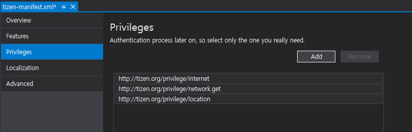
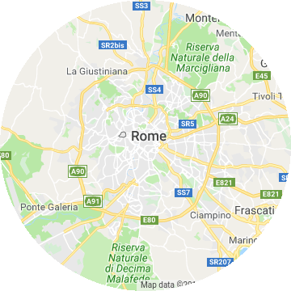
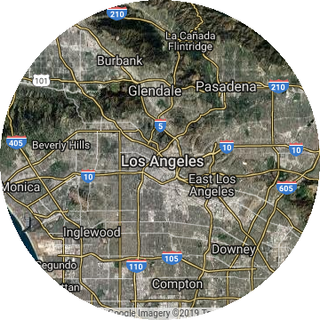
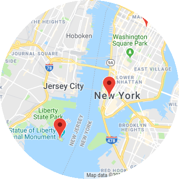
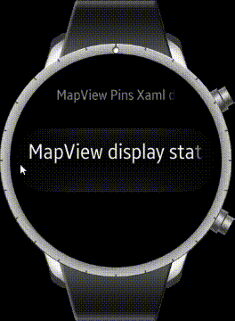

# GoogleMapView

## How to display Map in Tizen .NET application

You can use the following ways for displaying map in your .NET applications.

1. Tizen.Maps
    - Tizen.Maps provides geocoding. reverse geocording, place searching, route calculation, and map view widgets. This provides the most functionality for map in Tizen .NET application.
    - Tizen.Maps provides [Here Maps](https://developer.here.com/). In some country, it has low map quality or outdated(e.g. China, Korea, Japan), You can check at [mobile.here.com](https://mobile.here.com/?x=ep). So you need to make sure that the country where your app is deployed is provided with Here Map data.
    - For using this API, you should use Tizen .NET UI framework which are EFLShrap or Elmsharp or NUI. If you want to use this APIs in Xamarin.Forms Application. you should make custom renderer.
2. Xamarin.Forms.Maps
    - You can use Xamarin.Forms.Maps in Xamarin.Forms application. Xamarin.Forms.Maps.Tizen renderer use Tizen.Maps. So It provides Here Maps data. But, it provides minimun set of map functionality.
3. Use WebView and REST APIs
    - Map providers support Javascirpt API and REST APIs for Web and application.
    - You can retrive map data using `System.Net.Http`. You can implement javascript code for loading map and then set in Xamarin.Forms.WebView.
4. Tizen.Wearable.CircularUI GoogleMapView
    - `GoogleMapView` provides minimum functionality of [Google Maps javascript APIs](https://developers.google.com/maps/documentation/javascript/tutorial).

## Introduce

`GoogleMapView` provides minimum functionality of [Google Maps javascript APIs](https://developers.google.com/maps/documentation/javascript/tutorial). It display google map data in `WebView` which is predefined in renderer. GoogleMapView only provides static map data. It doesn't mean that map can't scroll and zoom. GoogleMapView property value can't reflect user interaction. For example, it is impossible to get the position(geographical coordinates) value where user clicks in GoogleMapView. And, it is impossbile to display the user's current position dynamically. Therefore, you can use it to display a map of a specific area or marking designated positions in the map.

## Prerequisite

### 1. Get Google API Key

To use the `GoogleMapView`, you must get an `google API key` in [Google Cloud Patform Console](https://console.cloud.google.com/google/maps-apis). The API key is used to track API requests associated with your project for usage and billing. For more detail Information, please refer to [Get API Key](https://developers.google.com/maps/documentation/javascript/get-api-key)

### 2. Insert API key in  FormsCircularUI.Init

set your `API key` for the parameter of `FormsCircularUI.Init(APIKEY)` method. Your API key will be used for loading google javascript map in GoogleMapView.

``` c#
    private static string APIKEY = "Insert_Your_Google_API_key";

...

    global::Xamarin.Forms.Platform.Tizen.Forms.Init(app);
    FormsCircularUI.Init(APIKEY);
```

### 3. Add Previleges

Before using `GoogleMapView` for your application, you must add the `http://tizen.org/privilege/internet` and `http://tizen.org/privilege/network.get` previlege to `tizen-manifest.xml` file. Because `GoogleMapView` needs internet connection. Following figure show adding privilege to `tizen-manifest.xml`. If you want to get the current location, you should use location service which needs `http://tizen.org/privilege/location`
privilege.


## Display map

`GoogleMapView` displays google javascript map. `GoogleMapView` setting value can be changed with `GoogleMapOption` structure which set by the `Update` method.
By default, `GoogleMapOption` structure is null. and GoogleMapView renderer set default value.
Following example show default GoogleMapView without GoogleMapOption and screen capture of this example(figure1).

_The code example of this guide uses TCMapViewStackLayout1 code of WearableUIGallery.
The code is available in test\WearableUIGallery\WearableUIGallery\TC\TCMapViewStackLayout1.xaml_

```xml
<ContentPage
    x:Class="WearableUIGallery.TC.TCMapViewStackLayout1"
    xmlns="http://xamarin.com/schemas/2014/forms"
    xmlns:x="http://schemas.microsoft.com/winfx/2009/xaml"
    xmlns:w="clr-namespace:Tizen.Wearable.CircularUI.Forms;assembly=Tizen.Wearable.CircularUI.Forms">
    <ContentPage.Content>
        <StackLayout Orientation="Vertical" VerticalOptions="FillAndExpand">
            <w:GoogleMapView x:Name="GoogleMapView" VerticalOptions="FillAndExpand" HorizontalOptions="FillAndExpand" />
        </StackLayout>
    </ContentPage.Content>
</ContentPage>
```

Following example show the GoogleMapView with GoogleMapOption and screen capture of this example(figure2).
Xaml code is same as the above example. Following example only show xaml.cs code. GoogleMapView center latitude and longitude value are set `34.0869` and `-118.282242`.
And then, `Zoom` value is set 10.1 and `Maptype` is set `Hybrid`.

_The code example of this guide uses TCMapViewStackLayout3 code of WearableUIGallery.
The code is available in test\WearableUIGallery\WearableUIGallery\TC\TCMapViewStackLayout3.xaml.cs_

```c#
private static double Latitude = 34.0869;
private static double Longitude = -118.282242;

public TCMapViewStackLayout3()
{
    InitializeComponent ();
    var position = new LatLng(Latitude, Longitude);
    var option = new GoogleMapOption(position);
    option.Zoom = 10.1;
    option.MapType = GoogleMapType.Hybrid;
    GoogleMapView.Update(option);
}
```

|||
|:------------------------------------------:|:--------------------------------------------:|
|          Default GoogleMapView(figure1)          |        GoogleMapView with GoogleMapOption(figure2)       |

## Display pins in Map

Specific locations can be marked on the map with `Xamarin.Forms.Maps.Pin` objects.
Following example show the GoogleMapView with `Pin` objects. The figure is the result of this example code.

```c#
    public partial class TCMapViewPins1 : ContentPage
    {
        private static double Latitude = 40.7157961;
        private static double Longitude = -74.0252194;
        public TCMapViewPins1()
        {
            InitializeComponent ();

            var option = new GoogleMapOption();
            var position = new LatLng(Latitude, Longitude);
            option.Center = position;
            option.Zoom = 12;
            mapview.Update(option);

            var marker1 = new Marker
            {
                Position = new LatLng(40.711493, -74.011351),
                Description = "Westfield World Trade Center",
                Address = "185 Greenwich St, New York, NY 10007",
            };

            var marker2 = new Marker
            {
                Position = new LatLng(40.689651, -74.045412),
                Description = "Statue of Liberty National Monument",
                Address = "New York, NY 10004",
            };

            var marker3 = new Marker
            {
                Position = new LatLng(40.748368, -73.985560),
                Description = "Empire State Building",
                Address = "20 W 34th St, New York, NY 10001",
            };

            mapview.Markers.Add(marker1);
            mapview.Markers.Add(marker2);
            mapview.Markers.Add(marker3);
        }
```



## Display device current position (statical)

If you want to display marker for your device's current position or display map on your current position, you can use [Tizen.Location](https://developer.tizen.org/development/guides/.net-application/location-and-sensors/location-information) API. To use the `Tizen.Location`, you must add `http://tizen.org/privilege/location` privilege to `tizen-manifest.xml` (refer to above [guide](https://samsung.github.io/Tizen.CircularUI/guide/GoogleMapView.html#Prerequisite)) and you should add code for checking and requesting of privacy-related permission. Following code example show you how can check and request privacy-related permission. For more detail informaiton about privacy-related permission, please refer to [Privacy-related Permissions guide](https://developer.tizen.org/development/guides/.net-application/security/privacy-related-permissions).

_The code example of this guide uses TCMapViewCurrentPosition code of WearableUIGallery.
The code is available in test\WearableUIGallery\WearableUIGallery\TC\TCMapViewCurrentPosition.xaml.cs_

```c#
        public void PrivilegeCheck()
        {
            try
            {
                CheckResult result = PrivacyPrivilegeManager.CheckPermission("http://tizen.org/privilege/location");
                switch (result)
                {
                    case CheckResult.Allow:
                        break;
                    case CheckResult.Deny:
                        break;
                    case CheckResult.Ask:
                        /// Request to privacy popup
                        PrivacyPrivilegeManager.RequestPermission("http://tizen.org/privilege/location");
                        break;
                }
            }
            catch (Exception ex)
            {
                /// Exception handling
            }
        }
```

If a user has granted permission to use the `http://tizen.org/privilege/location`, device can use `Tizen.Location` service.
Following example code show the GoogleMapView which move to current position and display marker your device position. And the following figure is the result of this example code.

```c#
        void LocationInitialize()
        {
            try
            {
                _locator = new Locator(LocationType.Hybrid);
                if (_locator != null)
                {
                    _locator.Start();
                    _locator.ServiceStateChanged += LocatorServiceStateChanged;
                }

                _locatorInitialized = true;
            }
            catch (Exception ex)
            {
                /// Exception handling
            }
        }

        public void LocatorServiceStateChanged(object sender, ServiceStateChangedEventArgs e)
        {
            if (e.ServiceState == ServiceState.Enabled)
            {
                GetCurrentPosition();
            }

...

        }

        private void GetCurrentPosition()
        {
            var marker = new Marker();
            try
            {
                Location location = _locator.GetLocation();
                var current = new LatLng(location.Latitude, location.Longitude);
                Tizen.Log.Debug("CircularUI", $"Current:[{location.Latitude},{location.Longitude} ]");
                marker.Position = current;
            }
            catch (Exception ex)
            {

...

            }

            marker.Description = "Current position";
            _option.Center = marker.Position;
            _option.Zoom = 14;
            mapviewPosition.Update(_option);

            mapviewPosition.Markers.Add(marker);
        }
```

