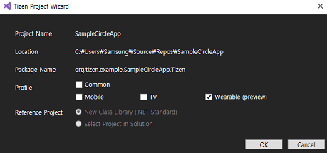
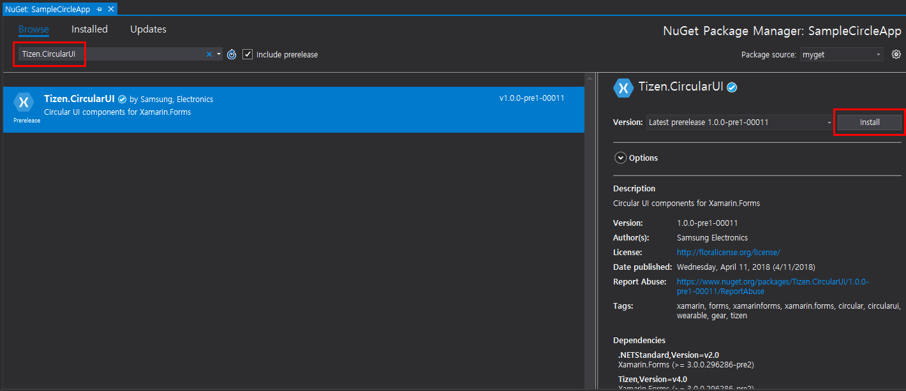
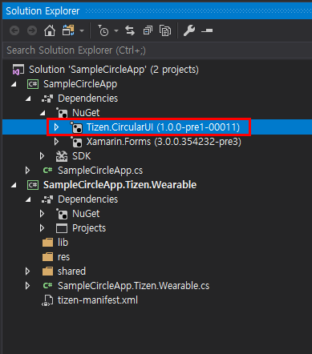
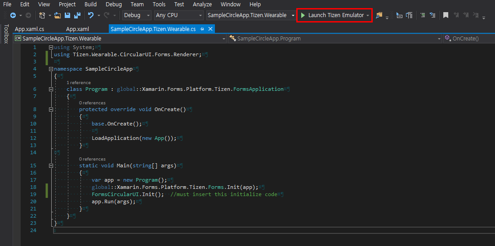

# How to make Tizen Xamarin Forms App with CircularUI

- Create Tizen Xamarin Forms App following to [Tizen.org guide](https://developer.tizen.org/development/training/.net-application/creating-your-first-tizen-.net-application). 
  In this guide project name is `SampleCircleApp`


- Select only wearable device at tizen project wizard.<br>
 


- Search Tizen.CircularUI nuget pakage at Nuget package manager.<br>
 


- Install Tizen.CircularUI nuget at portable class library(PCL) project.<br>
  


- remove SampleCircleApp.cs that is generated automatically at PCL. and then add App.xaml and App.xaml.cs using add item.

- Insert code at App.xaml.cs 

```
using CircularUI;
using System;

using Xamarin.Forms;
using Xamarin.Forms.Xaml;

namespace SampleCircleApp
{
    internal static class WidgetName
    {
        public const string Slider = "slider";
        public const string Progress = "progress";
    }

    [XamlCompilation(XamlCompilationOptions.Compile)]
    public partial class App : Application
    {
        public App()
        {
            InitializeComponent();
        }

        public void OnButtonClicked(object sender, EventArgs e)
        {
            Toast.DisplayText("Toast popup", 3000);
        }
    }
}
```


- Insert xaml code at App.xaml file

```
<?xml version="1.0" encoding="utf-8" ?>
<Application
    x:Class="SampleCircleApp.App"
    xmlns="http://xamarin.com/schemas/2014/forms"
    xmlns:x="http://schemas.microsoft.com/winfx/2009/xaml"
    xmlns:local="clr-namespace:SimpleCircleApp"
    xmlns:w="clr-namespace:CircularUI;assembly=CircularUI">
    <Application.MainPage>
        <NavigationPage x:Name="MainNavigation">
            <x:Arguments>
                <w:CirclePage
                    x:Name="page"
                    NavigationPage.HasNavigationBar="False"
                    RotaryFocusTargetName="slider">
                    <w:CirclePage.Content>
                        <StackLayout
                            HorizontalOptions="Center"
                            Orientation="Vertical"
                            VerticalOptions="Center">
                            <Label HorizontalTextAlignment="Center" Text="Welcome to Xamarin Forms!" />
                            <Button Clicked="OnButtonClicked" Text="show toast" />
                        </StackLayout>
                    </w:CirclePage.Content>
                    <w:CirclePage.CircleSurfaceItems>
                        <w:CircleSliderSurfaceItem
                            x:Name="slider"
                            Increment="0.5"
                            IsVisible="True"
                            Maximum="15"
                            Minimum="0"
                            Value="3" />
                    </w:CirclePage.CircleSurfaceItems>
                </w:CirclePage>
            </x:Arguments>
        </NavigationPage>
    </Application.MainPage>
</Application>
```


- Insert `CircularUI.Init()` code in Main method at SampleCircleApp.Tizen.Wearable.cs

```
        static void Main(string[] args)
        {
            var app = new Program();
            global::Xamarin.Forms.Platform.Tizen.Forms.Init(app);
            CircularUI.Tizen.CircularUI.Init();  //must insert this initialize code
            app.Run(args);
        }
```


- Build the solution.

- Launch Tizen Emulator <br>
  

  


- If your OS is window, launch Tizen Sdb Command Prompt(Tool > Tizen > Tizen Sdb Command Prompt).
  If you use Linux. you can use sdb command directly in your project path. 
  
- Install your app with sdb command

```
sdb install org.tizen.example.SampleCircleApp.Tizen.Wearable-1.0.0.tpk
```


- check your App at Wearable emulator<br>
  <br>

  <br>