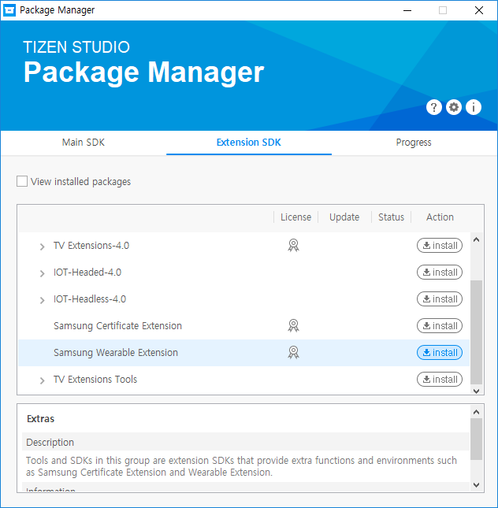

# Installing Certificate Extension

Samsung Certificate Extension provides functionalities to get and register certificates for Samsung commercial devices.  
It is an add-on SDK, which is installed using the Tizen Studio Package Manager.

Click **Tools** > **Tizen** > **Tizen Package Manager** in the menu bar to launch the Package Manager.

In the Extension SDK tab you can find the list of available extensions.  
The version of the extension is described in the lower window.

