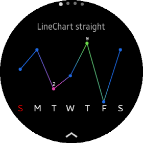
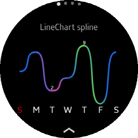
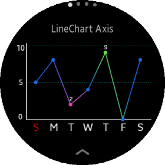
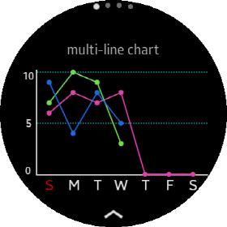
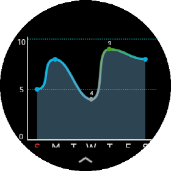

# LineChartView

A `LineChartView` is a chart that visualizes data as a set of data points connected by line.
The point of data is propotinal to the value of each `DataItem`. Any of Chart in CircularUI.Chart have `Minimum` and `Maximum` property.
The point is calculated by renderer using this Minimun and Maximum property and `LineChartView` size.

## Create LineChartView

You can add `LineChartView` with C# or XAML file. Following code show the way how to add `LineChartView`.
`Data` class which is a set of data items(`DataItem`). If you don't set Data or data has no `DataItem`, `LineChartView` shows empty chart.

**C# file**

```cs
    var lineChart = new new LineChartView
    {
        VerticalOptions = LayoutOptions.Center,
        Maximum = 10,
        WidthRequest = 300,
        HeightRequest = 200,
        Data = data
    }

    StackLayout layout = new StackLayout
    {
        VerticalOptions = LayoutOptions.Center,
        HorizontalOptions = LayoutOptions.Center,
        children =
        {
            lineChart
        }
    };
```

**XAML file**

_Refer to XAML code at the \test\CircularChartGallery\Pages\SimpleLineChartTest.xaml_

```xml
                <chart:LineChartView
                    x:Name="lineChart1"
                    VerticalOptions="CenterAndExpand"
                    HorizontalOptions="CenterAndExpand"
                    Maximum="10"
                    Data="{Binding WeeklyData}"
                    WidthRequest="300"
                    HeightRequest="200"/>
```

## Create data

The chart needs a set of data items. If you want to add values to the chart. You have to create `DataItem` object for each value.
add these data items to List. And then, you can hand over a list as `DataItems` property of `DataItemGroup` class. One or a List of `DataItemGroup` should be set of `DataItemGroups` property of `Data` class. One DataItemGroup object represents a group of DataItem, And One Data object is group of DataItemGroup object. It is designed to logically separate different groups (e.g Group Bar Char or Multi-Line Chart).
Following code show how to set each value and group.

_Refer to code at the \test\CircularChartGallery\ViewModel\SimpleChartModel.cs_

```cs
            //This label(TextItem) displayed in XAxis label
            var sunTextItem = new TextItem { Text = "S", FontSize = 7, TextColor = Color.Red };
            var monTextItem = new TextItem { Text = "M", FontSize = 7 };
            var tueTextItem = new TextItem { Text = "T", FontSize = 7 };
            var wedTextItem = new TextItem { Text = "W", FontSize = 7 };
            var thuTextItem = new TextItem { Text = "T", FontSize = 7 };
            var friTextItem = new TextItem { Text = "F", FontSize = 7 };
            var satTextItem = new TextItem { Text = "S", FontSize = 7 };

            //Create a list of DataItem.
            var dataItems = new List<IDataItem>
            {
                new DataItem {
                    Value = 5,           // value of data
                    Label = sunTextItem  // category label of each data
                },
                new DataItem {
                    Value = 8,
                    Label = monTextItem
                },
                new DataItem {
                    Value = 2,
                    Label = tueTextItem,
                    Color = Color.FromHex("#FF4AC0"),
                    ValueLabel = new TextItem { Text = "2", FontSize = 4, TextColor = Color.White }
                },
                new DataItem {
                    Value = 4,
                    Label = wedTextItem,
                },
                new DataItem {
                    Value = 9,
                    Label = thuTextItem,
                    Color = Color.FromHex("#7EFA55"),
                    ValueLabel = new TextItem { Text = "9", FontSize = 4, TextColor = Color.White }
                },
                new DataItem {
                    Value = 0,
                    Label = friTextItem
                },
                new DataItem {
                    Value = 8,
                    Label = satTextItem,
                }
            };

            //Set list of DataItem to  DataItems of DataItemGroup Class.
            var dataItemGroup = new DataItemGroup(dataItems, "test data set");
            dataItemGroup.Color = Color.FromHex("#2176FF");

            //Set dataItemGroup object to DataItemGroups of Data Class
            WeeklyData = new Data(dataItemGroup);
```

Following image shows the result of above data and XAML code.
The data item list is the same as the BarChartView guide because `DataItemGroup` is compatible with any chart in `Tizen.Wearable.CircularUI.Chart`.



## Category label

In the above image, the labels representing the day is added to X-Axis. These label is imported from `Label` property of each `DataItem` and displayed.

## LineMode

The ListChartView has two line mode. One is `Straight`, the other is `Spline`.
If you set `LineMode` property to `Spline`, data points are connected by smooth curves.
If you set `LineMode` property to `Straight`, data point are connected by straight line.
The default value of `LineMode` is `Straight`. following code show how to set `LineMode` and `LineWidth` in XAML code. and Image show the result of XAML code.

```xml
                <chart:LineChartView
                    x:Name="lineChart2"
                    VerticalOptions="CenterAndExpand"
                    HorizontalOptions="CenterAndExpand"
                    Maximum="10"
                    LineMode="Spline"
                    LineWidth="4"
                    PointIsVisible="False"
                    Data="{Binding WeeklyData}"
                    WidthRequest="300"
                    HeightRequest="200"/>
```



## Coloring line

In the above image, Line segments have different colors. If each `DataItem` has `Color` property and the value is not the `Color.Default`. renderer draw line with `DataItem`'s color at each dataitem's segment.
If `DataItemGroup` has `Color` property and the value is not the `Color.Default`. renderer draw whole line with `DataItemGroup`'s color except the segment which have own `DataItem`'s color. The above image is the result of the DataItemGroup's Color and DataItem's color in "Create Data".

## Labeling

If you want to display a value in the entire or specific data item, you must add the `ValueLabel` in the `DataItem` class.
In the above image, 4th and 5th bar have `ValueLabel`.

Following code is the data set of above image. This code shows how to add `ValueLabel` and `Label` in `DataItem` class.

```cs
            var dataItems = new List<IDataItem>
            {
                ...
                new DataItem {
                    Value = 2,
                    Label = tueTextItem,
                    Color = Color.FromHex("#FF4AC0"),
                    ValueLabel = new TextItem { Text = "2", FontSize = 4, TextColor = Color.White }
                },
                new DataItem {
                    Value = 4,
                    Label = wedTextItem,
                },
                new DataItem {
                    Value = 9,
                    Label = thuTextItem,
                    Color = Color.FromHex("#7EFA55"),
                    ValueLabel = new TextItem { Text = "9", FontSize = 4, TextColor = Color.White }
                ...
            }
```

## Customize Axis

You can create AxisOption structure and add it to AxisOption property of `LineChartView` for showing and customizing Axis.

### Create AxisOption

`AxisOption` struct controls axis line and reference labels and reference lines.
For more detail about AxisOption, please refere to [BarChartView guide](https://samsung.github.io/Tizen.CircularUI/guide/BarChartView.html).

Following code shows how to create AxisOption.

```cs
    var option = new AxisOption(true, true, true, true);
```

### Add reference label and reference line

`ReferenceDataItems` List is displayed in `Minor Axis`(`Y-Axis`). If any `DataItem` of ReferenceDataItems have the `ValueLabel` and `IsVisibleOfReferenceLabel` property of AxisOption
is true. the `ValueLabel` is displayed in `Minor Axis`.
If `IsVisibleOfReferenceLine` property of AxisOption is true, the reference lines are displayed by `Value` property of each `DataItem`.

Following code shows how to add reference labels and lines.

_Refer to XAML code at the \test\CircularChartGallery\Pages\SimpleLineChartTest.xaml and code at the \test\CircularChartGallery\ViewModel\SimpleChartModel.cs_

**CS file**

```cs
    option.ReferenceDataItems = new List<IDataItem>
    {
        new DataItem { Value = 0, ValueLabel = new TextItem{ Text = "0", FontSize = 5, TextColor = Color.White } },
        new DataItem { Value = 5, ValueLabel = new TextItem{ Text = "5", FontSize = 5, TextColor = Color.White } },
        new DataItem { Value = 10, ValueLabel = new TextItem{ Text = "10", FontSize = 5,  TextColor = Color.White } }
    };
```

**XAML file**

```xml
                <chart:LineChartView
                    x:Name="barChart3"
                    VerticalOptions="CenterAndExpand"
                    HorizontalOptions="CenterAndExpand"
                    Maximum="10"
                    Data="{Binding WeeklyData}"
                    AxisOption="{Binding MajorMinorAxisOption}"
                    WidthRequest="300"
                    HeightRequest="200"/>
```



## Multi-Line chart

In the Line chart, line is drawn as many times as the number of `DataItemGroup` added to `DataItemGroups`property of `Data` class.
If you create one `DataItemGroup` and set the data item list, it becomes a Single-Line Chart. If you create and set more than one `DataItemGroup`, it becomes Multi-line Chart.

Following code shows how to make multiple `DataItemGroup` for Multi-Line Chart. This is the same code creating group data for `GroupBarChartView`.
Each Line color can be set `Color` property in `DataItemGroup` class.

**CS file**

```cs
    var groupDataItems1 = new List<IDataItem>
    {
        new DataItem { Value = 6, Label = SunTextItem },
        new DataItem { Value = 8, Label = MonTextItem },
        new DataItem { Value = 7, Label = TueTextItem },
        new DataItem { Value = 8, Label = WedTextItem },
        new DataItem { Value = 0, Label = ThuTextItem }, //for drawing category label, add Label and Minimum value(for not drawing bar)
        new DataItem { Value = 0, Label = FriTextItem },
        new DataItem { Value = 0, Label = SatTextItem },
    };

    var groupDataItems2 = new List<IDataItem>
    {
        new DataItem { Value = 7 },
        new DataItem { Value = 10 },
        new DataItem { Value = 9 },
        new DataItem { Value = 3 },
    };

    var groupDataItems3 = new List<IDataItem>
    {
        new DataItem { Value = 9 },
        new DataItem { Value = 4 },
        new DataItem { Value = 8 },
        new DataItem { Value = 5 },
    };

    //Group-Bar Chart dataset
    var dataItemGroupList = new List<DataItemGroup>();
    var groupDataItemGroup1 = new DataItemGroup(groupDummyDataItems1, "Group data 1");
    var groupDataItemGroup2 = new DataItemGroup(groupDummyDataItems2, "Group data 2");
    var groupDataItemGroup3 = new DataItemGroup(groupDummyDataItems3, "Group data 3");
    groupDataItemGroup1.Color = Color.FromHex("#FF49BF");  // set color of group
    groupDataItemGroup2.Color = Color.FromHex("#7EF954");
    groupDataItemGroup3.Color = Color.FromHex("#2176FF");
    dataItemGroupList.Add(groupDataItemGroup1);
    dataItemGroupList.Add(groupDataItemGroup2);
    dataItemGroupList.Add(groupDataItemGroup3);

    GroupWeeklyData = new Data(dataItemGroupList);
```



## Coloring foreground area

If you want to set the foreground color of line area, set color on the `ForegroundColor` property of the `LineDataItemGroup` class.
The following code shows how to set foreground color for line area.

_Refer to code at the \test\CircularChartGallery\ViewModel\MainPageModel.cs_

```cs
            var lineDataItemGroup = new LineDataItemGroup(colorDummyDataItems, "Weekly data with each color and fg color");
            lineDataItemGroup.ForegroundColor = Color.LightSkyBlue.MultiplyAlpha(0.4);
```

