# Localization

This document describes how to localize your Tizen Xamarin.Forms application.

- [String Localization](#string-localization)
- [Display the correct Language](#display-the-correct-language)
- [Image Localization](#image-localization)
- [Application Name Localization](#application-name-localization)


## String Localization
You can begin with reading the following how-to article of Xamarin.Forms Localization.

[Xamarin.Forms Localization](https://docs.microsoft.com/en-us/xamarin/xamarin-forms/app-fundamentals/localization/#string-and-image-localization)

- The first step is adding the `RESX` resource files that will be used to store all the text used in the your app.<br>
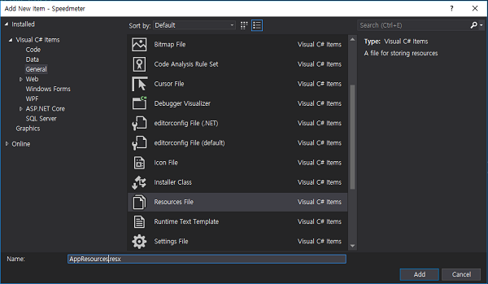<br><br>
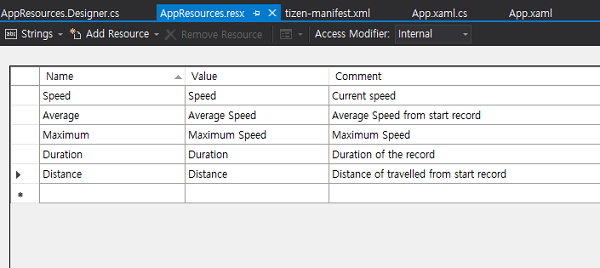<br><br>

- Change string visibility from internal to public. Select the your `resx` file and show the `Properties`. change the configuration to Custom Tool: PublicResXFileCodeGenerator as shown in the screenshot below.<br>
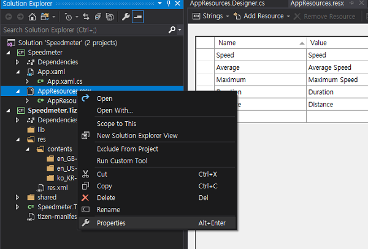<br><br>
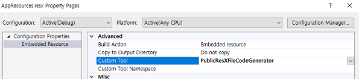<br><br>

- Add Language-Specific Resources files which must follow a specific naming convention and use the same filename as the base resources file.<br>
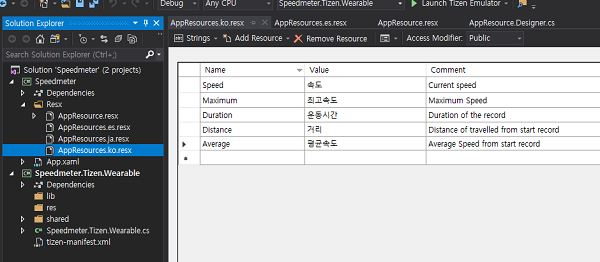<br><br>

- Use name of strings in the `RESX` files in the your user interface code.

**C# file**
```cs
var speedLabel = new Label ();
var maximumLabel = new Label ();

speedLabel.Text = AppResources.Speed;
maximumLabel.Text = AppResources.Maximum;
```

- Use name of strings in the `RESX` files in the your `xaml` code.

**XAML file**

```xml
<Application
    x:Class="Speedmeter.App"
    xmlns="http://xamarin.com/schemas/2014/forms"
    xmlns:x="http://schemas.microsoft.com/winfx/2009/xaml"
    xmlns:local="clr-namespace:Speedmeter"
    xmlns:resx="clr-namespace:Speedmeter.Resx;"
    xmlns:w="clr-namespace:Tizen.Wearable.CircularUI.Forms;assembly=Tizen.Wearable.CircularUI.Forms">
    <Application.MainPage>
        <w:CirclePage>
            <CirclePage.Content>
                <AbsoluteLayout>
                    <Label
                        x:Name="SpeedLabel"
                        AbsoluteLayout.LayoutBounds="0.5, 0.3"
                        AbsoluteLayout.LayoutFlags="PositionProportional"
                        Style="{StaticResource LabelStyle-Base}"
                        Text="{x:Static resx:AppResources.Speed}" />
                    <Label
                        x:Name="AverageLabel"
                        AbsoluteLayout.LayoutBounds="0.2, 0.7"
                        AbsoluteLayout.LayoutFlags="PositionProportional"
                        Style="{StaticResource LabelStyle-Base}"
                        Text="{x:Static resx:AppResources.Average}" />
```

<br><br>
## Display the correct Language
For display the correct language, you should implement additional code at your project to determine which language the user has selected.
Please refer to following Xamarin.Forms article. 

[Display the correct Language](https://docs.microsoft.com/en-us/xamarin/xamarin-forms/app-fundamentals/localization/text?tabs=vswin#displaying-the-correct-language)

- First. define an interface to use your `DependencyService`

```cs
public interface ILocalize
{
    CultureInfo CurrentCultureInfo { get; }
    void SetLocale(CultureInfo ci);
}
```
- Second. you should implement `DependencyService` at Tizen platform project for getting current system language setting.(`SystemSettings` API is included in Tizen.Net nuget package)

```cs
[assembly: Dependency(typeof(LocaleService))]

namespace Speedmeter.Tizen.Wearable.DependencyService
{
    class LocaleService : ILocalize
    {
        CultureInfo _currentCultureInfo;

        public LocaleService()
        {
            _currentCultureInfo = GetCurrentCultureInfo();
            // To get notified when system locale settings has been changed
            SystemSettings.LocaleLanguageChanged += LanguageChanged;
        }

        public CultureInfo CurrentCultureInfo
        {
            get
            {
                return _currentCultureInfo;
            }
        }

        public void SetLocale(CultureInfo info)
        {

            Thread.CurrentThread.CurrentCulture = info;
            Thread.CurrentThread.CurrentUICulture = info;
        }

        CultureInfo GetCurrentCultureInfo()
        {
            var netLanguage = "en";
            var TizenLocale = SystemSettings.LocaleLanguage;
            netLanguage = TizenToDotnetLanguage(TizenLocale.ToString().Replace("_", "-"));
            CultureInfo info = null;
            try
            {
                info = new CultureInfo(netLanguage);
            }
            catch (CultureNotFoundException e1)
            {
                Console.WriteLine("cannot find the current cultureInfo. so use 'en'. (" + e1.Message + ")");
                info = new CultureInfo("en");
            }

            return info;
        }

        private void LanguageChanged(object sender, LocaleLanguageChangedEventArgs e)
        {
            CultureInfo info = GetCurrentCultureInfo();
            _currentCultureInfo = info;
            // Notify the change of locale information
            MessagingCenter.Send<ILocalize, CultureInfo>(this, "LanguageChanged", info);
        }

        string TizenToDotnetLanguage(string tizenLanguage)
        {
            var netLanguage = tizenLanguage;
            //certain languages need to be converted to CultureInfo equivalent
            switch (tizenLanguage)
            {
                case "zh-CN":   // Chinese Simplified (People's Republic of China)
                    netLanguage = "zh-Hans"; // correct code for .NET
                    break;
                case "zh-HK":  // Chinese Traditional (Hong Kong)
                case "zh-hk":
                case "zh-tw":  // Chinese Traditional (Taiwan)
                case "zh-TW":
                    netLanguage = "zh-Hant"; // correct code for .NET
                    break;
            }

            Console.WriteLine("[Speedmeter] .NET Language/Locale:" + netLanguage);
            return netLanguage;
        }
    }
}

```

- Third. use the DependencyService in the Xamarin.Forms App to call the interface and set your `RESX` resources culture to the correct value.
  you can receive culture info using `MessagingCenter` and update your app UI when your app is running and system Language has been changed.

```cs
var ci = DependencyService.Get<ILocalize>().CurrentCultureInfo;
Resx.AppResources.Culture = ci; // set the RESX for resource localization
DependencyService.Get<ILocalize>().SetLocale(ci);

// Whenever language has been changed, CurrentCulture will be updated.
MessagingCenter.Subscribe<ILocalize, CultureInfo>(this, "LanguageChanged", (obj, culture) =>
{
    Resx.AppResources.Culture = culture; 
    DependencyService.Get<ILocalize>().SetLocale(culture);
    //update your App UI
});
```


<br><br>
## Image Localization
Tizen project supports localized images(resources) using different resource directories.
Tizen uses res.xml file to specify information about the directory where localized resources(e.g. Image, Sound, and so on) are contained.
The res.xml file is automatically generated when building your application.

<br><br>
**To add the localized resource directories in your application in Visual Studio:**

- In Solution Explorer, Select Tizen project. And then, Go to Tools -> Tizen -> Resource Manager<br>
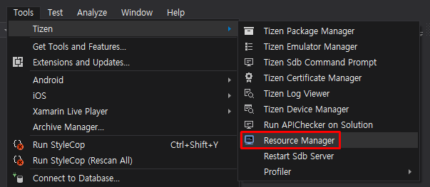

<br><br>
- Resource Manager opens configurations -> Open the language drop-down list<br>
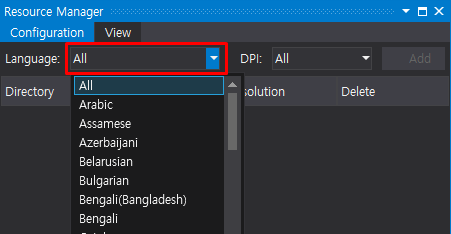

<br><br>
- Select the language to add -> click Add button<br>
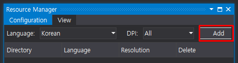<br>
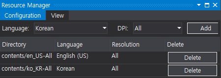

<br><br>
- Resource directories are automatically created in Tizen project as follows.<br>
  res.xml file will be generated in res directory of Tizen project after building an app.<br>
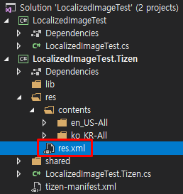<br>
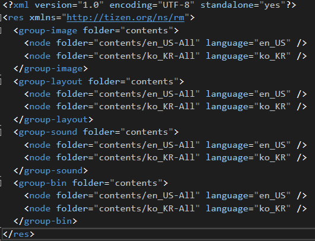

<br><br>
_Your application can sometimes run in a locale which you don't provide images for. In that case, Tizen loads the default image from the resource content directory (yourApp.Tizen/res/content/ ). If there is no default image within resource content directory and a device sets the locale which you don't provide images for, an error occurs._

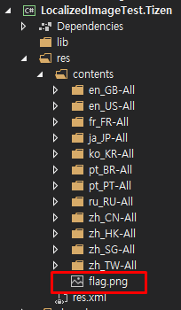

<br><br>
When you detect locale changes, you need to update the resource culture and then update the texts and images you want to provide for localization.
As for localized images, you can make custom image renderer to load the proper locale-specific images.
Tizen provides the path of locale-specific images via ResourceManager.TryGetPath/GetPath methods. With this, you can change 

**class LocalizedImageRenderer :ImageRenderer**
```cs
        using TizenResourceManager = Tizen.Applications.ResourceManager;
  
        public LocalizedImageRenderer() : base()
        {
            SystemSettings.LocaleLanguageChanged += SystemSettings_LocaleLanguageChanged;
        }
 
        // Invoked every time the language setting has been changed
        private void SystemSettings_LocaleLanguageChanged(object sender, LocaleLanguageChangedEventArgs e)
        {
            // Get the path of a proper image based on locale and update the source of an image
            Element.Source = TizenResourceManager.TryGetPath(TizenResourceManager.Category.Image, fileName);
        }
```


<br><br>
## Application Name Localization
You can add localized Application name and icon using `tizen-manifest.xml` in the Tizen project.

- Open the `tizen-manifest.xml` and select the Localization tab and click Add button in Name.

- Add application names for languages you want to support.<br>
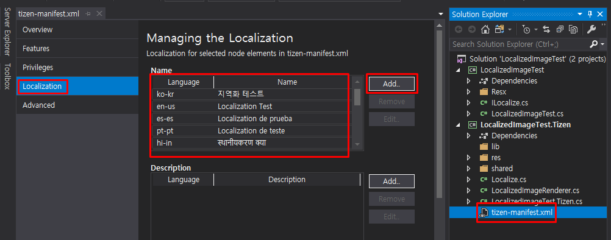
