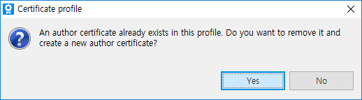
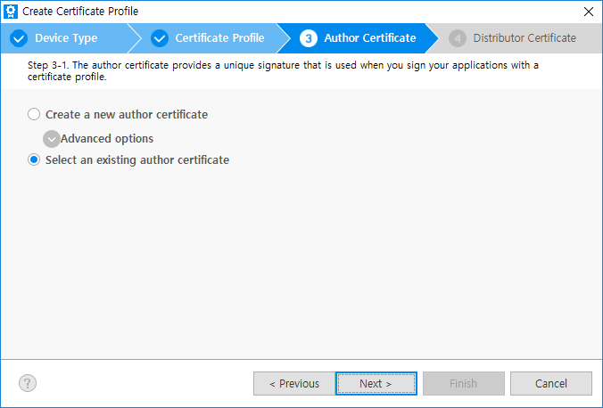

# Managing Certificate Profile

Before installing your application on a device or submitting it to the Tizen Store, it must be signed with a certificate profile.
The signature verifies the source of the application and makes sure it has not been tampered with since its publication.
A certificate profile is a combination of the certificates used for signing.

## General Information

In the menu bar, click `Tools > Tizen > Tizen Certificate Manager` to launch the Certificate Manager.

* The Active profile is indicated by the check mark.
* All of the application in this SDK will be signed with this active profile.
* You can create, delete, and set a profile to active here.
* Lower window shows the information of each certificate.
* You can replace the certificate with another existing one.
* The Tizen platform allows multiple distributor certificates up to 2 which supports other device manufacturers or telecommunication companies but it is not needed for most of developers generally.

## Changing Only a Distributor Certificate in a Profile

There might be an instance where you need to register more devices or change the devices to the distributor certificate.  
However author certificates rarely needs to be changed.  
This section describes how to do it.

Do the same steps to create a certificate profile described in Creating Certificates before step [Create new or select old profile](xref:Tizen.Wearable.CircularUI.doc.CreatingCertificates#4-create-new-or-select-old-profile)

### 1. Select an existing certificate profile

Click `Select an existing certificate profile` and select a profile which you want to change the registered device then click `Next`.

### 2. Use the existing author certificate

Click `No` to use the existing author certificate then it moves to [Create new or select existing distributor certiicate](xref:Tizen.Wearable.CircularUI.doc.CreatingCertificates#1-create-new-or-select-existing-distributor-certiicate) to register DUID.

> If you click `Yes`, it moves to [Create a new author certificate](xref:Tizen.Wearable.CircularUI.doc.CreatingCertificates#create-a-new-author-certificate) step and original author certificate will be removed permanently.
> So it should be carefully considered.  
> However the SDK automatically backups the original author.p12 file with timestamp extension like author.p12_bak_20160806092013 in the profile directory to protect developer from unintended removal.

### 3. Create new Distributor for certificate profile

Next steps are same as guided in [Create Certificate](xref:Tizen.Wearable.CircularUI.doc.CreatingCertificates) after [Create new or select existing distributor certiicate](xref:Tizen.Wearable.CircularUI.doc.CreatingCertificates#1-create-new-or-select-existing-distributor-certiicate) step

## Importing Existing Certificates

If you already have both the `author.p12` and `distributor.p12` certificates and don’t need a new certificate from Samsung, you can just import and use them to sign your application.  
In that case, just create a new certificate profile and select existing certificates at each step.

Do the same steps to create a certificate profile described in Creating Certificates before step [Create new or select old profile](xref:Tizen.Wearable.CircularUI.doc.CreatingCertificates#4-create-new-or-select-old-profile)

### 1. Select an existing author certificate

Note that the author certificate must be the same for the application to be upgraded.

Select `Select an existing author certificate` and click `Next`.

`Browse` and select your `author.p12` file and enter the password then click `Next`.

### 2. Select an existing distributor certificate

Click `Select an existing distributor certificate` and `Browse` and select your `distributor.p12` file and enter the password then click `Finish`.

### 3. Find the created profile in the list

Finally you can find the created profile in the list.

## Troubleshooting

I lost the author.p12. Can I make my application upgrade?
No. If the author key is different, any application cannot be upgraded.
