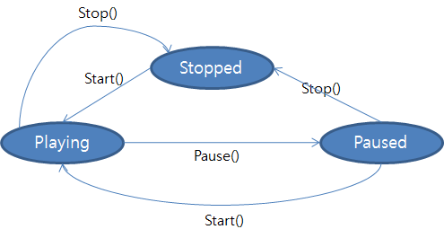
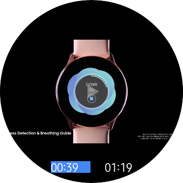

# MediaView and MediaPlayer
## Introduction
`MediaView` is used to displaythe video on the screen. `MediaPlayer` provides functionality of playing multimedia. 

## PlaybackState
 `MediaPlayer` has a `PlaybackState`. Some APIs only work on the certain state and some APIs transit the state.

#### State diagram of PlaybackState



## Video output type
#### Buffer
 * It displays video data on the graphics buffer using GL surface. It is usually used to attach a video on a part of the view.
 * `MediaView`


## Associating Player with MediaView
 `MediaPlayer` and video output are created independently. The developer needs to associate Player and the video output to display video data.

#### Use Player property of MediaView
``` xml
<w:CirclePage
    x:Class="WearableUIGallery.TC.TCMediaViewStackLayout"
    xmlns="http://xamarin.com/schemas/2014/forms"
    xmlns:x="http://schemas.microsoft.com/winfx/2009/xaml"
    xmlns:w="clr-namespace:Tizen.Wearable.CircularUI.Forms;assembly=Tizen.Wearable.CircularUI.Forms">
    <w:CirclePage.Content>
        <StackLayout>
            <w:MediaView x:Name="View">
                <w:MediaPlayer x:Name="VideoPlayer" Source="test.mp4" AutoPlay="true" UsesEmbeddingControls="true"/>
            </w:MediaView>
        </StackLayout>
    </w:CirclePage.Content>
</w:CirclePage>
```
``` c#
var view = new MediaView
{
    Player = new MediaPlayer
    {
        UsesEmbeddingControls = true,
        AutoPlay = true,
        Source = MediaSource.FromFile("test.mp4")
    }
};
```


## Embedding controls
 By default, `MediaPlayer` provides an embedding control. If you don't want to use the default embedding controls, set `UsesEmbeddingControls` to false.
``` c#
public bool UsesEmbeddingControls
```
||||
|:----------------------------------------------:|:------------------------------------------:|:------------------------------------------------------------:|
|        embedding contols (on playing)          |      embedding contols (on pausing)        |                without embedding controls                    |


## AutoPlay/AutoStop
Video can't play before media view is shown, so you need to know when the media views are available. If you use `AutoPlay`/`AutoStop` property, you don't need to care about the view state.
#### AutoPlay
``` c#
public bool AutoPlay
```
 Automatically starts a player when a `View` is shown (Rendered).
#### AutoStop
``` c#
public bool AutoStop
```
Automatically stops a player when a `View` is gone (Renderer was disposed).


## Convert Position to Progress
In many cases, `MediaPlayer.Position` is `int` value, whereas `Progressbar.Progress` is `double` value (0 to 1.0), so conversion is required. This can be easily implemented through a custom converter as follows.
#### Create a custom converter
 Implements [Xamarin.Forms.IValueConverter](https://developer.xamarin.com/api/type/Xamarin.Forms.IValueConverter/)

```C#
public class PositionToProgressConverter : IValueConverter
{
    public object Convert(object value, Type targetType, object parameter, CultureInfo culture)
    {
        return ((int)value / (double)(GetParameter(parameter)));
    }

    public object ConvertBack(object value, Type targetType, object parameter, CultureInfo culture)
    {
        return (int)((double)value * GetParameter(parameter));
    }

    int GetParameter(object parameter)
    {
        var duration = ((Tizen.Wearable.CircularUI.Forms.MediaPlayer)parameter).Duration;
        if (duration == 0)
            duration = 1;
        return duration;
    }
}
```
 Pass a `MediaPlayer` instance as the parameter

#### Use a custom converter in Xaml
```xml
....

    <ContentPage.Resources>
        <ResourceDictionary>
            <local:PositionToProgressConverter x:Key="positionToProgress"/>
        </ResourceDictionary>
    </ContentPage.Resources>
...

    <ProgressBar Progress="{Binding Source={x:Reference Player}, Path=Position, Converter={StaticResource positionToProgress}, ConverterParameter={x:Reference Player}}}"/>

....
```
