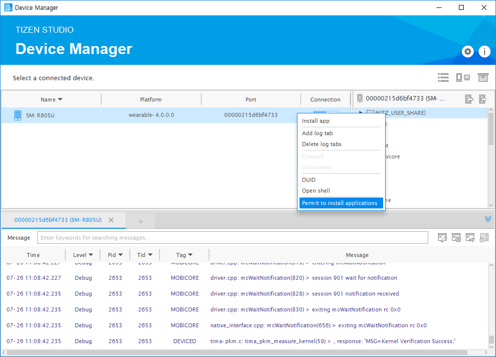

# Permit Device To Install Applications

In the menu bar, click **Tools** > **Tizen** > **Tizen Device Manager**.

Right-click anywhere in the file explorer of the **Device Manager** and select **Permit to install applications**.

## Troubleshooting

If failed to install application to device, follow the instructions:
- Verify the device date and time.
   If the certificate issued is before the device date and time, the application cannot be installed, as the certificate is considered invalid.
- Verify whether the permit to install applications process is performed correctly.
