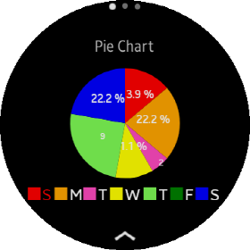
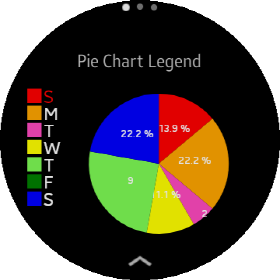

# PieChartView

A `PieChartView` is a circular chart looking like a pie which is divied into slices to illustrate numerical proportion.
The arch length of each slice is proportional to the `Value` of each data item from total.
Pie chart is used very widely with small sets of data to compare categories. Pie chart does not support multiple `DataItemGroup`.

## Create PieChartView

You can add `PieChartView` with C# or XAML file. Following code show the way how to add `PieChartView`.
`Data` class which is a set of data items(`DataItem`). If you don't set Data or data has no `DataItem`, `PieChartView` shows empty chart.

**C# file**

```cs
    var pieChart = new new PieChartView
    {
        VerticalOptions = LayoutOptions.Center,
        Maximum = 10,
        WidthRequest = 300,
        HeightRequest = 200,
        Data = data
    }

    StackLayout layout = new StackLayout
    {
        VerticalOptions = LayoutOptions.Center,
        HorizontalOptions = LayoutOptions.Center,
        children =
        {
            pieChart
        }
    };
```

**XAML file**

_Refer to XAML code at the \test\CircularChartGallery\Pages\SimplePieDonutChartTest.xaml_

```xml
                <chart:PieChartView
                    x:Name="pieChart1"
                    VerticalOptions="CenterAndExpand"
                    HorizontalOptions="CenterAndExpand"
                    Maximum="10"
                    Data="{Binding WeeklyDummyData}"
                    WidthRequest="300"
                    HeightRequest="200"/>
```

## Create data

Creating data for a PieChartView is the same as creating data of LineChartView or BarChartView.
The chart needs a set of data items. If you want to add values to the chart. You have to create `DataItem` object for each value.
add these `DataItem`s to List. And then, you can hand over a list as `DataItems` property of `DataItemGroup` class.
One `DataItemGroup` should be set of `DataItemGroups` property of `Data` class Because Pie chart does not support multiple charts.

_Refer to code at the \test\CircularChartGallery\ViewModel\SimpleChartModel.cs_

```cs
            //This label(TextItem) displayed in XAxis label
            var sunTextItem = new TextItem { Text = "S", FontSize = 7, TextColor = Color.Red };
            var monTextItem = new TextItem { Text = "M", FontSize = 7 };
            var tueTextItem = new TextItem { Text = "T", FontSize = 7 };
            var wedTextItem = new TextItem { Text = "W", FontSize = 7 };
            var thuTextItem = new TextItem { Text = "T", FontSize = 7 };
            var friTextItem = new TextItem { Text = "F", FontSize = 7 };
            var satTextItem = new TextItem { Text = "S", FontSize = 7 };

            //Create a list of DataItem.
            var dataItems = new List<IDataItem>
            {
                new DataItem {
                    Value = 5,
                    Label = sunTextItem,
                },
                new DataItem {
                    Value = 8,
                    Label = monTextItem
                },
                new DataItem {
                    Value = 2,
                    Label = tueTextItem,
                    Color = Color.FromHex("#FF4AC0"),
                    ValueLabel = new TextItem { Text = "2", FontSize = 4, TextColor = Color.White }
                },
                new DataItem {
                    Value = 4,
                    Label = wedTextItem,
                },
                new DataItem {
                    Value = 9,
                    Label = thuTextItem,
                    Color = Color.FromHex("#7EFA55"),
                    ValueLabel = new TextItem { Text = "9", FontSize = 4, TextColor = Color.White }
                },
                new DataItem {
                    Value = 0,
                    Label = friTextItem
                },
                new DataItem {
                    Value = 8,
                    Label = satTextItem,
                }
            };

            //Set list of DataItem to  DataItems of DataItemGroup Class.
            var dataItemGroup = new DataItemGroup(dataItems, "test data set");

            //Set dataItemGroup object to DataItemGroups of Data Class
            WeeklyData = new Data(dataItemGroup);
```



## Coloring Slice

Each slice of DataItem is drawn clockwise from 12 o'clock.
In the data creating code above, each `DataItem` does not have `Color` property except for the third and the fifth DataItem. But in the image above, you can see that each slice has a different color.
PieChartView renderer set designated color at slice if `Color` property of DataItem is null or `Color.Default`. The following code shows an array of color values in the renderer.

```cs
protected SKColor[] Colors = { SKColors.Red, SKColors.Orange, SKColors.Yellow, SKColors.Green, SKColors.Blue, SKColors.Indigo, SKColors.Purple, SKColors.Gray, SKColors.DarkRed, SKColors.Brown, SKColors.SkyBlue, SKColors.Ivory};
```

## Value Label

In the image above, some slice has a percentage value(e.g 22.2 %), but some slice has its own value (e.g 9).
If a `DataItem` object have `ValueLabel`, chart draws `ValueLabel` in the slice.
If `ValueLabel` property of a `DataItem` is null or empty, chart draws a value using `ValueLabelTextFormat` property. Default value of `ValueLabelTextFormat` property is percent `"{0:P1}"`. So, all slice except it having ValueLabel have percent value which is propotional to the total value.
In the image above, the first label looks cut (percent is 13.9% but only show 3.9 %) because of the last slice overwritten on the label.
You can fix this issue changing the value of `ValueLabelFontSize` property. Following code set the 4 for ValueLabelFontSize. The Image show the result.

```xml
                <chart:PieChartView
                    x:Name="pieChart1"
                    VerticalOptions="CenterAndExpand"
                    HorizontalOptions="CenterAndExpand"
                    Maximum="10"
                    ValueLabelFontSize="4"
                    Data="{Binding WeeklyData}"
                    WidthRequest="300"
                    HeightRequest="200"/>
```


Unlike other values displayed at the center of the slice, the value '2'  is shown in the arc.
In order to avoid the overlapping labels when the size of the slice is too small, if the sweeping angle of the slice is less than 30 degrees, the label is drawn on the arc.

## Legend

In the PieChartView, Legend represents each category label(`DataItem`'s Label) and color box of a slice. You can change a position of legend using `LegendPosition` property. And also you can change a visibility of legend using `LegendIsVisible` property. Following code changes the position of legend to left.

```xml
                <chart:PieChartView
                    x:Name="pieChart2"
                    VerticalOptions="CenterAndExpand"
                    HorizontalOptions="CenterAndExpand"
                    Maximum="10"
                    LegendPosition="Left"
                    ValueLabelFontSize="4"
                    Data="{Binding WeeklyData}"
                    WidthRequest="300"
                    HeightRequest="200"/>
```

