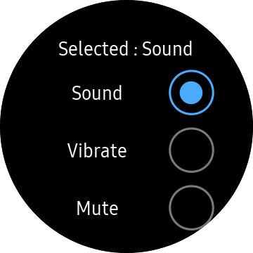

# Radio

> :warning: **Radio is obsolete as of version 1.5.0.**
> 
> Please use `Xamarin.Forms.RadioButton` instead.
>
> - Radio → `Xamarin.Forms.RadioButton`
>    - Value → `Xamarin.Forms.RadioButton.Text`
>    - IsSelected → `Xamarin.Forms.RadioButton.IsChecked`
>    - GroupName → `Xamarin.Forms.RadioButton.GroupName`
>    - Color → `Xamarin.Forms.RadioButton.BackgroundColor`
>    - Selected → `Xamarin.Forms.RadioButton.CheckChanged`
>    - CircleSurfaceEffectBehavior → `BezelInteractionPage`

`Radio` displays one or more options. You can select only one of the options having same GroupName property.
`Radio` can select only one item among items having same `GroupName` property.



## Create Radio

The `GroupName` property specifies mutually exclusive Radio controls. If you select one Radio control of radio control group, other items are not selected.
`IsSelected` property sets default selected value of Radio control. `Selected` event occurs when the Radio selection is changed.
`Value` property sets any value of Radio control. `Value` property is useful to distinguish which item is selected if all Radio control has the same `Selected` event handler.
The following code explains the process of creating `Radio`.

For more information, see [Radio  API reference](https://samsung.github.io/Tizen.CircularUI/api/Tizen.Wearable.CircularUI.Forms.Radio.html).

_The code example of this guide uses TCRadioStackLayout code of WearableUIGallery. The code is available in test\WearableUIGallery\WearableUIGallery\TC\TCRadioStackLayout.xaml.cs_

**XAML file**

```xml
   <w:CirclePage.Content>
        <w:CircleScrollView x:Name="myscroller" Orientation="Vertical">
            <StackLayout Padding="50,50" Orientation="Vertical">
                <Label
                    x:Name="label1"
                    FontSize="Medium"
                    HorizontalOptions="CenterAndExpand"
                    Text="{Binding RadioLabel1, StringFormat='SoundMode:{0}'}"/>
                <StackLayout Orientation="Horizontal">
                    <Label
                        HorizontalOptions="CenterAndExpand"
                        Text="{Binding Sound.Text}"
                        VerticalOptions="Center" />
                    <w:Radio
                        GroupName="{Binding Sound.GroupName}"
                        HorizontalOptions="End"
                        IsSelected="{Binding Sound.IsSelected,  Mode=TwoWay}"
                        Selected="OnSelected"
                        Value="{Binding Sound.Value}" />
                </StackLayout>
                <StackLayout Orientation="Horizontal">
                    <Label
                        HorizontalOptions="CenterAndExpand"
                        Text="{Binding Vibrate.Text}"
                        VerticalOptions="Center" />
                    <w:Radio
                        GroupName="{Binding Vibrate.GroupName}"
                        HorizontalOptions="End"
                        IsSelected="{Binding Vibrate.IsSelected, Mode=TwoWay}"
                        Selected="OnSelected"
                        Value="{Binding Vibrate.Value}" />
                </StackLayout>
                <StackLayout Orientation="Horizontal">
                    <Label
                        HorizontalOptions="CenterAndExpand"
                        Text="{Binding Mute.Text}"
                        VerticalOptions="Center" />
                    <w:Radio
                        GroupName="{Binding Mute.GroupName}"
                        HorizontalOptions="End"
                        IsSelected="{Binding Mute.IsSelected, Mode=TwoWay}"
                        Selected="OnSelected"
                        Value="{Binding Mute.Value}" />
                </StackLayout>
                </StackLayout>
            </StackLayout>
        </w:CircleScrollView>
    </w:CirclePage.Content>
```

**C# file**
```cs
        public void OnSelected(object sender, SelectedEventArgs args)
        {
            Radio radio = sender as Radio;
            if (radio != null)
            {
                Console.WriteLine($"<<OnSelected>>  Radio Value:{radio.Value}, GroupName:{radio.GroupName}, IsSelected:{radio.IsSelected}");
            }
        }
```

## Add Radio in ListViewItem
If you want to use `Radio` control on ListView, you can add `Radio` control in `ViewCell` for customizing item.

*When you use `Radio` on  ListView, you must set `HasUnevenRows` property `True`. If you don't set this property, Unwanted item's radio can be selected when you scroll up the ListView Since Xamarin.Forms reuse ListView Item rendering*

_The code example of this guide uses TCRadioListView code of WearableUIGallery. The code is available in test\WearableUIGallery\WearableUIGallery\TC\TCRadioListView.xaml.cs_

**XAML file**
```xml
   <w:CirclePage.BindingContext>
        <local:TCRadioViewModel />
    </w:CirclePage.BindingContext>
    <w:CirclePage.Content>
        <w:CircleListView
            x:Name="mylist"
            HasUnevenRows="True"
            ItemsSource="{Binding SampleData}">
            <w:CircleListView.ItemTemplate>
                <DataTemplate>
                    <ViewCell>
                        <StackLayout HeightRequest="120" Orientation="Horizontal">
                            <Label
                                HorizontalOptions="CenterAndExpand"
                                Text="{Binding Text}"
                                VerticalOptions="Center" />
                            <w:Radio
                                GroupName="{Binding GroupName}"
                                HorizontalOptions="End"
                                IsSelected="{Binding IsSelected, Mode=TwoWay}"
                                Selected="OnSelected"
                                VerticalOptions="Center"
                                Value="{Binding Value}" />
                        </StackLayout>
                    </ViewCell>
                </DataTemplate>
            </w:CircleListView.ItemTemplate>
```

