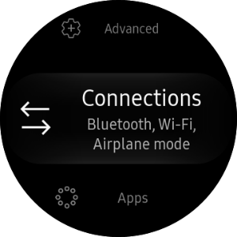
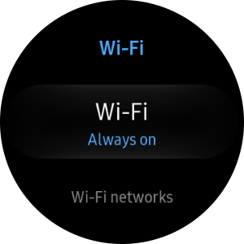

# Test Tizen .NET Application on a Gear device

To publish a Tizen .NET Application to Samsung Gallaxy Apps store, you have to test it on Samsung Gear devices.
Since Samsung Gear does not have a USB port, Tizen provides a support to publish the app to the app store over Wi-Fi.

Therefore, you must connect the Gear device to Wi-Fi and the host PC to Wi-Fi or the Unshielded-Twisted-Pair (UTP) cable to the same local network.


## Prepare Gear Device

To debug an application on the Samsung Gear device:

1. Execute the **Settings** application.

2. Scroll to the bottom of the menu and tap **About watch**.

    

3. Tap **Debugging** to turn on.


4. Press the back button of the hardware, scroll to the **Connections**  menu, and tap it.

    

5. Tap **Wi-Fi** to turn it on.

    
    
    
    

## Debugging over Wi-Fi

You can install and execute your application on the Samsung Gear device over Wi-Fi.

1. Open Visual Studio 2017 app on your developer computer.

2. Select **Tizen** > **Tizen Device Manager** > **Remote Device Manager**.

    

3. Click **Scan Devices** to search for remote Samsung Gear devices. You can see a list of available remote devices.

    
    

4. Select the IP of Samsung Gear Device that you want to connect to.
    

    The connected Gear device appears on the Device Manager Explorer window.
    

## Connecting via the SDB command

You can connect to Gear device via SDB command.

Open the Command Prompt in the Host PC and enter the following command:

```
$ sdb connect [Gear S2 IP address]:26101
```

Example

```
$ sdb connect 192.168.0.71:26101
```
	

You can see the states of the connected Gear devices using SDB command.

```
$ sdb devices
List of devices attached
192.168.0.71:26101      device       SM-R805U
```
