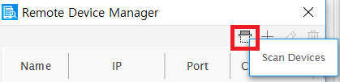
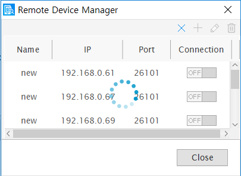
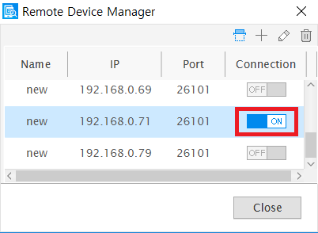

# Test Tizen .Net Application on a Gear device

To deploy Tizen .Net Application to Samsung Gallaxy app store, you need to test it on Samsung Gear devices.
As Samsung Gear doesn't have a USB port, Tizen provides a way to do it over Wi-Fi.

Therefore, the Gear device should be connected to Wi-Fi, and the host PC to Wi-Fi or UTP cable to the same local network.


## Prepare The Gear Device

To debug on the Samsung Gear device, use the following steps:

### 1. Open the Settings app

### 2. Scroll to the bottom of the menu and tap About watch.


### 3. Turn on Debugging mode.


### 4. Press hardware back button and scroll to the Connections of menu and tap it.


### 5. Turn on Wi-Fi.


## Debugging over Wi-Fi

You can install and execute your application on the Samsung Gear device over Wi-Fi.

### 1. Open Visual Studio 2017 app on your developer computer.
### 2. On the Tools menu, select Tizen >> Tizen Device Manager. and then choose Remote Device Manager.


### 3. To search for remote Samsung Gear devices, select Scan Devices. You can see a list of available remove devices.




### 4. Select the IP of Samsung Gear Device that you want to connect to.



### 5. The connected Gear device will be displayed on Device Manager Explorer.


## Connecting via the SDB command

You can connect to Gear device via the SDB command.

Open the Command Prompt in the Host PC and use the following command.

```
$ sdb connect [Gear S2 IP address]:26101
```

Example

```
$ sdb connect 192.168.0.71:26101
```
	

You can see the states of the connected Gear devices by using SDB command.

```
$ sdb devices
List of devices attached
192.168.0.71:26101      device       SM-R805U
```
