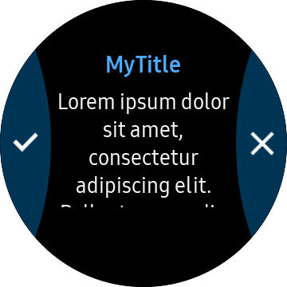

# TwoButtonPage
`TwoButtonPage` derive from `Xamarin.Forms.Page`. TwonButtonPage and has two semicircular button that is located at left side and right side of circle.



## Create TwoButtonPage
you can set control in the `TwoButtonPage.Content`. In this example, long text Label and two buttons was set for Content.
If `Overlap` property is `true`. `Content` area occupies all of the screen. If `Overlap` property is `false`. `Content` area occupies screen that is excluded button's area. `Overlap` property default value is `false`.
`TwoButtonPage.firstButton` set left side button. `TwoButtonPage.SecondButton` set right side button. you can add button using `MenuItem`.

_This guide's code example use WearableUIGallery's TCTwoButtonPage code at the test\WearableUIGallery\WearableUIGallery\TC\TCTwoButtonPage.xaml_

For more information . Please refer to [TwoButtonPage  API reference](https://github.sec.samsung.net/pages/dotnet/tizen-circular-ui/api/Tizen.Wearable.CircularUI.Forms.TwoButtonPage.html)

**XAML file**
```xml
<?xml version="1.0" encoding="utf-8" ?>
<w:TwoButtonPage
    x:Class="WearableUIGallery.TC.TCTwoButtonPage"
    xmlns="http://xamarin.com/schemas/2014/forms"
    xmlns:x="http://schemas.microsoft.com/winfx/2009/xaml"
    xmlns:local="clr-namespace:WearableUIGallery.TC"
    xmlns:w="clr-namespace:Tizen.Wearable.CircularUI.Forms;assembly=Tizen.Wearable.CircularUI.Forms">
    <w:TwoButtonPage.BindingContext>
        <local:TCTwoButtonPageViewModel />
    </w:TwoButtonPage.BindingContext>
    <w:TwoButtonPage.Content>
        <ScrollView>
            <StackLayout HorizontalOptions="FillAndExpand" VerticalOptions="FillAndExpand">
                <Label
                    HorizontalOptions="FillAndExpand"
                    HorizontalTextAlignment="Center"
                    Text="{Binding Text}"
                    VerticalOptions="FillAndExpand" />
                <Button Clicked="OnRemove1" Text="Remove 1" />
                <Button Clicked="OnRemove2" Text="Remove 2" />
            </StackLayout>
        </ScrollView>
    </w:TwoButtonPage.Content>
    <w:TwoButtonPage.FirstButton>
        <MenuItem Command="{Binding Command1}" Icon="image/tw_ic_popup_btn_check.png" />
    </w:TwoButtonPage.FirstButton>
    <w:TwoButtonPage.SecondButton>
        <MenuItem Command="{Binding Command2}" Icon="image/tw_ic_popup_btn_delete.png" />
    </w:TwoButtonPage.SecondButton>
</w:TwoButtonPage>
```

